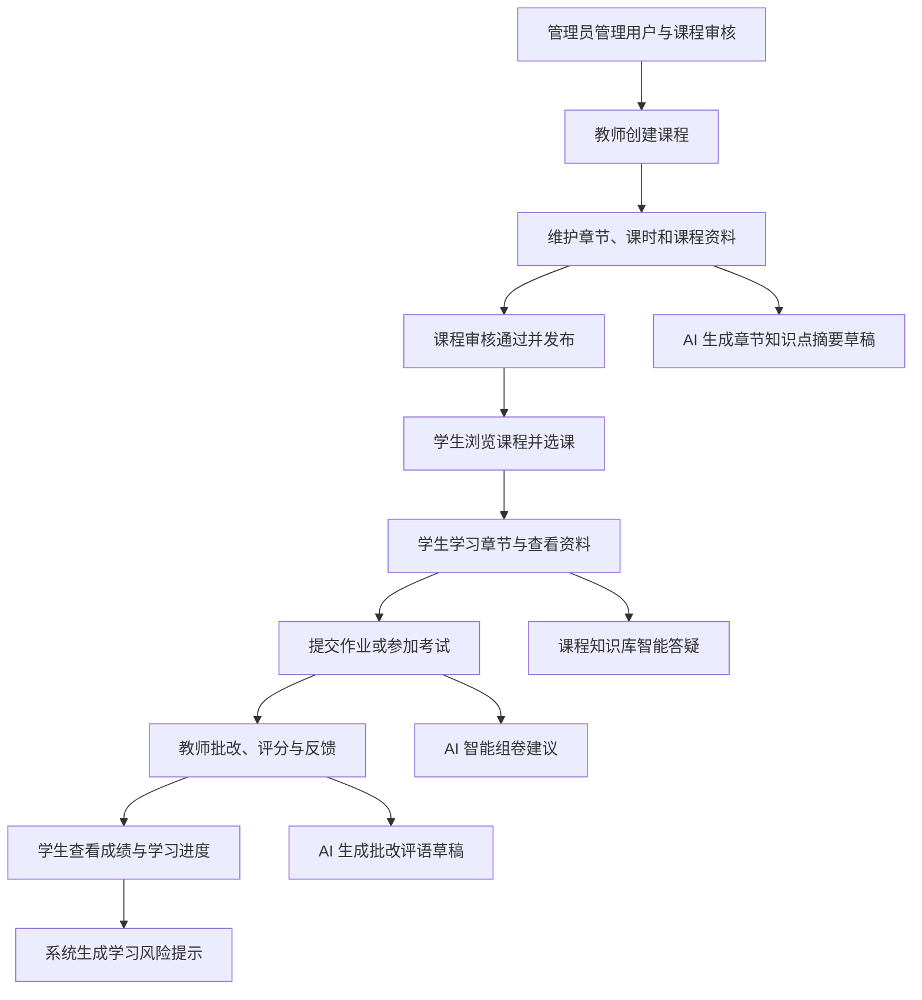
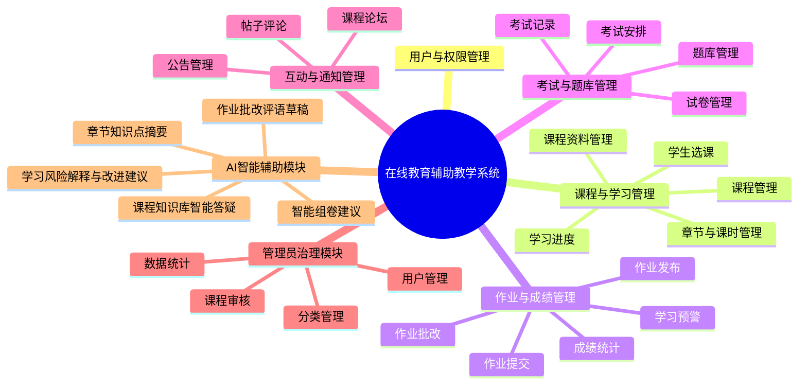

| 版本号 | 时间 | 小组名称/组号 |
| --- | --- | --- |
| v1.0 | 2026-07-07 | 第一组 |

# 在线教育辅助教学系统

# 需求分析说明书

小组名称/组号：第一组

| 版本号 | 时间 | 小组名称/组号 |
|---|---|---|
| v1.0 | 2026-07-07 | 第一组 |

**材料检查结果**

| 检查项 | 结果 |
| --- | --- |
| 老师模板/样例 | 已找到 E:/第1组-Xxxx需求规格说明书.doc，并转换为可读 docx/txt 作为格式参考。该样例文件业务主题与本项目不同，本文只参考其章节层级、封面、目录和正式程度，不复制其业务内容。 |
| 项目设计材料 | 已找到 design-research.md、sitemap.md、ui-spec.md、wireframes.md、CONTEXT.md、README.md。 |
| 后端与接口材料 | 已找到 backend-architecture.md、api-style.md、database-conventions.md、course-module-design.md、course-api-contract.md、course-module-delivery.md、OpenAPI 文件、Flyway 脚本和后端 pom.xml。 |
| 当前能确认的信息 | 项目名称为在线教育辅助教学系统；小组为第一组；技术栈包含 Vue 3、Vite、TypeScript、Element Plus、Spring Boot 3.5.0、JDK 21、Spring Cloud Alibaba、MyBatis-Plus、MySQL 8、Redis、RabbitMQ、Nacos，并规划 AI 服务、RAG、SSE 和向量库。 |
| 来自真实材料的范围 | 课程、章节、课时、课程资料、教师负责人/协作者、课程审核、学生选课、学习记录、进度聚合、JWT、资源级权限、统一响应、Flyway、AI 服务边界。 |
| 合理需求设计补足 | 作业、考试、题库、成绩、论坛、公告、学习风险预警、管理员统计、AI 评语草稿、摘要、组卷建议等在项目材料中已有规划方向但未全部实现，本文按教学闭环补足需求。 |
| 信息冲突 | 未发现与在线教育辅助教学系统冲突的材料；样例文件业务主题与本项目不同，仅作格式参考。 |

# 第一章 引言

## 1.1 编写目的

本《需求分析说明书》用于明确在线教育辅助教学系统的业务范围、用户角色、功能需求、非功能需求和 AI 辅助边界，为后续系统设计、前后端开发、数据库设计、接口联调、测试验收和部署运维提供统一依据。

本文围绕学生、教师、管理员三类用户展开，说明课程学习、作业提交、教师批改、成绩反馈、学习预警和 AI 辅助教学之间的完整业务闭环。文档同时明确传统教学管理数据与 AI 生成内容之间的责任边界：课程、作业、成绩、试卷、正式评语等关键业务事实必须由授权用户确认后进入正式流程，AI 仅提供答疑、草稿、解释、引用和建议。

本说明书也是第一组成员进行任务分工、接口契约设计、测试用例设计、数据库建模和后续设计文档编写的基础。

## 1.2 需求分析理论

需求分析是软件工程中把用户目标、业务规则、运行环境和系统约束转化为可描述、可验证、可追踪需求的过程。它既要说明系统应当提供哪些功能，也要说明系统在性能、安全性、扩展性、可用性等方面需要满足的质量要求。

功能需求描述系统对外表现出的业务行为，例如学生选课、提交作业、教师批改、管理员审核课程等；非功能需求描述系统运行质量，例如响应时间、并发能力、权限隔离、日志审计和可扩展能力。两类需求共同决定系统能否被开发、测试和验收。

本项目采用用户角色分析、业务流程分析、用例分析、原型分析和接口契约分析相结合的方法。角色分析用于区分学生、教师、管理员的职责边界；流程分析用于确认课程学习到成绩反馈的闭环；用例分析用于拆分可测试的原子功能；原型分析用于验证页面入口与操作路径；接口契约分析用于保证前后端协作时字段、状态和权限一致。

在 AI 功能需求分析中，还需要额外考虑数据来源、课程上下文、角色权限、人工确认和结果可解释性。AI 回答必须基于用户有权访问的课程资料；AI 评语、摘要和组卷建议必须以草稿或建议形式出现；系统不得把模型输出直接作为正式成绩、正式课程内容或正式试卷。

## 1.3 系统建设目标

从业务目标看，系统建设目标是统一管理课程、章节、课时、资料、作业、考试、成绩、论坛、公告和学习预警，减少教师和管理员在多个工具之间重复维护数据的成本，形成清晰的教学业务流程。

从教学目标看，系统应帮助学生明确当前课程任务、学习进度、作业截止时间、考试安排、成绩反馈和风险提示；支持教师高效维护课程内容、发布作业和考试、批改提交、统计成绩、跟踪学生学习情况；支持管理员完成用户治理、课程分类、课程审核、公告发布、论坛治理和基础统计。

从智能化目标看，系统应基于课程资料和章节内容建设课程知识库，提供可追溯来源的智能答疑，并在真实教学场景中提供作业批改评语草稿、章节知识点摘要草稿、学习风险解释与改进建议、智能组卷建议。AI 输出为教学辅助，不替代教师评分、课程审核和最终决策。

## 1.4 参考文献

1. 赵一丁.《软件工程基础》. 北京邮电大学出版社.
1. Karl E. Wiegers, Joy Beatty. Software Requirements, 3rd Edition. Microsoft Press, 2013.
1. Ian Sommerville. Software Engineering, 10th Edition. Pearson, 2015.
1. Vue.js 官方文档: https://vuejs.org/guide/introduction
1. Spring Boot 官方参考文档: https://docs.spring.io/spring-boot/documentation.html
1. Element Plus 官方文档: https://element-plus.org/
1. Spring AI 官方参考文档: https://docs.spring.io/spring-ai/reference/index.html
1. 第一组在线教育辅助教学系统项目材料: design-research.md、sitemap.md、ui-spec.md、wireframes.md、docs/backend-architecture.md、docs/course-module-design.md、docs/course-api-contract.md.
1. 老师样例文件: E:/第1组-Xxxx需求规格说明书.doc.

# 第二章 需求概述

## 2.1 项目背景

高校课程教学过程中，课程资源、作业提交、考试安排、成绩反馈和学习进度往往分散在多个工具或人工流程中。学生需要在不同入口查找课程资料、作业截止时间和成绩反馈，教师需要重复处理课程发布、作业批改、成绩统计和学生学情跟踪，管理员也需要面对课程审核、用户治理、公告发布和论坛内容治理等基础运行事务。

当课程资料、学生学习行为和成绩数据无法在同一系统内形成连续链路时，学生容易出现学习任务不清晰、学习进度滞后、反馈不及时、课程资料检索困难等问题。教师虽然能够通过传统教学平台发布部分资源，但仍需要投入大量时间处理重复性批改、学情汇总和风险识别工作，难以及时发现低进度、低完成率或成绩波动明显的学生。

传统教学管理系统通常更强调基础信息管理，缺少与课程资料、学习过程和教师工作流紧密结合的智能辅助能力。大语言模型和 RAG 技术能够辅助实现基于课程资料的问答、知识点摘要、评语草稿和学习建议，但这类能力必须受课程上下文、角色权限、来源引用和人工确认约束。因此，本项目建设在线教育辅助教学系统，以统一支持课程学习、教学管理和 AI 辅助教学流程。

## 2.2 需求概述

本系统不是普通课程展示网站，而是面向高校学生、教师和管理员的在线教育辅助教学系统。系统以“课程学习—作业提交—教师批改—成绩反馈—学习预警—AI 辅助教学”为核心闭环，传统业务域负责正式教学数据和状态流转，AI 智能域负责基于授权上下文生成回答、草稿、解释、引用和建议。

### 2.2.1 系统整体业务流程

系统整体业务流程从管理员基础治理开始，经教师创建课程和维护教学内容，进入学生选课、学习、提交作业或参加考试，再由教师批改评分并反馈成绩，最终形成学习预警和 AI 辅助改进的闭环。

图 2-1 系统整体业务流程

管理员在流程中负责用户、角色、课程分类、课程审核、公告、论坛治理和基础运行统计，保证系统基础数据可用、课程发布合规、内容治理有依据。

教师在流程中负责创建课程、维护章节和课时、上传课程资料、发布作业与考试、批改作业、登记成绩、处理学习预警，并对 AI 生成的摘要、评语和组卷建议进行编辑和确认。

学生在流程中负责浏览并选择课程、学习章节、查看资料、提交作业、参加考试、查看成绩和反馈、参与课程论坛，并在课程或章节上下文中使用 AI 答疑和学习建议。

AI 服务不独立替代教学业务流程，而是在课程资料、作业批改、学习预警和试卷编排等具体场景中提供辅助输出。AI 输出必须显示来源、上下文或证据，且不得绕过角色权限和人工确认。

### 2.2.2 系统功能结构图

系统功能结构按照传统教学业务域和 AI 智能辅助域划分，传统业务模块负责正式数据，AI 模块作为辅助能力嵌入具体业务场景。

图 2-2 系统功能结构图

传统业务域负责用户、课程、章节、资料、作业、考试、成绩、公告、论坛和预警等正式数据的创建、修改、发布和审计。AI 智能域只生成建议、草稿、解释、引用和任务结果，不能绕过角色权限，也不能直接修改成绩、正式评语、课程内容和试卷。AI 结果必须由教师或用户确认后才进入正式业务流程。

### 2.2.3 用户角色与权限概述

表 1 用户角色与权限边界

| 角色 | 主要权限 | 权限边界 |
| --- | --- | --- |
| 学生 | 浏览可选课程、选课与退选、学习已选课程、查看资料、提交作业、参加考试、查看本人成绩和预警、参与课程论坛、在课程上下文使用 AI 答疑。 | 只能学习已选且已发布课程内容，只能查看和操作自己的学习记录、作业、成绩、考试记录和论坛内容。 |
| 教师 | 创建和维护本人负责课程，管理章节、课时、资料、作业、考试、题库、成绩和本课程学情，使用 AI 生成摘要、评语草稿和组卷建议。 | 只能管理本人负责或协作的课程，不能越权管理其他教师课程；AI 也只能使用其有权访问的课程资料和题库。 |
| 管理员 | 管理用户、角色、课程分类、课程审核、公告、论坛治理、系统统计和 AI 服务基础状态。 | 管理员负责治理和统计，不默认直接改写教师课程正文、学生成绩、学生作业提交内容或私人 AI 会话正文。 |
| AI 助手 | 基于当前课程、章节、作业、预警或考试上下文生成回答、草稿、解释、引用和建议。 | 继承当前用户的业务权限和资源范围；后端必须进行资源级权限校验，不能仅通过前端隐藏菜单控制访问。 |

## 2.3 系统开发流程

表 2 系统开发流程

| 阶段 | 输入 | 核心活动 | 主要产出 | 参与角色 | 与下一阶段衔接 |
| --- | --- | --- | --- | --- | --- |
| 需求收集 | 项目选题、用户访谈、课程材料、原型目标 | 分析学生、教师、管理员真实场景，确认教学闭环与 AI 边界 | 需求分析说明书、角色权限表、核心业务流程 | 小组全员、产品负责人、指导教师 | 作为 UI、原型和接口设计依据 |
| UI 设计 | 需求说明、设计调研、功能结构 | 设计学生端、教师端、管理员端信息架构和视觉规范 | ui-spec.md、页面布局、组件规范 | UI 设计成员、前端成员 | 转入低保真/中保真原型 |
| 原型设计 | UI 规范、路由规划、用户流程 | 形成学习首页、课程详情、章节学习、作业提交、批改工作台、管理看板等核心页面 | wireframes.md、交互说明、页面流转 | 产品、UI、前端、后端 | 为接口和架构设计提供页面入口 |
| 系统架构设计 | 需求、原型、业务边界 | 区分网关、传统业务服务和 AI 智能服务，明确数据库、接口、权限和事件边界 | backend-architecture.md、api-style.md、database-conventions.md | 架构成员、后端成员 | 形成前后端开发契约 |
| 前后端开发 | 接口契约、数据库迁移、原型和任务分工 | 按 Git 分支协作，前端实现角色路由和页面交互，后端实现业务接口、权限、Flyway 迁移和测试 | 前端页面、后端服务、OpenAPI、数据库脚本 | 前端、后端、测试成员 | 进入联调和测试 |
| 测试与联调 | 已实现接口、页面和测试数据 | 覆盖功能、权限、异常、资源归属、AI 引用来源、AI 人工确认和 SSE 异常 | 测试用例、缺陷记录、联调报告 | 测试成员、前后端成员 | 为部署验收提供依据 |
| 部署与运维 | 可运行系统、配置和构建产物 | 配置环境变量、服务启动、日志、备份、监控、AI 限流和异常处理 | 部署说明、运行检查、备份与监控方案 | 后端、运维、测试成员 | 支撑课程验收和演示运行 |

# 第三章 功能需求

本章按业务域拆分功能模块。每个原子功能从使用角色、前置条件、输入、业务处理、输出、异常边界和权限要求说明系统行为，避免把单纯页面描述等同于需求。

## 3.1 用户与权限管理模块

### 3.1.1 用户登录与身份认证

| 项目 | 说明 |
| --- | --- |
| 功能名称 | 用户登录与身份认证 |
| 使用角色 | 学生、教师、管理员 |
| 前置条件 | 用户账号存在且状态可用。 |
| 输入 | 用户名、密码、当前角色选择、验证码或二次验证信息。 |
| 业务处理 | 系统校验账号状态和密码，签发 JWT，返回用户角色、权限和工作台入口。 |
| 输出 | 登录令牌、用户基本信息、角色权限集合。 |
| 异常或边界情况 | 账号不存在、密码错误、账号停用、Token 过期时返回明确错误。 |
| 权限要求 | 未登录可访问登录接口；登录后按角色进入对应工作台。 |

### 3.1.2 用户个人信息管理

| 项目 | 说明 |
| --- | --- |
| 功能名称 | 用户个人信息管理 |
| 使用角色 | 学生、教师、管理员 |
| 前置条件 | 用户已登录。 |
| 输入 | 姓名、联系方式、头像、通知偏好、密码修改信息。 |
| 业务处理 | 系统校验本人身份和字段格式，保存个人资料变更并记录更新时间。 |
| 输出 | 更新后的个人资料和安全提示。 |
| 异常或边界情况 | 敏感字段修改需验证旧密码或二次确认；不得回显密码。 |
| 权限要求 | 用户只能维护本人资料，管理员按授权可维护用户状态。 |

### 3.1.3 角色管理与权限分配

| 项目 | 说明 |
| --- | --- |
| 功能名称 | 角色管理与权限分配 |
| 使用角色 | 管理员 |
| 前置条件 | 管理员已登录并具有用户治理权限。 |
| 输入 | 用户 ID、角色、启停状态、权限范围。 |
| 业务处理 | 系统维护学生、教师、管理员三类角色和权限关系，变更后写入审计记录。 |
| 输出 | 角色分配结果、权限集合。 |
| 异常或边界情况 | 内置角色不可随意删除；存在引用时禁止删除权限。 |
| 权限要求 | 仅管理员可分配角色；普通用户不可自行提升权限。 |

### 3.1.4 资源级访问控制

| 项目 | 说明 |
| --- | --- |
| 功能名称 | 资源级访问控制 |
| 使用角色 | 学生、教师、管理员、AI 助手 |
| 前置条件 | 用户已认证并访问受保护资源。 |
| 输入 | 当前用户、角色、资源 ID、操作类型。 |
| 业务处理 | 系统按角色权限、功能权限、资源归属和对象状态逐级校验。 |
| 输出 | 允许访问或返回 403/404/409。 |
| 异常或边界情况 | 教师替换 URL 访问其他课程、学生访问他人成绩时必须拒绝。 |
| 权限要求 | 后端必须执行资源级校验，不能只依赖前端菜单隐藏。 |

### 3.1.5 操作日志与异常登录处理

| 项目 | 说明 |
| --- | --- |
| 功能名称 | 操作日志与异常登录处理 |
| 使用角色 | 管理员、系统 |
| 前置条件 | 系统发生登录、权限、审核、评分、发布等关键操作。 |
| 输入 | 操作人、操作对象、操作类型、时间、结果、traceId。 |
| 业务处理 | 系统记录关键操作日志和异常登录情况，支持审计查询。 |
| 输出 | 审计日志、异常登录提示。 |
| 异常或边界情况 | 日志不得记录明文密码、Token 和 AI 内部提示词。 |
| 权限要求 | 仅授权管理员可查看审计记录。 |

## 3.2 课程与学习管理模块

### 3.2.1 课程创建与基础信息维护

| 项目 | 说明 |
| --- | --- |
| 功能名称 | 课程创建与基础信息维护 |
| 使用角色 | 教师 |
| 前置条件 | 教师已登录并具有教师角色。 |
| 输入 | 课程编号、名称、简介、学期、分类、学分、选课时间、课程时间。 |
| 业务处理 | 教师创建课程草稿，系统建立负责人关系并校验课程编号唯一。 |
| 输出 | 课程草稿和版本号。 |
| 异常或边界情况 | 课程编号重复、时间范围不合法、状态不允许修改时拒绝。 |
| 权限要求 | 教师只能维护本人负责课程；协作者仅可编辑低风险内容。 |

### 3.2.2 课程审核、发布与下线

| 项目 | 说明 |
| --- | --- |
| 功能名称 | 课程审核、发布与下线 |
| 使用角色 | 教师、管理员 |
| 前置条件 | 课程已创建并具备必要信息。 |
| 输入 | 提交审核命令、审核意见、发布或下线命令。 |
| 业务处理 | 教师提交审核，管理员批准或驳回；审核通过后教师发布课程；必要时下线课程。 |
| 输出 | 课程状态、审核记录、驳回原因。 |
| 异常或边界情况 | 待审核时冻结关键字段；驳回必须保留原因；批准不自动发布。 |
| 权限要求 | 负责人提交和发布；管理员审核；学生只见已审核并已发布课程。 |

### 3.2.3 教师课程负责人和协作者管理

| 项目 | 说明 |
| --- | --- |
| 功能名称 | 教师课程负责人和协作者管理 |
| 使用角色 | 教师 |
| 前置条件 | 课程存在且当前教师为负责人。 |
| 输入 | 协作者教师 ID、角色关系。 |
| 业务处理 | 系统维护 OWNER/COLLABORATOR 关系，同一教师同一课程只有一条成员关系。 |
| 输出 | 课程教师成员列表。 |
| 异常或边界情况 | 不能删除唯一负责人；不能添加非教师账号。 |
| 权限要求 | 仅课程负责人可管理协作者。 |

### 3.2.4 学生课程浏览、选课与退选

| 项目 | 说明 |
| --- | --- |
| 功能名称 | 学生课程浏览、选课与退选 |
| 使用角色 | 学生 |
| 前置条件 | 课程审核通过、已发布且在可选课时间内。 |
| 输入 | 课程 ID、选课或退选命令。 |
| 业务处理 | 系统展示可选课程，学生确认后创建或恢复选课关系；退选变更选课状态。 |
| 输出 | 选课记录、课程列表状态。 |
| 异常或边界情况 | 课程已结束、下线、超出选课窗口或已选课时返回冲突。 |
| 权限要求 | 学生只能操作本人选课关系。 |

### 3.2.5 章节与课时管理

| 项目 | 说明 |
| --- | --- |
| 功能名称 | 章节与课时管理 |
| 使用角色 | 教师 |
| 前置条件 | 课程存在且教师为负责人或协作者。 |
| 输入 | 章节标题、课时标题、内容类型、Markdown 内容、解锁规则、排序。 |
| 业务处理 | 系统维护课程下章节和课时，支持草稿、发布、下线状态。 |
| 输出 | 课程大纲、章节课时详情。 |
| 异常或边界情况 | 章节未发布时课时不可对学生可见；排序冲突需稳定处理。 |
| 权限要求 | 课程教师可编辑；学生只读已发布且已解锁内容。 |

### 3.2.6 课程资料上传、预览与下载

| 项目 | 说明 |
| --- | --- |
| 功能名称 | 课程资料上传、预览与下载 |
| 使用角色 | 教师、学生 |
| 前置条件 | 课程存在，资料归属于课程、章节或课时。 |
| 输入 | 资料名称、类型、文件元数据、可见范围。 |
| 业务处理 | 教师维护资料元数据，学生访问时系统校验所属课程、章节、课时权限。 |
| 输出 | 资料列表、预览或下载授权信息。 |
| 异常或边界情况 | 资料下线、无权限、文件预览失败时给出明确提示。 |
| 权限要求 | 资料继承所属课程/章节/课时访问权限，不暴露内部文件地址。 |

### 3.2.7 学生章节学习与课时完成记录

| 项目 | 说明 |
| --- | --- |
| 功能名称 | 学生章节学习与课时完成记录 |
| 使用角色 | 学生 |
| 前置条件 | 学生已选课，课程、章节、课时均发布且课时已解锁。 |
| 输入 | 课时 ID、开始学习命令、完成命令。 |
| 业务处理 | 系统创建或更新本人学习记录，完成命令幂等处理。 |
| 输出 | 学习记录、完成状态、最近学习时间。 |
| 异常或边界情况 | 未选课、未解锁、课时下线时拒绝操作。 |
| 权限要求 | 学生只能更新本人学习记录。 |

### 3.2.8 学习进度统计与继续学习推荐

| 项目 | 说明 |
| --- | --- |
| 功能名称 | 学习进度统计与继续学习推荐 |
| 使用角色 | 学生、教师 |
| 前置条件 | 存在课时和学习记录。 |
| 输入 | 课程 ID、学生 ID 或课程范围。 |
| 业务处理 | 系统按已完成课时数与可学习课时数计算进度，并推荐下一个未完成课时。 |
| 输出 | 课程进度、最近课时、下一课时。 |
| 异常或边界情况 | 无可学习课时时进度为 0 并说明原因。 |
| 权限要求 | 学生查看本人进度；教师查看负责课程的聚合学情。 |

## 3.3 作业、成绩与学习预警模块

### 3.3.1 教师作业发布与编辑

| 项目 | 说明 |
| --- | --- |
| 功能名称 | 教师作业发布与编辑 |
| 使用角色 | 教师 |
| 前置条件 | 课程已发布，教师具有课程编辑权限。 |
| 输入 | 作业标题、要求、截止时间、满分、提交类型、附件、评分规则。 |
| 业务处理 | 系统保存作业草稿或发布作业，已发布作业修改需记录影响范围。 |
| 输出 | 作业详情、发布状态。 |
| 异常或边界情况 | 截止时间早于发布时间、课程下线或状态不允许时拒绝。 |
| 权限要求 | 教师只能发布本人负责课程作业。 |

### 3.3.2 学生作业查看、保存与提交

| 项目 | 说明 |
| --- | --- |
| 功能名称 | 学生作业查看、保存与提交 |
| 使用角色 | 学生 |
| 前置条件 | 学生已选课程且作业已发布。 |
| 输入 | 在线文本、附件、提交说明、保存或提交命令。 |
| 业务处理 | 学生可保存草稿，正式提交后形成提交记录和提交时间。 |
| 输出 | 提交状态、提交记录。 |
| 异常或边界情况 | 超过截止、文件不合法、重复提交超过限制时按规则处理。 |
| 权限要求 | 学生只能查看和提交本人作业。 |

### 3.3.3 作业截止、逾期与退回重交规则

| 项目 | 说明 |
| --- | --- |
| 功能名称 | 作业截止、逾期与退回重交规则 |
| 使用角色 | 学生、教师 |
| 前置条件 | 作业已发布并配置截止时间和重交规则。 |
| 输入 | 截止时间、重交次数、退回原因。 |
| 业务处理 | 系统根据服务端时间判断逾期，教师可退回重交并说明原因。 |
| 输出 | 逾期提示、退回状态、重交入口。 |
| 异常或边界情况 | 已关闭作业不可再提交；逾期是否允许提交按作业规则执行。 |
| 权限要求 | 教师只能退回负责课程的提交。 |

### 3.3.4 教师作业批改、评分与反馈

| 项目 | 说明 |
| --- | --- |
| 功能名称 | 教师作业批改、评分与反馈 |
| 使用角色 | 教师 |
| 前置条件 | 学生已提交作业，教师具有课程批改权限。 |
| 输入 | 分数、评语、量规得分、批注、发布命令。 |
| 业务处理 | 教师查看提交内容并评分，保存草稿或发布反馈，系统记录修改历史。 |
| 输出 | 评分结果、教师评语、发布时间。 |
| 异常或边界情况 | 分数超出满分、提交被撤回、版本冲突时拒绝。 |
| 权限要求 | 教师只能批改负责课程学生提交。 |

### 3.3.5 成绩查询、成绩统计与成绩明细

| 项目 | 说明 |
| --- | --- |
| 功能名称 | 成绩查询、成绩统计与成绩明细 |
| 使用角色 | 学生、教师 |
| 前置条件 | 成绩已生成且按规则发布。 |
| 输入 | 课程、作业、考试、学期、学生范围。 |
| 业务处理 | 系统展示成绩构成、明细、趋势和统计，不把未发布成绩按 0 分展示。 |
| 输出 | 成绩总览、课程成绩详情、统计结果。 |
| 异常或边界情况 | 成绩未发布、缺考、缓考、免考需使用独立状态。 |
| 权限要求 | 学生只看本人已发布成绩；教师看负责课程成绩。 |

### 3.3.6 学习风险识别与预警展示

| 项目 | 说明 |
| --- | --- |
| 功能名称 | 学习风险识别与预警展示 |
| 使用角色 | 学生、教师 |
| 前置条件 | 系统已有学习进度、作业完成率、成绩和考试表现数据。 |
| 输入 | 课程学习记录、作业提交、成绩趋势、考试表现。 |
| 业务处理 | 系统按低、中、高风险识别学生学习风险，展示原因、证据和建议。 |
| 输出 | 风险等级、触发证据、处理状态。 |
| 异常或边界情况 | 数据不足时显示未评估，不给绝对化结论。 |
| 权限要求 | 学生看本人预警；教师看负责课程学生预警。 |

### 3.3.7 AI 自动生成批改评语草稿

| 项目 | 说明 |
| --- | --- |
| 功能名称 | AI 自动生成批改评语草稿 |
| 使用角色 | 教师 |
| 前置条件 | 教师处于真实作业批改页面，提交内容和评分规则可用。 |
| 输入 | 学生提交内容、量规、教师已选问题点、课程上下文。 |
| 业务处理 | AI 生成可编辑评语草稿，教师可编辑、重生成、复制或确认发布。 |
| 输出 | 评语草稿、生成依据、操作状态。 |
| 异常或边界情况 | AI 失败或内容不足时保留教师输入；不得自动修改分数。 |
| 权限要求 | AI 继承教师课程权限；正式评语必须由教师确认。 |

### 3.3.8 AI 学习风险解释与改进建议

| 项目 | 说明 |
| --- | --- |
| 功能名称 | AI 学习风险解释与改进建议 |
| 使用角色 | 学生、教师 |
| 前置条件 | 已有风险记录和可见证据。 |
| 输入 | 风险等级、触发证据、课程进度、作业完成率、成绩趋势。 |
| 业务处理 | AI 基于证据生成风险解释和改进建议，用户可采纳或加入计划。 |
| 输出 | 解释、建议、证据列表。 |
| 异常或边界情况 | 无可靠证据时提示无法生成，不虚构原因。 |
| 权限要求 | 仅使用当前用户有权访问的学习数据。 |

## 3.4 考试、题库与智能组卷模块

### 3.4.1 题库分类与题目维护

| 项目 | 说明 |
| --- | --- |
| 功能名称 | 题库分类与题目维护 |
| 使用角色 | 教师、管理员 |
| 前置条件 | 教师具有题库维护权限。 |
| 输入 | 题型、题干、选项、答案、解析、知识点、难度、适用课程。 |
| 业务处理 | 系统维护教师私有、课程共享或学校公共题库，题目被使用后按版本管理。 |
| 输出 | 题目列表、题目详情。 |
| 异常或边界情况 | 已入卷题目不可无痕删除；题目内容不完整时不可发布。 |
| 权限要求 | 教师只能维护本人或课程可用题库；管理员治理公共题库。 |

### 3.4.2 考试创建与考试安排

| 项目 | 说明 |
| --- | --- |
| 功能名称 | 考试创建与考试安排 |
| 使用角色 | 教师 |
| 前置条件 | 课程已发布，教师有课程管理权限。 |
| 输入 | 考试名称、说明、开始时间、结束时间、时长、总分、成绩发布规则。 |
| 业务处理 | 系统创建考试草稿并配置考试时间窗口和参与范围。 |
| 输出 | 考试安排、考试状态。 |
| 异常或边界情况 | 时间冲突、课程下线、状态不允许时拒绝。 |
| 权限要求 | 教师只能创建负责课程考试。 |

### 3.4.3 试卷编排与题目配置

| 项目 | 说明 |
| --- | --- |
| 功能名称 | 试卷编排与题目配置 |
| 使用角色 | 教师 |
| 前置条件 | 考试已创建，题库可用。 |
| 输入 | 题目 ID、题型结构、分值、顺序、知识点覆盖。 |
| 业务处理 | 教师手动选择或调整题目，系统校验总分、重复题和题库权限。 |
| 输出 | 试卷草稿、分布校验结果。 |
| 异常或边界情况 | 总分不一致、题目停用、越权题库时提示。 |
| 权限要求 | 教师只能使用授权题库。 |

### 3.4.4 学生考试说明、考试参与与考试记录

| 项目 | 说明 |
| --- | --- |
| 功能名称 | 学生考试说明、考试参与与考试记录 |
| 使用角色 | 学生 |
| 前置条件 | 学生已选课且考试已发布，当前时间满足考试规则。 |
| 输入 | 考试会话、答题内容、保存或交卷命令。 |
| 业务处理 | 系统展示考试说明，创建考试记录，保存答题过程并接收交卷。 |
| 输出 | 考试记录、交卷状态。 |
| 异常或边界情况 | 未到开考时间、已结束、重复进入、网络中断需有明确恢复策略。 |
| 权限要求 | 学生只能参与本人课程考试。 |

### 3.4.5 考试成绩统计与结果查看

| 项目 | 说明 |
| --- | --- |
| 功能名称 | 考试成绩统计与结果查看 |
| 使用角色 | 学生、教师 |
| 前置条件 | 考试结束并完成阅卷或结果发布。 |
| 输入 | 考试记录、题目得分、总分、发布命令。 |
| 业务处理 | 教师统计考试结果并发布，学生查看本人结果和反馈。 |
| 输出 | 考试成绩、统计概览、结果详情。 |
| 异常或边界情况 | 成绩未发布不对学生显示；缺考等状态独立处理。 |
| 权限要求 | 教师看负责课程考试结果；学生只看本人结果。 |

### 3.4.6 AI 智能组卷建议

| 项目 | 说明 |
| --- | --- |
| 功能名称 | AI 智能组卷建议 |
| 使用角色 | 教师 |
| 前置条件 | 教师处于具体考试或试卷编排页面，题库和约束条件可用。 |
| 输入 | 知识点覆盖、难度分布、题型结构、分值、题库范围。 |
| 业务处理 | AI 生成候选题目和分布建议，教师采纳、替换、修改或拒绝。 |
| 输出 | 组卷建议、候选题、覆盖分析。 |
| 异常或边界情况 | 题库不足时列出缺口，不伪造题目；AI 不自动发布正式试卷。 |
| 权限要求 | AI 不得越权访问其他课程题库，最终试卷由教师确认。 |

## 3.5 互动交流与通知模块

### 3.5.1 课程论坛与帖子发布

| 项目 | 说明 |
| --- | --- |
| 功能名称 | 课程论坛与帖子发布 |
| 使用角色 | 学生、教师 |
| 前置条件 | 用户已加入或负责课程。 |
| 输入 | 课程 ID、帖子标题、正文、附件。 |
| 业务处理 | 系统在课程上下文中创建帖子，支持按课程查看与搜索。 |
| 输出 | 帖子列表、帖子详情。 |
| 异常或边界情况 | 课程关闭、内容违规或无权限时拒绝发布。 |
| 权限要求 | 学生只能在已选课程发帖；教师管理本课程帖子。 |

### 3.5.2 帖子评论与互动

| 项目 | 说明 |
| --- | --- |
| 功能名称 | 帖子评论与互动 |
| 使用角色 | 学生、教师 |
| 前置条件 | 帖子存在且未锁定。 |
| 输入 | 评论内容、回复对象、点赞或收藏操作。 |
| 业务处理 | 系统保存评论和互动记录，更新帖子活跃时间。 |
| 输出 | 评论列表、互动状态。 |
| 异常或边界情况 | 帖子锁定、评论被删除、内容过长时提示。 |
| 权限要求 | 用户只能编辑或删除本人未锁定内容；教师可治理本课程内容。 |

### 3.5.3 课程公告发布与查看

| 项目 | 说明 |
| --- | --- |
| 功能名称 | 课程公告发布与查看 |
| 使用角色 | 教师、管理员、学生 |
| 前置条件 | 教师负责课程或管理员具有公告权限。 |
| 输入 | 公告标题、内容、发布范围、发布时间。 |
| 业务处理 | 教师发布课程公告，管理员发布全局或重要公告，学生按范围查看。 |
| 输出 | 公告列表、公告详情、未读状态。 |
| 异常或边界情况 | 公告撤回后学生不可见；历史发布需留审计。 |
| 权限要求 | 发布者按范围授权；学生只读。 |

### 3.5.4 内容举报与基础治理

| 项目 | 说明 |
| --- | --- |
| 功能名称 | 内容举报与基础治理 |
| 使用角色 | 学生、教师、管理员 |
| 前置条件 | 论坛或评论内容存在。 |
| 输入 | 举报原因、处理结果、治理动作。 |
| 业务处理 | 用户可举报内容，教师处理本课程内容，管理员处理全局治理事项。 |
| 输出 | 举报记录、处理状态。 |
| 异常或边界情况 | 恶意重复举报需要限流；治理删除保留证据。 |
| 权限要求 | 管理员全局治理，教师课程内治理。 |

### 3.5.5 消息提醒与待办通知

| 项目 | 说明 |
| --- | --- |
| 功能名称 | 消息提醒与待办通知 |
| 使用角色 | 学生、教师、管理员 |
| 前置条件 | 业务事件产生通知。 |
| 输入 | 作业截止、考试安排、成绩发布、公告、预警、审核结果等事件。 |
| 业务处理 | 系统生成站内消息和待办提醒，支持已读和跳转。 |
| 输出 | 消息列表、未读数、业务入口。 |
| 异常或边界情况 | 通知发送失败不影响正式业务事务；需可重试。 |
| 权限要求 | 用户只看本人相关通知。 |

## 3.6 管理员治理与统计模块

### 3.6.1 用户管理

| 项目 | 说明 |
| --- | --- |
| 功能名称 | 用户管理 |
| 使用角色 | 管理员 |
| 前置条件 | 管理员已登录。 |
| 输入 | 用户查询条件、账号状态、角色分配信息。 |
| 业务处理 | 系统支持分页查询、启停用户、分配角色和查看基础资料。 |
| 输出 | 用户列表、用户详情。 |
| 异常或边界情况 | 不可删除存在业务历史的账号；敏感信息脱敏显示。 |
| 权限要求 | 仅管理员可操作用户治理。 |

### 3.6.2 课程分类管理

| 项目 | 说明 |
| --- | --- |
| 功能名称 | 课程分类管理 |
| 使用角色 | 管理员 |
| 前置条件 | 课程分类功能启用。 |
| 输入 | 分类名称、排序、启停状态。 |
| 业务处理 | 系统维护课程分类字典，教师创建课程时选择分类。 |
| 输出 | 分类列表、启停结果。 |
| 异常或边界情况 | 分类被课程引用时不可物理删除。 |
| 权限要求 | 管理员维护，教师和学生只读启用项。 |

### 3.6.3 课程审核与驳回处理

| 项目 | 说明 |
| --- | --- |
| 功能名称 | 课程审核与驳回处理 |
| 使用角色 | 管理员 |
| 前置条件 | 教师已提交课程审核。 |
| 输入 | 审核结论、驳回原因、备注。 |
| 业务处理 | 管理员查看课程快照并批准或驳回，驳回必须说明原因。 |
| 输出 | 审核记录、课程审核状态。 |
| 异常或边界情况 | 审核通过不自动修改教师课程正文；重复审核需处理状态冲突。 |
| 权限要求 | 仅管理员审核。 |

### 3.6.4 公告管理

| 项目 | 说明 |
| --- | --- |
| 功能名称 | 公告管理 |
| 使用角色 | 管理员 |
| 前置条件 | 管理员具有公告治理权限。 |
| 输入 | 公告标题、内容、范围、发布时间、撤回命令。 |
| 业务处理 | 系统支持全局公告创建、发布、撤回和列表查询。 |
| 输出 | 公告列表和状态。 |
| 异常或边界情况 | 已发布公告撤回保留历史；内容为空或范围不合法拒绝。 |
| 权限要求 | 管理员发布全局公告。 |

### 3.6.5 论坛内容治理

| 项目 | 说明 |
| --- | --- |
| 功能名称 | 论坛内容治理 |
| 使用角色 | 管理员 |
| 前置条件 | 论坛、帖子或评论存在。 |
| 输入 | 内容 ID、治理原因、处理动作。 |
| 业务处理 | 管理员可锁定、隐藏、恢复或处理举报内容，保留治理记录。 |
| 输出 | 治理结果、处理记录。 |
| 异常或边界情况 | 不得无记录删除争议内容。 |
| 权限要求 | 管理员全局治理；教师课程内治理。 |

### 3.6.6 系统数据统计与运行概览

| 项目 | 说明 |
| --- | --- |
| 功能名称 | 系统数据统计与运行概览 |
| 使用角色 | 管理员 |
| 前置条件 | 系统存在业务数据。 |
| 输入 | 学期、课程、角色、时间范围等筛选条件。 |
| 业务处理 | 系统统计用户活跃、课程数量、选课、作业完成、预警数量等指标。 |
| 输出 | 统计看板、趋势、明细入口。 |
| 异常或边界情况 | 统计模块失败不应导致首页完全不可用。 |
| 权限要求 | 管理员查看聚合数据，不越权查看私密正文。 |

### 3.6.7 AI 服务基础运行状态查看

| 项目 | 说明 |
| --- | --- |
| 功能名称 | AI 服务基础运行状态查看 |
| 使用角色 | 管理员 |
| 前置条件 | AI 服务接入并产生任务状态。 |
| 输入 | 时间范围、AI 功能类型、服务状态。 |
| 业务处理 | 系统展示 AI 任务数量、失败数量、索引状态、限流情况和服务健康。 |
| 输出 | AI 运行概览、失败记录。 |
| 异常或边界情况 | 不展示模型内部推理过程、系统提示词或密钥。 |
| 权限要求 | 管理员只看基础运行信息和必要审计。 |

## 3.7 AI 智能辅助模块

### 3.7.1 课程知识库构建与资料权限控制

| 项目 | 说明 |
| --- | --- |
| 功能名称 | 课程知识库构建与资料权限控制 |
| 使用角色 | 教师、AI 服务、管理员 |
| 前置条件 | 课程资料已发布或更新。 |
| 输入 | 资料 ID、课程/章节/课时归属、版本、权限范围。 |
| 业务处理 | 业务服务发布资料事件，AI 服务按授权上下文建立索引；资料下线后触发索引清理。 |
| 输出 | 索引状态、资料版本、失败原因。 |
| 异常或边界情况 | 资料无权限、资料下线、解析失败时不进入可问答范围。 |
| 权限要求 | AI 不直接读取业务数据库，只通过授权上下文和资料授权使用数据。 |

### 3.7.2 课程知识库 RAG 智能答疑

| 项目 | 说明 |
| --- | --- |
| 功能名称 | 课程知识库 RAG 智能答疑 |
| 使用角色 | 学生、教师 |
| 前置条件 | 用户从课程、章节或已选上下文进入。 |
| 输入 | 问题、课程 ID、章节/资料范围、选中文本。 |
| 业务处理 | AI 检索课程知识库并流式生成回答，返回引用来源或无可靠资料提示。 |
| 输出 | 回答、引用、grounding 状态、SSE 事件。 |
| 异常或边界情况 | 无资料、权限不足、流式中断时保留输入并给出重试入口。 |
| 权限要求 | 只能使用当前用户有权访问的课程资料。 |

### 3.7.3 章节知识点摘要生成与发布

| 项目 | 说明 |
| --- | --- |
| 功能名称 | 章节知识点摘要生成与发布 |
| 使用角色 | 教师、学生 |
| 前置条件 | 教师在课时编辑或章节管理页面操作。 |
| 输入 | 章节内容、课程资料、摘要生成命令。 |
| 业务处理 | AI 生成摘要草稿，教师编辑并发布后学生查看。 |
| 输出 | 摘要草稿、已发布摘要。 |
| 异常或边界情况 | 学生不直接看到未确认草稿；资料不足时提示无法生成。 |
| 权限要求 | 教师确认后摘要才成为正式课程内容。 |

### 3.7.4 AI 评语草稿生成机制

| 项目 | 说明 |
| --- | --- |
| 功能名称 | AI 评语草稿生成机制 |
| 使用角色 | 教师 |
| 前置条件 | 教师位于批改页面并有学生提交内容。 |
| 输入 | 提交内容、评分量规、问题点、教师输入。 |
| 业务处理 | AI 生成可编辑评语草稿，可重生成、复制、编辑和确认发布。 |
| 输出 | 评语草稿和生成状态。 |
| 异常或边界情况 | 不得自动评分，不得覆盖教师已写内容。 |
| 权限要求 | 教师确认后才写入正式评语。 |

### 3.7.5 AI 学习风险解释与学习建议

| 项目 | 说明 |
| --- | --- |
| 功能名称 | AI 学习风险解释与学习建议 |
| 使用角色 | 学生、教师 |
| 前置条件 | 系统已有风险记录和证据。 |
| 输入 | 作业完成率、进度、成绩趋势、考试表现。 |
| 业务处理 | AI 解释低/中/高风险原因并生成可执行建议。 |
| 输出 | 风险解释、证据、建议。 |
| 异常或边界情况 | 不得使用绝对化结论；数据不足时显示未评估。 |
| 权限要求 | 仅使用当前学生本人或教师负责课程范围内的数据。 |

### 3.7.6 AI 智能组卷建议机制

| 项目 | 说明 |
| --- | --- |
| 功能名称 | AI 智能组卷建议机制 |
| 使用角色 | 教师 |
| 前置条件 | 教师在具体考试试卷编排页面。 |
| 输入 | 题库范围、知识点、题型、难度、分值约束。 |
| 业务处理 | AI 基于授权题库生成候选建议，教师逐题采纳或修改。 |
| 输出 | 候选题、分布分析、缺口提示。 |
| 异常或边界情况 | 题库不足时不虚构题目；AI 不自动发布试卷。 |
| 权限要求 | 最终试卷由教师确认。 |

### 3.7.7 AI 结果引用、人工确认与异常处理

| 项目 | 说明 |
| --- | --- |
| 功能名称 | AI 结果引用、人工确认与异常处理 |
| 使用角色 | 学生、教师、管理员 |
| 前置条件 | AI 功能被触发。 |
| 输入 | 上下文、用户权限、生成任务状态。 |
| 业务处理 | 系统展示引用、来源版本、无依据提示、失败和重试状态；关键结果需人工确认。 |
| 输出 | 引用列表、确认状态、异常提示。 |
| 异常或边界情况 | 不展示模型内部推理过程、系统提示词或未授权资料。 |
| 权限要求 | 正式成绩、课程内容、试卷和评语必须由授权用户确认后写入。 |

# 第四章 非功能需求

## 4.1 性能需求

以下指标为课程实训项目的验收目标，用于指导设计、实现和测试，不表示当前系统已经完成正式压测。

表 3 性能需求指标

| 编号 | 性能指标 | 验收目标 |
| --- | --- | --- |
| P-01 | 注册用户规模 | 系统支持不少于 300 名注册用户。 |
| P-02 | 同时在线 | 支持不少于 100 名用户同时在线。 |
| P-03 | 普通并发操作 | 支持不少于 50 名用户并发进行普通查询、课程浏览、作业列表、成绩查询等操作。 |
| P-04 | 普通查询平均响应 | 正常网络和数据库负载下，普通查询接口平均响应时间不超过 1 秒。 |
| P-05 | 常用接口 95% 响应 | 课程详情、作业列表、成绩查询等常用接口 95% 响应时间不超过 2 秒。 |
| P-06 | 写操作响应 | 登录、选课、提交作业、教师评分等写操作响应时间不超过 3 秒。 |
| P-07 | 文件资料元数据 | 文件资料元数据保存响应时间不超过 3 秒，大文件真实上传耗时不纳入普通业务接口指标。 |
| P-08 | AI 首次响应 | AI 首次响应时间目标不超过 5 秒。 |
| P-09 | AI SSE 首片段 | AI SSE 流式输出建立连接后，应在 2 秒内返回首个有效内容片段；无法完成时返回明确错误状态。 |
| P-10 | 分页查询 | 系统应支持分页查询，默认单页不超过 20 条或 50 条，避免一次性返回大量记录。 |
| P-11 | 局部可用 | 不同模块加载失败时，不应导致整个首页或课程页面完全不可用。 |

## 4.2 安全性需求

表 4 安全性需求

| 安全目标 | 措施 | 验证方式 |
| --- | --- | --- |
| 认证与鉴权 | 使用 JWT、登录状态校验、Token 过期处理和未登录统一返回。 | 未登录访问受保护接口返回 401；过期 Token 返回明确错误。 |
| 角色权限隔离 | 学生、教师、管理员使用角色入口和功能权限隔离。 | 学生访问教师/管理员接口返回 403。 |
| 资源归属权限 | 教师只能操作本人负责或协作课程；学生只能访问本人选课、成绩、作业和学习记录。 | 替换 URL 中资源 ID 进行越权测试。 |
| 数据安全 | 密码使用 BCrypt 加密，敏感配置不提交仓库，数据库定期备份。 | 检查数据库密码字段、仓库配置和备份脚本。 |
| 输入校验 | 后端参数校验、文件类型和大小限制、富文本/XSS 防护。 | 提交非法参数、超大文件和脚本内容进行测试。 |
| 接口安全 | HTTPS 部署建议、CORS 白名单、AI 接口限流、防重复提交。 | 检查网关配置、限流返回 429、幂等冲突返回 409。 |
| 文件资料安全 | 下载和预览必须经过权限校验，不暴露内部文件地址。 | 学生访问未选课程资料应被拒绝。 |
| AI 安全 | AI 仅使用用户有权访问的课程资料，不展示模型内部推理，关键结果人工确认。 | 用不同角色触发 AI，验证引用来源和确认流程。 |
| 日志审计 | 记录课程审核、成绩修改、作业批改、权限变更等重要操作。 | 检查操作后审计记录是否包含操作人、对象和时间。 |
| 异常处理 | 接口不得向前端暴露 SQL、堆栈和内部路径。 | 制造服务端异常，验证统一错误响应。 |

## 4.3 扩展性需求

表 5 扩展性需求

| 扩展方向 | 需求说明 | 边界说明 |
| --- | --- | --- |
| 系统架构扩展 | 课程、作业、考试、论坛、公告、AI 功能按业务域拆分，网关、业务服务和 AI 服务职责清晰。 | 不为简单业务过度拆分大量微服务。 |
| 服务扩展 | 传统业务服务与 AI 服务可独立扩容，AI 耗时任务不阻塞核心业务事务。 | AI 服务不可直接修改业务事实。 |
| 数据扩展 | 使用统一 ID、分页、索引、逻辑删除、乐观锁和 Flyway 迁移机制。 | 禁止跨服务共享数据库和跨库 JOIN。 |
| AI 扩展 | 可替换大模型供应商、向量数据库和 Embedding 模型，可新增问答、摘要、推荐能力。 | 替换模型不改变权限、引用和人工确认原则。 |
| 接口扩展 | 统一 `/api/v1` 版本控制、DTO/VO、统一响应格式和错误码。 | 破坏性变更必须升级版本或单独评审。 |
| 前端扩展 | 学生、教师、管理员路由域清晰，后续可扩展移动端或小程序。 | 教师批改和管理后台首版以桌面端为主。 |
| 运行扩展 | 可通过 Redis、RabbitMQ、对象存储、容器化部署逐步扩展。 | 不宣称无限扩展；按中小型高校实训系统规模设计。 |

# 附录 A 自查结果

| 检查项 | 结果 |
| --- | --- |
| 四章结构 | 第一章至第四章齐全，未新增第五章主体。 |
| 标题层级 | Word 中第一章至第四章使用标题 1，1.1/2.1 等使用标题 2，3.1.1 等使用标题 3。 |
| 占位符 | 未保留任何模板占位符；组号统一为第一组。 |
| 项目名称 | 全文使用在线教育辅助教学系统，未出现错误项目名称。 |
| Mermaid 图 | 包含系统整体业务流程图和系统功能结构图源码，可复制到 Mermaid Live Editor 或 ProcessOn 绘制。 |
| 性能指标 | 性能指标具体、可测试，并标明为课程实训验收目标。 |
| Word 目录 | 已插入可更新的 Word TOC 字段。打开 Word 后右键目录选择“更新域/更新整个目录”。 |
| 表格 | 所有表格均为 Word 可编辑表格，不使用截图。 |

# 附录 B 使用的项目材料

- E:/第1组-Xxxx需求规格说明书.doc
- design-research.md
- sitemap.md
- ui-spec.md
- wireframes.md
- README.md
- CONTEXT.md
- docs/backend-architecture.md
- docs/api-style.md
- docs/database-conventions.md
- docs/course-module-design.md
- docs/course-api-contract.md
- docs/course-module-delivery.md
- docs/openapi/course-module.openapi.yaml
- backend/README.md
- backend/pom.xml
- package.json
- backend/edu-biz-service/src/main/resources/db/migration/V1__init_auth_tables.sql
- backend/edu-biz-service/src/main/resources/db/migration/V2__create_course_tables.sql
- backend/edu-biz-service/src/main/resources/db/migration/V3__create_course_review_table.sql
