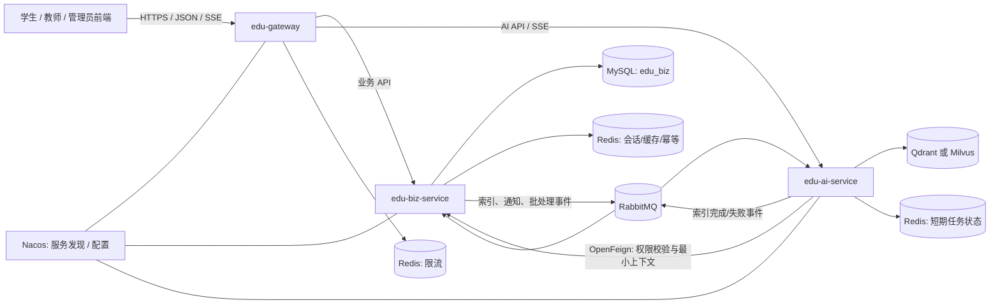
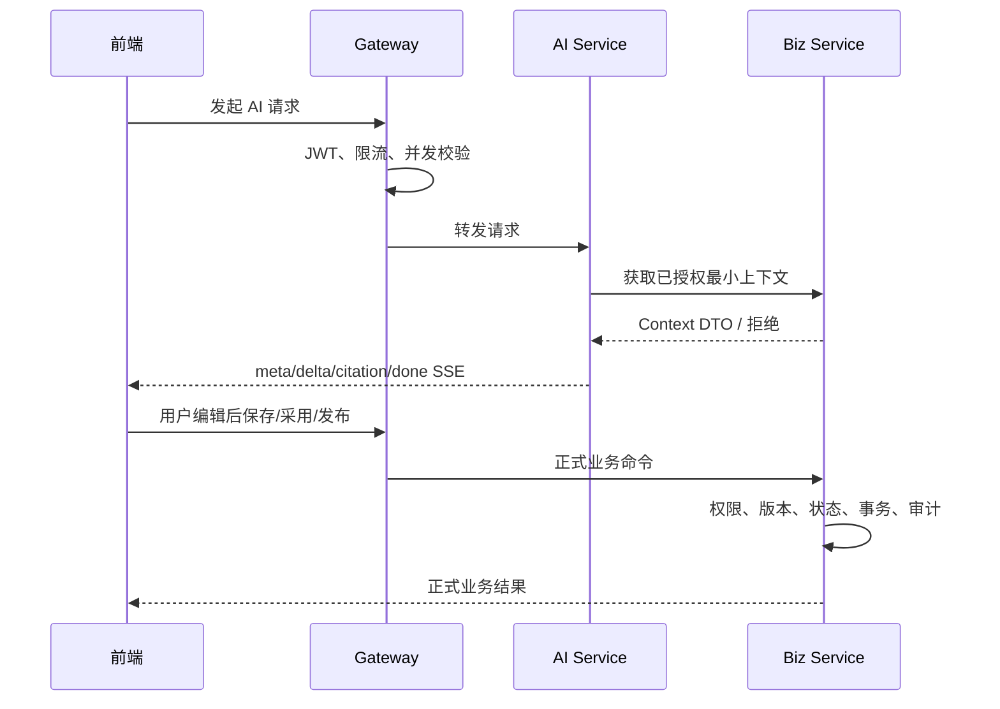

# 在线教育辅助教学系统后端架构规范

> 状态：MVP 架构基线  
> 适用技术：JDK 21、Spring Boot 3.x、Spring Cloud Alibaba、Nacos、Spring Cloud Gateway、OpenFeign、MyBatis-Plus、MySQL 8、Redis、RabbitMQ、Spring AI/LangChain4j、Qdrant/Milvus  
> 目标：在多名组员并行开发时，优先保证服务少、职责清、权限一致、数据不串库、接口可联调。

## 1. 架构原则

1. 只部署三个应用服务：`edu-gateway`、`edu-biz-service`、`edu-ai-service`。Maven 公共库不算微服务。
2. `edu-biz-service` 是用户、权限、课程、提交、成绩、考试等业务事实的唯一权威来源。
3. `edu-ai-service` 是无状态计算服务。它可以使用自己负责的 Qdrant/Milvus 向量集合和短期 Redis 任务状态，但不读取、写入 `edu-biz-service` 的 MySQL。
4. 外部请求只进入网关；服务之间的同步调用走内部接口和 OpenFeign，异步处理走 RabbitMQ。
5. 权限采用“角色/功能权限 + 资源数据范围”两级校验。隐藏前端菜单、只校验 JWT 中角色或只在网关鉴权都不够。
6. AI 生成内容永远是回答、建议、草稿、引用或任务状态。成绩、评语、课程、考试、预警状态等正式数据，只能由有权限的人在业务服务中确认后变更。
7. 先完成课程—章节—作业—提交—批改—成绩的真实闭环，再扩展考试、论坛、预警和高级统计。

## 2. 总体架构图



### 2.1 数据所有权

| 数据 | 唯一所有者 | 允许的访问方式 |
|---|---|---|
| 用户、角色、权限、课程、章节、选课、作业、提交、成绩、考试、公告、论坛、学习进度、预警、业务审计 | `edu-biz-service` | 业务 API、内部最小上下文 API、业务事件 |
| AI 会话正式记录、教师最终采用的草稿、AI 操作与人工确认关联 | `edu-biz-service` | 由业务服务落库，AI 服务返回结果但不直接保存为正式业务数据 |
| 课程资料向量、分块、Embedding 版本、索引运行状态 | `edu-ai-service` | Qdrant/Milvus；通过内部 AI API 或状态事件暴露 |
| AI 短期任务状态 | `edu-ai-service` | 独立 Redis，设置 TTL；不能成为成绩或课程状态的事实来源 |
| JWT 限流计数 | `edu-gateway` | 独立 Redis key namespace |

## 3. 三个服务的职责边界

### 3.1 `edu-gateway`

负责：

- 统一入口、路由转发、CORS、请求体大小和超时等入口策略。
- 校验 JWT 的签名、有效期、发行者、受众和会话版本。
- 清理客户端伪造的 `X-User-*`、`X-Internal-*` 等内部请求头，生成或透传 `X-Trace-Id`。
- 对 AI 接口按“用户 + 功能 + 时间窗”做 Redis 限流，并限制单用户并发流数量。
- 将网关自身产生的 401、403、404、429、503 按统一 JSON 错误结构返回。
- 转发 SSE，并关闭会破坏流式响应的聚合缓冲。

不负责：

- 不编排课程、作业、评分等业务流程。
- 不读取业务数据库，不判断教师是否拥有某门课程。
- 不把网关校验当作下游服务唯一安全边界。
- 不修改下游业务错误含义；只补充/透传 `traceId`。

### 3.2 `edu-biz-service`

负责：

- 用户、角色、权限和当前角色上下文。
- 课程、章节、课时、课程资料、选课、学习进度。
- 作业、提交、评分量规、成绩发布。
- 考试、题库、试卷、答题会话、阅卷和结果发布。
- 公告、论坛、学习预警和处理记录。
- MySQL 持久化、Redis 缓存/幂等、业务审计。
- 对每次操作执行功能权限、资源归属、对象状态三类校验。
- 为 AI 服务提供经过授权、字段最小化、可版本化的内部上下文 DTO。
- 接收 AI 结果后，由前端发起独立“保存草稿/采用建议/发布”业务命令。

不负责：

- 不在业务事务中直接调用大模型等待长时间结果。
- 不访问 AI 服务的向量库。
- 不把 AI 生成文本直接当成已发布评语、成绩、课程内容或试卷。

### 3.3 `edu-ai-service`

负责：

- 课程知识库切分、Embedding、索引、检索和版本管理。
- 课程知识库 RAG 答疑，返回可定位引用。
- 章节知识点摘要草稿、作业评语草稿、风险解释与建议、智能组卷候选建议。
- SSE 流式输出和 AI 任务状态。
- 模型供应商、提示词模板、内容安全、超时、重试和降级。
- 验证当前请求上下文；通过内部 Feign 接口向业务服务获取最小必要数据。

不负责：

- 不提供传统业务 CRUD。
- 不直接查询 `edu_biz` 数据库，也不持有业务服务的 Mapper、Entity 或数据库账号。
- 不修改成绩、正式评语、课程内容、考试、试卷、预警状态或学生计划。
- 不替业务服务决定教师是否拥有课程、学生是否已选课。
- 不返回模型原始推理过程、系统提示词、密钥或未授权资料片段。

## 4. 服务调用方式

### 4.1 外部调用

| 路径 | 目标 | 说明 |
|---|---|---|
| `/api/v1/auth/**`、`/api/v1/student/**`、`/api/v1/teacher/**`、`/api/v1/admin/**`、`/api/v1/files/**` | `edu-biz-service` | 传统业务、权限和正式数据 |
| `/api/v1/ai/**` | `edu-ai-service` | AI 请求、SSE、AI 任务状态 |
| `/actuator/**` | 不对公网开放 | 仅内网或运维访问 |

网关路由使用明确白名单，不开启“发现一个服务就自动暴露全部路径”。

### 4.2 同步内部调用

内部接口使用 `/_internal/v1/**`，不得由网关公开路由。OpenFeign 只传递集成 DTO，不传递 Entity。

主要调用方向：

```text
edu-ai-service
  → edu-biz-service /_internal/v1/ai-context/*
  → 校验用户、课程、章节、提交、预警或题库权限
  → 返回本次生成所需的最小不可变上下文快照
```

内部调用必须携带：

- 短期服务身份凭证，推荐签名的 service JWT，包含 `iss`、`aud`、`exp`。
- 原始用户 `userId`、当前角色、`traceId`；用户身份不能仅靠可伪造普通请求头。
- 明确的用途 `purpose`，如 `COURSE_QA`、`GRADING_COMMENT_DRAFT`。

内部 API 只在确有两个适配器时建立接口：生产使用 Feign adapter，测试使用 in-memory adapter。不要为了分层制造一组只透传的方法。

### 4.3 AI 交互闭环



## 5. 同步与异步处理边界

### 5.1 必须同步完成或同步确认

以下操作需要即时、明确的成功/失败结果，不能只丢入消息队列后返回成功：

- 登录、刷新令牌、退出、权限和资源范围判断。
- 课程/章节/作业/考试等 CRUD、提交审核、发布、撤回。
- 学生选课、保存作业草稿、正式提交、重交。
- 考试会话创建、答题保存、交卷。
- 教师保存评分草稿、发布评分、修改已发布成绩。
- 管理员课程审核、用户启停、内容治理。
- AI 请求前的上下文权限校验。
- 面向用户的 AI 交互生成：使用 HTTP + SSE 流式返回，不使用 RabbitMQ 替代交互连接。
- 高风险操作的核心审计记录，应与业务事务同成败。

### 5.2 适合 RabbitMQ 异步处理

| 场景 | 生产者 | 消费者 | 说明 |
|---|---|---|---|
| 课程资料发布、更新、下线后的索引/删除索引 | Biz | AI | 事件只带资源 ID、版本、对象定位；正文通过授权接口或对象存储读取 |
| 索引完成、失败、需重试 | AI | Biz | Biz 可保存面向管理页面的状态投影，不复制向量或业务实体 |
| 作业/成绩/公告发布后的站内通知 | Biz | Biz 通知消费者 | 正式发布事务先成功，通知允许稍后送达 |
| 批量预警计算、统计快照 | Biz 定时任务 | Biz 消费者 | 结果仍由 Biz 落库；消息只触发计算 |
| 批量 AI 摘要/批量分析任务 | Biz/AI | AI | 只适合明确显示任务状态的后台任务，不替代单次交互式 SSE |
| 审计归档、日志分析、指标采集 | 各服务 | 观测消费者 | 核心审计仍同步保存，归档和聚合异步 |

RabbitMQ 统一采用至少一次投递语义。消费者必须用 `eventId` 或业务幂等键去重；配置有限重试、指数退避和死信队列，禁止无限重试。

事件信封：

```json
{
  "eventId": "01J...",
  "eventType": "course.resource.index.requested.v1",
  "occurredAt": "2026-07-06T12:30:45.123Z",
  "producer": "edu-biz-service",
  "traceId": "8b7c...",
  "aggregateId": "1908874353992142848",
  "aggregateVersion": 3,
  "payload": {}
}
```

业务事务发布事件使用 transactional outbox，避免“数据库已提交但消息未发送”。MVP 也不得在事务提交前直接 `convertAndSend` 后假定两边原子成功。

## 6. 数据与契约隔离红线

### 6.1 禁止共享数据库

- `edu-biz-service` 只持有 `edu_biz` MySQL 账号。
- `edu-ai-service` 不得配置 `edu_biz` 数据源；只访问自己的向量库和短期 Redis。
- `edu-gateway` 不得配置业务 MySQL 数据源。
- 禁止跨服务 SQL、跨库 JOIN、数据库视图共享和把数据库密码复制到多个服务。

### 6.2 禁止复制业务实体

- 禁止把 `UserEntity`、`CourseEntity`、`AssignmentEntity` 等复制到 AI 或 Gateway。
- 服务间只共享/定义版本化契约 DTO，例如 `AiCourseContextV1`、`CourseResourceIndexRequestedV1`。
- 集成 DTO 只包含调用所需字段，不追求还原完整业务对象。
- 可以保存明确标记的只读投影或外部引用，但必须注明来源、版本、刷新规则和失效策略；投影不是第二份业务事实。
- 公共 Maven 模块只能放响应协议、分页、错误接口、追踪等技术契约，不得放业务 Entity、Mapper 或可变业务状态。

## 7. 权限一致性

权限校验顺序固定为：

1. JWT 是否有效，会话是否被撤销。
2. 当前角色是否允许进入 API 域。
3. 是否拥有功能权限，例如 `assignment:grade`。
4. 是否拥有资源数据范围，例如该教师是否为课程负责人/协作者。
5. 资源状态是否允许动作，例如作业是否截止、考试是否开考、成绩是否已发布。
6. 对写操作执行版本号/幂等校验并写审计。

网关完成第 1 层和入口策略；Biz 完成全部业务校验；AI 在自身入口复核身份，并通过 Biz 获取第 3～5 层授权后的上下文。任何服务都不能仅信任前端传来的 `role`、`courseId` 或权限字符串。

## 8. AI 安全与责任边界

AI 服务允许返回：

- `answer`：课程问答回答。
- `draft`：摘要、评语等可编辑草稿。
- `suggestions`：学习改进或组卷建议。
- `citations`：资料标题、页码/章节、版本和可访问定位。
- `warnings`：资料不足、题库不足、考试限制、内容安全提示。
- `taskStatus`：`PENDING/RUNNING/SUCCEEDED/FAILED/CANCELLED`。

AI 服务禁止：

- 写入或覆盖分数、正式评语、课程正文、考试、试卷、题库、预警处理状态。
- 在教师未确认时把摘要展示为已发布内容。
- 为题库中不存在的题目伪造可追溯来源。
- 返回其他课程、其他学生或未授权资料的标题、片段和链接。
- 返回模型原始思维链、系统提示词或内部安全策略。

考试进行期间，Biz 在上下文 DTO 中返回允许的 AI 模式；AI 只能按规则给概念提示或拒绝直接答案。

## 9. 可用性与可观测性基线

- 三个服务统一 `traceId`，日志和错误响应可按该 ID 关联；HTTP header 使用 `X-Trace-Id` 传输。
- Feign 调用设置连接/读取超时和有限重试；写操作默认不自动重试。
- SSE 配置首包超时、总时长、客户端取消和服务端取消传播。
- AI 服务不可用时，课程、作业、评分等传统业务仍可正常使用。
- Actuator 健康检查区分 liveness/readiness；外部依赖故障不能让实例无限接收新流量。
- 关键指标至少包括：HTTP 延迟/错误率、Feign 失败、MQ 堆积/DLQ、AI 首 token 时间、生成失败率、索引失败率、限流次数。

## 10. 推荐项目目录树

```text
zhongruan/
├─ docs/
│  ├─ backend-architecture.md
│  ├─ backend-conventions.md
│  ├─ database-conventions.md
│  ├─ team-development-workflow.md
│  ├─ module-ownership.md
│  └─ api-style.md
├─ backend/
│  ├─ pom.xml                         # 聚合父工程、BOM 和插件版本
│  ├─ edu-common/                    # 只放技术协议，不部署
│  ├─ edu-gateway/
│  ├─ edu-biz-service/
│  └─ edu-ai-service/
├─ deploy/
│  ├─ docker-compose.yml
│  ├─ nacos/
│  ├─ mysql/
│  ├─ redis/
│  ├─ rabbitmq/
│  └─ qdrant/                        # 若最终选择 Milvus，则替换本目录
├─ scripts/                          # 本地启动、健康检查、测试数据脚本
└─ frontend/ 或现有前端文件
```

`edu-common` 不是第四个服务。它只能包含 `ApiResponse`、`PageResponse`、错误码接口、请求追踪和少量通用校验；一旦出现课程、作业、用户 Entity 或业务状态枚举，应移回所有者模块。

## 11. 第一阶段最小可运行骨架

第一阶段只创建：

1. Maven 父工程：JDK 21、依赖 BOM、编译/测试/格式插件。
2. `edu-common`：统一响应、分页、异常码接口、traceId，不放业务模型。
3. `edu-gateway`：Nacos 注册、显式路由、JWT 验证骨架、CORS、统一网关错误、AI 限流占位。
4. `edu-biz-service`：MySQL/Flyway/MyBatis-Plus/Redis、全局异常、参数校验、审计字段自动填充、健康检查。
5. `edu-ai-service`：本阶段只提供可启动骨架和 Actuator 健康检查，不接入模型、向量库、RAG 或 SSE 业务。
6. 本地依赖编排：Nacos、MySQL、Redis、RabbitMQ；向量库留到 AI 阶段选型后再加入。
7. 冒烟测试：网关显式路由、未登录返回 401、Biz 可在空库执行 Flyway、AI 服务健康检查为 UP。

此阶段不批量创建业务 Controller、Service、Mapper 或表。
