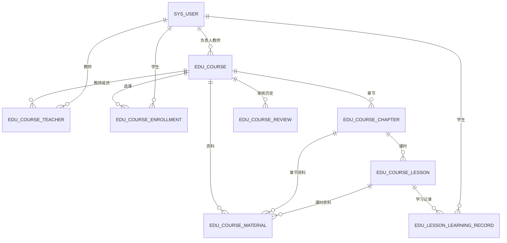

# 课程与学习基础模块设计

> 状态：阶段 2 实施基线  
> 部署位置：`edu-biz-service`  
> API 前缀：`/api/v1/teacher`、`/api/v1/student`、`/api/v1/admin/course-reviews`

## 1. 负责范围与边界

本模块负责课程、课程教师关系、选课、章节、课时、课程资料元数据、学习记录、课程学习进度聚合、课程发布状态和课程审核状态。

本模块不负责作业、考试、成绩、论坛、公告、消息、预警、AI、向量库、RAG、真实文件上传与对象存储。资料只保存 `fileKey/fileUrl` 等元数据；学生访问资料必须先经过课程权限校验，不能直接暴露内部存储路径。

AI 服务未来只通过课程模块提供的授权上下文使用 `courseId/chapterId/lessonId/materialId`。禁止复制课程表，也禁止课程模块直接调用模型或向量库。

## 2. 聚合与关系



- `edu_course.owner_teacher_id` 是唯一负责人事实来源；创建课程时同时建立 `OWNER` 教师关系。
- `edu_course_teacher` 维护 OWNER/COLLABORATOR 成员资格，同一教师同一课程只有一条关系。
- `edu_course_enrollment` 是学生与课程的唯一关系，退选/完成通过状态变更，不重复插入。
- `edu_course_review` 保存每次提交后的审核结论与原因，`edu_course.review_status` 是当前审核状态投影。
- `edu_lesson_learning_record` 对学生和课时唯一；课程进度不落在课程表，通过当前可学习课时与完成记录聚合。

## 3. 数据管理责任

| 数据 | 写入者 | 读取者 | 关键限制 |
|---|---|---|---|
| 课程元数据 | OWNER；协作者仅可编辑低风险内容 | 管理员、课程教师、合资格学生 | 关键字段只在 DRAFT 或 REJECTED 时改 |
| 教师关系 | OWNER | 课程教师、管理员 | OWNER 唯一；协作者不能管理成员 |
| 审核记录 | 管理员 | 管理员、课程教师 | 追加式结论；驳回必须有原因 |
| 选课 | 学生本人 | 学生本人、课程教师、管理员 | 仅在审核通过、已发布且选课窗口开放时建立 |
| 章节/课时 | OWNER/COLLABORATOR | 课程教师、已选学生 | 学生只读已发布且已解锁内容 |
| 资料元数据 | OWNER/COLLABORATOR | 课程教师、授权学生 | 访问继承课程/章节/课时可见性 |
| 学习记录 | 学生本人 | 学生本人；后续教师只读聚合 | 只能更新本人，完成命令幂等 |

管理员可审核与查看运行元数据，但不通过审核接口修改课程正文、课时内容或学习记录。

## 4. 状态机

### 4.1 课程运行状态与审核状态

课程运行状态：

```text
DRAFT → PENDING_REVIEW → PUBLISHED → ONGOING → FINISHED → OFFLINE
  ↑           │              │          │          │
  └─ REJECTED─┘              └──────────┴──────────┴→ OFFLINE
```

审核状态：

```text
NOT_SUBMITTED → PENDING → APPROVED
                       └→ REJECTED → PENDING（重新提交）
```

规则：

- 新建课程为 `DRAFT + NOT_SUBMITTED`。
- OWNER 提交审核后为 `PENDING_REVIEW + PENDING`，关键字段冻结。
- 管理员批准只把审核状态改为 `APPROVED`；不自动发布、不自动开放选课。
- 管理员驳回时记录原因，课程回到 `DRAFT + REJECTED`，允许教师修改后重提。
- OWNER 仅可将 `PENDING_REVIEW + APPROVED` 发布为 `PUBLISHED`。
- `ONGOING/FINISHED` 首版保留状态和查询语义，后续由明确命令或调度器推进；不根据客户端时间静默改库。
- `PUBLISHED/ONGOING` 且审核通过的课程可被学生看见；选课还需满足选课时间窗。
- `OFFLINE` 不再允许学生进入或新选课；教师和管理员仍可查看管理数据。
- `FINISHED` 不允许新选课；已选学生是否长期保留资料访问由后续保留策略扩展，本阶段按已发布内容可读处理。

### 4.2 章节与课时

```text
DRAFT → PUBLISHED → OFFLINE
```

- 课程发布不自动发布章节或课时。
- 学生可见要求课程可学习、章节 `PUBLISHED`、课时 `PUBLISHED`，并通过解锁规则。
- `IMMEDIATE` 立即解锁；`SCHEDULED` 仅在服务端时间不早于 `unlockAt` 时解锁。
- 下线或逻辑删除只影响新访问，不删除历史学习记录。

### 4.3 选课与学习记录

```text
ENROLLED → WITHDRAWN
ENROLLED → COMPLETED

NOT_STARTED → IN_PROGRESS → COMPLETED
NOT_STARTED ───────────────→ COMPLETED
```

- 退选只改变唯一选课记录状态；作业、考试、成绩关联后的复杂退选策略留到相应模块定义。
- `start` 首次创建 `IN_PROGRESS`，重复调用只刷新最后学习时间。
- `complete` 首次创建或推进到 `COMPLETED`，重复调用保持同一记录。

## 5. 权限校验顺序

所有 Service 命令按以下顺序校验，Controller 的角色注解只是第一道门：

1. JWT 已认证且具备角色入口权限。
2. 目标资源存在且未逻辑删除；敏感越权可统一返回 404。
3. 角色功能权限。
4. `CoursePermissionService` 校验课程教师关系、选课关系或管理员审核范围。
5. 课程/章节/课时/资料的跨表归属一致性。
6. 当前状态是否允许命令。
7. 乐观锁版本与唯一约束。
8. 在同一事务中写入业务事实与审计字段。

核心能力：

- `canManageCourse(userId, courseId)`：仅 OWNER。
- `canEditCourseContent(userId, courseId)`：OWNER 或 COLLABORATOR。
- `canViewCourseAsStudent(userId, courseId)`：有效选课且课程处于允许学习状态。
- `canEnrollCourse(studentId, courseId)`：审核通过、课程可发布/进行中、选课窗口开放。
- `canAccessLesson(studentId, lessonId)`：选课、课程/章节/课时发布、课时解锁全部成立。
- `canAccessMaterial(userId, materialId)`：教师成员或学生通过资料所属层级全部校验。

## 6. 内容与资料约定

- `edu_course_lesson.content` 首版统一为 Markdown；`RICH_TEXT` 表示 Markdown 富文本，不接受 HTML 和任意富文本 JSON 混用。
- `VIDEO/DOCUMENT/MIXED` 的说明文字仍是 Markdown，媒体本体由 `videoUrl` 或课程资料元数据引用。
- `visibility=COURSE` 时只要求 `courseId`；`CHAPTER` 必须有匹配课程的 `chapterId`；`LESSON` 必须同时有匹配课程/章节的 `lessonId`。
- 学生资料接口返回授权后的可访问描述；本阶段 mock 文件可返回 `accessMode=MOCK_METADATA_ONLY`，不返回服务器物理路径。

## 7. 表与关键索引

| 表 | 唯一约束 | 关键查询索引及原因 |
|---|---|---|
| `edu_course` | `course_code` | owner+status 管理列表；review_status 审核队列；status+时间目录；term/category 筛选 |
| `edu_course_teacher` | course+teacher | teacher+role 反查教师课程；course+role 校验负责人/协作者 |
| `edu_course_enrollment` | course+student | student+status 我的课程；course+status 全局选课统计 |
| `edu_course_chapter` | course+sort_order | course+status+sort_order 生成稳定大纲 |
| `edu_course_lesson` | chapter+sort_order | course/chapter+status+unlock_at 访问和大纲查询 |
| `edu_course_material` | 无业务唯一键 | course/chapter/lesson+status+sort_order 列表和权限校验 |
| `edu_lesson_learning_record` | lesson+student | student+course+status 聚合进度和最近课时 |
| `edu_course_review` | 无业务唯一键 | course+created_at 审核历史；review_status+reviewed_at 管理统计 |

不创建物理外键。OWNER 唯一以课程表单值字段为权威，并由事务服务保证 OWNER 关系一致；数据库唯一约束保证关系和学习事实不重复。

## 8. 后续模块依赖

- 作业模块：引用 `courseId/chapterId/lessonId`，通过课程权限接口确认教师可编辑、学生已选且内容已发布；不得直接修改课程表。
- 考试模块：引用 `courseId`，复用课程成员和发布范围；考试自身状态独立。
- AI 服务：调用未来的内部授权上下文接口，输入当前用户、课程/课时/资料 ID，获得最小且已授权的资料描述；不得查 Biz 数据库或依赖裸 URL。

## 9. 独占维护范围

课程模块负责人独占维护：

- `com.zhongruan.edu.biz.course/**`。
- Flyway `V2__create_course_tables.sql`、`V3__create_course_review_table.sql` 及后续课程 migration。
- `R__local_course_test_data.sql`。
- 本文和 `course-api-contract.md`。
- 本文列出的八张表及 `/api/v1/*/courses`、`/chapters`、`/lessons`、`/materials`、`/course-reviews` 路径。

禁止课程模块修改 auth Entity/Mapper/Security 结构、作业/考试/成绩表、AI 服务或网关业务逻辑。公共错误码、父 POM、基础审计类如需调整必须单独 PR。

## 10. 本阶段不做的扩展

- 课程负责人转移、审核撤回、多级审批、定时自动状态迁移。
- 复杂前置课时依赖、拖拽排序、学习时长防作弊。
- 实体文件上传、对象存储、转码、病毒扫描、签名 URL。
- 作业/考试存在后的退选清理与成绩保留策略。
- 进度缓存、离线统计、消息通知、AI 索引与 RAG。
