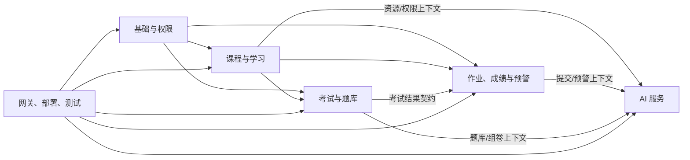

# MVP 模块归属与协作边界

> 本文划分的是代码/数据负责人，不是新增微服务。除 AI 和 Gateway 外，业务模块都部署在同一个 `edu-biz-service` 中。

## 1. 使用方式

- 项目启动时把“负责人 A～F”替换为真实姓名，并为每个模块指定至少一名备份评审人。
- 模块负责人拥有本模块表、公开 interface、API 前缀、错误码和状态枚举的最终评审权。
- 所有者不等于唯一编码者；其他人可以贡献，但必须由所有者 review。
- 跨模块需求先改契约，再由提供方和消费方分别实现。
- `sys_audit_log`、安全配置、父 POM、Flyway 目录和公共 API schema 属于高风险公共区，不得“顺手修改”。

## 2. 总览

| 模块 | 建议负责人 | 部署位置 | MVP 优先级 |
|---|---|---|---|
| 基础与权限 | 负责人 A | `edu-biz-service` | P0 |
| 课程与学习 | 负责人 B | `edu-biz-service` | P0 |
| 作业、成绩与预警 | 负责人 C | `edu-biz-service` | P0 作业/成绩；P1 预警 |
| 考试与题库 | 负责人 D | `edu-biz-service` | P1 |
| AI 服务 | 负责人 E | `edu-ai-service` | P0 课程答疑/评语；其余 P1 |
| 网关、部署、测试与联调 | 负责人 F | `edu-gateway` + 工程公共区 | P0 |

公告、论坛首期归“课程与学习”模块，后续体量明显增大时再在 Biz 内拆 package，不新增微服务。

## 3. 基础与权限模块

### 3.1 负责范围

- 登录、刷新令牌、退出、密码安全、当前角色切换。
- 用户、角色、权限、用户角色关系、角色权限关系。
- Spring Security 公共认证上下文、权限码类型和资源权限扩展接口。
- 高风险业务审计框架和审计查询权限。
- Biz 内统一文件对象、上传会话和存储 adapter；业务模块仍负责判断文件用途和资源归属。

### 3.2 负责的表

```text
sys_user
sys_role
sys_permission
sys_user_role
sys_role_permission
sys_user_session
sys_audit_log
sys_file_object
sys_outbox_event（公共基础设施，事件生产方按规范写入）
```

组织/院系/班级如进入 MVP，由该负责人先定义所有权；不得由课程模块临时创建重复组织表。

### 3.3 负责的接口前缀

```text
/api/v1/auth/**
/api/v1/users/me/**
/api/v1/admin/users/**
/api/v1/admin/roles/**
/api/v1/files/**
/_internal/v1/identity/**
```

### 3.4 依赖

- 依赖 Redis 保存会话版本、刷新令牌状态和必要缓存。
- 为所有业务模块提供 `CurrentActor`、`PermissionCode`、审计 interface。
- 不依赖课程/作业 Mapper；资源归属由业务模块实现自己的检查器。

### 3.5 不允许越界修改

- 不直接修改课程、作业、成绩、考试表。
- 不把 `ADMIN/TEACHER/STUDENT` 判断散落到业务模块；提供类型安全角色和权限接口，但不替业务模块判断具体资源归属。
- 不在 JWT 放完整可变业务对象或敏感资料。

### 3.6 联调前提供

- 学生、教师、管理员测试账号及固定用户 ID。
- 登录、刷新、退出、`/users/me` 接口契约。
- 文件上传/下载接口、purpose 枚举、大小/MIME 限制和本地测试存储配置。
- JWT claims 说明、过期/撤销规则、测试公钥。
- 权限码清单和“功能权限 + 资源范围”示例。
- 401、403、会话失效错误样例。

## 4. 课程与学习模块

### 4.1 负责范围

- 课程分类、课程、课程教师/协作者、课程审核。
- 章节、课时、课程资料、选课、学习进度。
- 课程公告、课程论坛和管理员内容治理的基础数据。
- 学生/教师/管理员对同一课程的不同视图和资源数据范围。

### 4.2 负责的表

```text
edu_course_category
edu_course
edu_course_teacher
edu_course_review
edu_chapter
edu_lesson
edu_course_resource
edu_enrollment
edu_lesson_progress
edu_ai_conversation
edu_ai_message
edu_lesson_summary
edu_announcement
edu_announcement_audience
edu_forum_post
edu_forum_comment
edu_forum_report
```

课程资料文件本体存对象存储/文件存储，表中只保存 object key、版本、MIME、大小和权限范围。

### 4.3 负责的接口前缀

```text
/api/v1/student/courses/**
/api/v1/student/announcements/**
/api/v1/student/forums/**
/api/v1/teacher/courses/**
/api/v1/teacher/announcements/**
/api/v1/teacher/forums/**
/api/v1/admin/course-categories/**
/api/v1/admin/courses/**
/api/v1/admin/course-reviews/**
/api/v1/admin/announcements/**
/api/v1/admin/forum-moderation/**
/_internal/v1/ai-context/courses/**
/_internal/v1/ai-context/resources/**
```

### 4.4 依赖

- 基础权限：当前用户、角色、课程权限码、审计。
- 作业/考试模块：课程详情中的近期任务只通过 application query interface 获取摘要，不直接查对方 Mapper。
- AI 服务：课程资料发布/更新/下线后发送索引事件；接收索引状态事件。
- AI 会话正文和教师已确认发布的课时摘要由本模块通过 Biz 用例持久化；AI 服务只返回流和草稿。

### 4.5 不允许越界修改

- 不修改提交、成绩、考试答案和 AI 向量集合。
- 不替作业/考试模块定义其状态枚举。
- 不把 AI 摘要草稿直接写为 `PUBLISHED`；正式发布必须经过教师命令。
- 不允许管理员接口绕过教师职责直接修改课程正文；治理动作只能审核、下线或按明确权限处理。

### 4.6 联调前提供

- 一门草稿课程、一门已审核/进行中课程。
- 教师—课程授权、学生选课关系。
- 至少两章、三个课时、一份带版本的课程资料。
- 学生可见/不可见/未解锁三类样例。
- 课程权限矩阵、课程/课时状态流转。
- 课程详情、章节学习、内部 AI context DTO 和资源索引事件 schema。

## 5. 作业、成绩与预警模块

### 5.1 负责范围

- 作业创建、发布、关闭和提交规则。
- 学生作业草稿、正式提交、重交和附件关系。
- 评分量规、教师评分草稿、评语、成绩发布和更正。
- 学习预警、证据、学生已读/计划、教师干预和关闭。
- AI 评语/预警建议的“人工采用”业务命令和审计。

### 5.2 负责的表

```text
edu_assignment
edu_assignment_attachment
edu_assignment_submission
edu_submission_attachment
edu_submission_version
edu_rubric
edu_rubric_item
edu_submission_rubric_score
edu_grade
edu_grade_version
edu_warning
edu_warning_evidence
edu_warning_action
```

是否需要全部版本表由表设计评审决定；一旦简化，仍必须保证提交/成绩历史可追踪。

### 5.3 负责的接口前缀

```text
/api/v1/student/assignments/**
/api/v1/student/grades/**
/api/v1/student/progress/**
/api/v1/teacher/assignments/**
/api/v1/teacher/courses/{courseId}/gradebook/**
/api/v1/teacher/warnings/**
/_internal/v1/ai-context/submissions/**
/_internal/v1/ai-context/warnings/**
```

### 5.4 依赖

- 基础权限：当前身份、`assignment:submit`、`assignment:grade`、`grade:publish` 等权限和审计。
- 课程与学习：课程、选课、教师授权、章节/作业归属、进度数据。
- AI 服务：评语草稿和风险解释；AI 结果通过前端/契约返回后由本模块执行采用或保存。
- RabbitMQ：成绩/作业发布后的通知、异步预警计算。

### 5.5 不允许越界修改

- 不直接更新课程、选课或用户角色表。
- 不让 AI 服务写 `edu_grade`、正式评语、`edu_warning.status`。
- 不读取其他课程学生提交用于生成当前学生评语。
- 不把“逾期”“待批改”等展示状态硬编码成与数据库冲突的第二套状态。

### 5.6 联调前提供

- 一份已发布作业、截止前/截止后时间场景。
- 未提交、草稿、已提交、退回重交、已批改五类提交样例。
- 一套评分量规、已保存未发布成绩和已发布成绩。
- 一条包含缺交/低分/进度落后证据的预警。
- 学生本人、同课程教师、无关教师三组权限样例。
- 评语 AI context DTO、预警 AI context DTO、采用草稿接口和错误码。

## 6. 考试与题库模块

### 6.1 负责范围

- 题库范围：本人私有、课程共享、学校公共。
- 考试创建、时间窗、试卷编排、发布和取消。
- 考试会话、答题保存、断线恢复、交卷、阅卷、结果发布。
- AI 智能组卷建议的约束输入、候选题采用和最终试卷确认。

### 6.2 负责的表

```text
edu_question_bank
edu_question
edu_question_version
edu_question_option
edu_exam
edu_exam_candidate
edu_exam_paper
edu_exam_paper_question
edu_exam_session
edu_exam_answer
edu_exam_grade
```

### 6.3 负责的接口前缀

```text
/api/v1/student/exams/**
/api/v1/teacher/exams/**
/api/v1/teacher/question-bank/**
/_internal/v1/ai-context/papers/**
```

### 6.4 依赖

- 基础权限：身份、考试/题库权限、审计。
- 课程与学习：课程授权、选课/考生范围、知识点和章节。
- 作业成绩模块：结果发布后进入课程成绩构成时，通过明确接口/事件同步，不直接写对方表。
- AI 服务：传入允许的题库 ID、题目摘要和组卷约束，接收候选题 ID/理由，不接受虚构题目。

### 6.5 不允许越界修改

- 不直接写课程成绩总表；发布考试成绩通过成绩模块 interface。
- 不把答案、未发布试题或其他课程私有题目发给无权 AI 请求。
- 不允许 AI 自动确认试卷、发布考试或发布成绩。
- 不修改课程/选课 Mapper 判断考生资格。

### 6.6 联调前提供

- 一套覆盖易/中/难和多知识点的题库样例。
- 一场待开始考试、一个进行中会话和一个已交卷会话。
- 题库权限、考试时间窗、重复进入/交卷幂等规则。
- 智能组卷 context DTO、候选题返回、分布校验和题库不足错误样例。

## 7. AI 服务模块

### 7.1 负责范围

- 模型 provider adapter、Embedding、向量存储 adapter、提示词版本。
- 课程资料索引/删除/重建和索引状态。
- 课程 RAG 答疑、章节摘要草稿、评语草稿、风险解释/建议、组卷建议。
- SSE `meta/delta/citation/done/error` 协议实现。
- AI 超时、取消、限额配合、内容安全和无可靠来源处理。

### 7.2 负责的数据

不负责 Biz 业务表。AI 所有者负责：

```text
Qdrant/Milvus collection: course_knowledge_v1
Redis namespace: ai:task:*
Redis namespace: ai:conversation-runtime:*（仅短期；正式会话由 Biz 持久化）
RabbitMQ queues/exchanges for indexing
prompt/config version metadata
```

向量 payload 只保存检索所需引用：`courseId/resourceId/resourceVersion/chunkId/locator/accessScope`，不得复制用户、成绩、完整提交等业务实体。

### 7.3 负责的接口前缀

```text
/api/v1/ai/course-qa/**
/api/v1/ai/lesson-summaries/**
/api/v1/ai/grading-comments/**
/api/v1/ai/risk-advice/**
/api/v1/ai/paper-suggestions/**
/api/v1/ai/tasks/**
/_internal/v1/indexes/**
```

### 7.4 依赖

- 基础权限/Gateway：有效用户身份、限流结果、traceId。
- Biz 各模块的 `/_internal/v1/ai-context/**`：权限校验后的最小上下文。
- 课程资源索引事件、Qdrant/Milvus、模型供应商、AI 自有 Redis。

### 7.5 不允许越界修改

- 不配置 Biz MySQL 数据源，不引用 Biz Entity/Mapper。
- 不直接修改成绩、评语、课程、课时、题库、试卷、预警或学生计划。
- 不自作主张扩大资料范围，不泄露无权限资料标题/片段。
- 不返回模型原始推理过程、系统 prompt、密钥。
- 不把 AI 失败升级成传统业务不可用。

### 7.6 联调前提供

- AI API 和 SSE 事件样例，包括中止、无来源、权限不足。
- 引用结构、`citationId` 与资源定位规则。
- 索引事件/状态事件 schema、幂等键、重试和 DLQ 规则。
- 本地 fake model/vector adapter，使无外部 key 时也能联调协议。
- 模型/向量库配置清单和健康检查。

## 8. 网关、部署、测试与联调模块

### 8.1 负责范围

- Gateway 路由、JWT 入口校验、CORS、内部头清理、AI 限流、SSE 转发。
- Nacos、Docker Compose、环境变量、健康检查和本地启动脚本。
- Maven 父工程/BOM、CI、测试基础设施和端到端联调。
- OpenAPI 聚合、契约检查、测试数据装载说明。

### 8.2 负责的数据/配置

无业务表。负责：

```text
Redis namespace: gateway:rate-limit:*
Redis namespace: gateway:ai-concurrency:*
Nacos service/config names
Docker volumes/network/ports
CI test reports
```

### 8.3 负责的接口前缀

- 对外所有 `/api/v1/**` 的路由策略，但不拥有业务接口语义。
- 网关自身错误与健康检查。
- `/actuator/**` 的内网暴露策略。

### 8.4 依赖

- 基础权限提供 JWT 签发和 claims 规范。
- 所有模块提供 OpenAPI、健康检查、测试数据和服务超时需求。
- AI 模块提供 SSE 和限流维度。

### 8.5 不允许越界修改

- 不在 Gateway 写课程/作业/评分业务逻辑。
- 不直连业务 MySQL 或向量库。
- 不替下游重新包装成另一套错误码。
- 不在部署文件写入真实密码/key。
- 不为方便而自动暴露所有 Nacos 服务路由或内部接口。

### 8.6 联调前提供

- 一键启动依赖、端口表、环境变量模板和健康检查命令。
- 三角色登录后的网关路由验证。
- CORS、401、403、429、503 和 SSE 断流测试。
- 空库 Flyway、Redis/RabbitMQ/Qdrant 连通和服务发现验证。
- 端到端测试报告与失败复现步骤。

## 9. 跨模块依赖图



依赖方向不代表可以直接访问数据库；跨模块使用 application interface，跨服务使用内部 HTTP contract 或事件。

## 10. 第一阶段联调数据包

第一次全链路联调前，团队统一提供一份可重复初始化的数据包：

1. 三类账号各 1 个；另加“无关教师”用于越权测试。
2. 一门进行中课程，负责人教师、无关教师、两名已选学生。
3. 两章、三个已发布/未发布/锁定课时和一份可索引资料。
4. 一份已发布作业，两条不同状态提交和一套量规。
5. 一份未发布成绩和一份已发布成绩。
6. 一条带三项证据的学习预警。
7. 一条课程资料索引成功状态和一条失败状态。
8. 固定错误场景：401、403、404、409、429、AI 无来源、SSE 中断。

数据包必须通过脚本/Flyway dev seed 可重复生成，不能依赖某位组员手工改共享数据库。

## 11. 越界变更处理

当需求确实跨越所有权时：

1. 请求方先提交契约/字段需求和业务理由。
2. 数据/接口所有者确认是否应扩展现有 interface，避免复制数据或绕过权限。
3. 合并顺序通常为：契约 → 提供方 → 消费方 → E2E。
4. PR 明确标记跨模块影响并同时请求双方 owner review。
5. 紧急修复后也必须补文档、测试和所有权确认，不能形成长期“谁都能改”的公共区。
