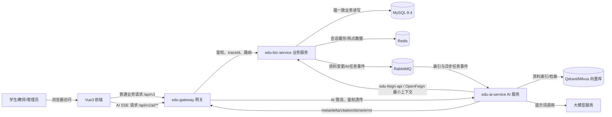
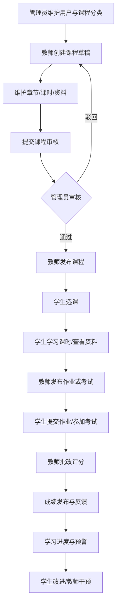
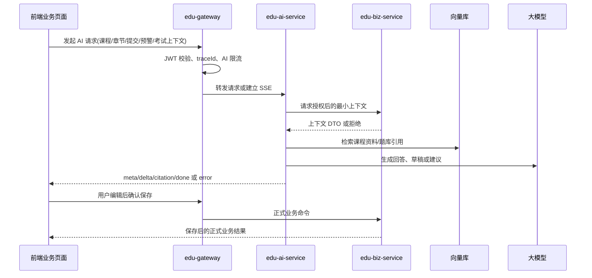
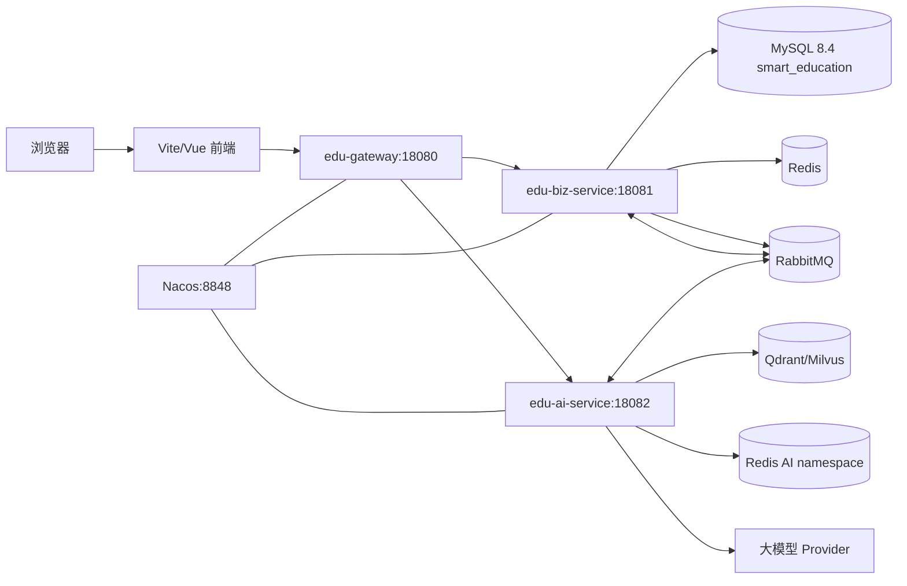

# 在线教育辅助教学系统

# 项目设计文档

文档类型：概要设计与详细设计结合版

项目选题：选题 8

小组名称/组号：第一组

文档版本：V1.0

生成日期：2026-07-08

适用范围：本设计文档承接需求分析说明书，面向前端、后端业务、后端 AI、测试联调与答辩说明使用。

## 目录

在 Word 版本中已插入可更新目录字段。Markdown 版本可使用编辑器的大纲功能查看标题层级。

# 第一章 引言

## 1.1 编写目的

本《项目设计文档》用于承接《在线教育辅助教学系统需求分析说明书》，把已经明确的业务需求转换为可开发、可联调、可测试的系统设计方案。文档重点说明系统总体架构、服务边界、功能模块、数据库、接口、前端、安全、部署、测试和协作计划，作为第一组成员分工、编码实现、接口评审、联调验收和答辩说明的依据。

本项目设计的核心不是单纯展示课程信息，而是让学生、教师、管理员围绕课程学习、作业批改、考试安排、成绩反馈、论坛互动、公告治理和学习预警形成完整教学闭环。AI 能力只作为嵌入业务流程的辅助能力，负责生成回答、草稿、解释、引用和建议，不直接替代教师、管理员或学生完成关键业务决策。

## 1.2 项目概述

在线教育辅助教学系统面向高校教学场景，服务对象包括学生、教师和管理员。系统通过前后端分离的 B/S 架构，为学生提供选课、章节学习、资料查看、作业提交、考试安排、成绩查询、课程论坛和学习预警；为教师提供课程建设、章节课时维护、作业发布、批改评分、题库与组卷、学情跟踪和课程公告；为管理员提供用户治理、课程分类、课程审核、公告管理、论坛治理、统计分析和 AI 运行状态概览。

在智能化能力方面，系统基于课程资料和章节内容建设课程知识库，提供课程 RAG 智能答疑、章节知识点摘要、作业批改评语草稿、学习风险解释和智能组卷建议。AI 功能必须继承当前用户的业务权限和资源范围，并显示引用来源、上下文和异常状态。教师或管理员确认之前，AI 结果不得写入正式成绩、正式评语、正式课程内容、正式试卷或正式预警处理状态。

## 1.3 设计原则

1. 前后端分离：前端只负责展示、交互和状态引导，后端负责最终权限校验、业务规则和数据一致性。
2. 轻量微服务：只部署 `edu-gateway`、`edu-biz-service`、`edu-ai-service` 三个应用服务，`edu-common` 作为公共 Maven 模块，`edu-feign-api` 作为服务间契约模块，二者都不作为独立微服务部署。
3. 业务与 AI 解耦：传统业务事实归 `edu-biz-service` 管理，AI 服务不直接访问业务数据库，不直接写正式业务数据。
4. 角色权限与资源权限结合：先校验角色和功能权限，再校验课程归属、选课关系、作业归属、成绩归属、资料范围和题库范围。
5. 数据一致性优先：课程、选课、作业、成绩、考试和预警等关键操作在业务服务中同步完成，必要时使用事务、乐观锁和幂等键。
6. AI 结果人工确认：AI 输出是草稿、建议、解释或引用，关键业务数据必须由教师或管理员确认后写入。
7. 接口契约优先：REST API、SSE 事件、错误码、DTO/VO、内部上下文契约先评审再开发。
8. 可维护、可测试、可扩展：模块按业务域组织，公共能力保持稳定，测试覆盖正常、异常、越权、状态冲突和 AI 降级场景。

## 1.4 参考资料

本文使用的资料以本机和当前仓库可确认内容为准，不伪造论文或不存在的资料。

- `E:\武汉理工实训选题.docx`：老师提供的实训选题说明，确认选题 8、业务范围、AI 范围和技术栈参考。
- `第1组-在线教育辅助教学系统需求规格说明书.docx`：确认项目名称、组号、需求边界和功能优先级。
- `sitemap.md`：学生端、教师端、管理员端路由规划和 AI 业务入口。
- `ui-spec.md`：Vue 3、Frappe UI、Tailwind、三端页面布局、AI 组件和状态展示规范。
- `wireframes.md`：学生学习首页、章节学习、教师工作台、批改工作台、管理员看板、智能组卷、学习预警等文字版低保真原型。
- `docs/database-conventions.md`、`docs/module-ownership.md`、`docs/migration-register.md`、`docs/team-division.md`：数据库、模块归属、三人协作和 Bootstrap SQL 规则。
- `docs/api-reference.md`：项目唯一的前后端 API 文档，包含接口路径、状态、权限、错误码和联调规则。
- `backend/README.md`、`backend/pom.xml`、各服务 `application.yml`、Bootstrap SQL 和现有 Java/Vue 代码：确认实际技术栈、服务端口、表结构、接口路径和实现状态。
- Vue、Vite、Frappe UI、Tailwind、Spring Boot、Spring Cloud Gateway、Spring Cloud Alibaba、MyBatis-Plus、Spring AI 和 Qdrant 官方文档：作为技术实现参考。

# 第二章 系统总体设计

## 2.1 系统设计目标

业务目标：系统要支持高校课程教学的真实闭环，覆盖用户权限、课程建设、选课学习、章节课时、资料管理、作业提交、教师批改、考试安排、成绩统计、论坛公告和学习预警，避免只形成静态课程展示页面。

教学目标：学生能够清楚知道下一步学习任务、待交作业、考试安排、成绩反馈和风险原因；教师能够连续处理课程内容、作业批改、成绩发布、学情预警和组卷；管理员能够维护基础数据、审核课程、治理内容并掌握系统运行状态。

AI 辅助目标：AI 必须嵌入课程、章节、作业、预警和组卷场景，提供有上下文、有来源、有权限边界的答疑、摘要、评语草稿、风险解释和组卷建议。AI 不直接决定成绩、发布试卷、修改课程正文或关闭预警。

协作开发目标：前后端和双人后端成员以契约先行为原则协作。后端 A 维护 Biz 主链和正式业务事实，后端 B 维护 AI、考试题库、平台治理、网关和部署联调，公共模块、单一 Bootstrap SQL、Gateway、JWT 和 API 契约通过评审后合并。

## 2.2 系统总体架构

系统采用 B/S 架构和前后端分离模式。前端使用 Vue 3 + Vite + TypeScript + Frappe UI + Tailwind，按学生端、教师端、管理员端组织路由和页面。外部请求统一进入 `edu-gateway`，网关负责路由、JWT 初步鉴权、跨域、traceId、AI 接口限流和 SSE 转发。传统业务由 `edu-biz-service` 负责，数据存储在 MySQL 8.4，使用 MyBatis-Plus，并由唯一的 `online_education_bootstrap.sql` 初始化空库。AI 能力由 `edu-ai-service` 负责，当前使用 Spring AI、OpenFeign 和 SSE，后续可接入 Qdrant 向量检索与 Redis 短期任务状态。服务间同步调用的 DTO 与 Feign Client 统一放在 `edu-feign-api`，避免 AI 或 Gateway 直接依赖 Biz 的 Entity、Mapper 或 Service。

图 2-1 系统总体架构图



架构调用链路按业务一致性和 AI 辅助边界区分：

- 前端普通业务请求链路：前端 → Gateway → Biz → MySQL/Redis。课程审核、选课、作业评分、成绩发布等强一致业务由 Biz 同步处理。
- 前端 AI 请求链路：前端 → Gateway → AI → Biz 获取授权上下文 → 向量库/大模型 → SSE 返回前端。AI 只获得当前用户被授权访问的最小上下文。
- 课程资料索引链路：Biz 发布课程资料变更事件 → RabbitMQ → AI 消费事件 → 切分/向量化/索引。该链路用于资料索引和异步任务，不承担成绩、审核等强一致写入。
- AI 结果正式保存链路：前端展示 AI 结果 → 用户编辑或确认 → 前端调用 Biz → Biz 写入正式业务数据。AI 不直接写 Biz MySQL，不直接修改正式成绩、正式评语、课程正文、正式试卷和预警状态。

## 2.3 服务划分设计

表 2-1 服务职责划分表

| 服务/模块 | 职责 | 不负责什么 | 主要依赖 | 对外接口类型 | 与其他服务调用关系 | 后续扩展方向 |
|---|---|---|---|---|---|---|
| `edu-gateway` | 统一入口、显式路由、JWT 验证、CORS、traceId、AI 限流、SSE 转发、网关级错误响应 | 不编排课程、作业、成绩、考试业务；不读业务数据库；不替 Biz 判断资源归属 | Spring Cloud Gateway、Redis、Nacos、edu-common | HTTP、SSE 转发 | 外部前端只访问网关；网关转发到 Biz 或 AI | 更细粒度限流、灰度路由、网关审计、SSE 超时控制 |
| `edu-biz-service` | 用户、权限、课程、选课、章节、资料、学习记录、作业、考试、成绩、论坛、公告、预警等正式业务事实 | 不直接调用大模型等待结果；不访问向量库；不把 AI 文本直接当正式业务结果 | Spring Boot、MyBatis-Plus、MySQL、单一 Bootstrap SQL、Nacos | REST API、内部 context API、业务事件 | 对 AI 提供授权后最小上下文；接收 AI 结果后由用户确认再落库 | 教学闭环维护、规则扩展、统计与审计 |
| `edu-ai-service` | 授权课程问答、课时摘要、评语、风险解释、组卷建议和 SSE 流式输出；后续接入 RAG | 不提供传统业务 CRUD；不连接 Biz MySQL；不修改成绩、评语、课程、试卷、预警状态 | Spring AI 1.1.8、OpenFeign、Nacos；后续 Qdrant/Redis | `/api/v1/ai/**`、SSE、内部 Biz context 调用 | 向 Biz 请求授权上下文并向前端返回草稿；后续通过事件维护索引 | 真实模型接入、向量检索、提示词版本、内容安全和 AI 管理 |
| `edu-common` | 统一响应、分页、错误码接口、JWT 工具、traceId、基础异常、少量通用工具 | 不放业务 Entity、Mapper、Service、DTO 和业务状态枚举 | Maven 公共模块 | 代码依赖，不部署 | Gateway、Biz、AI 共同依赖 | 稳定技术契约、通用错误和上下文工具 |
| `edu-feign-api` | 跨服务 Feign Client、内部请求/响应 DTO、服务间契约常量 | 不放数据库 Entity、Mapper、业务 Service、Controller 实现或前端 VO | Maven 契约模块、Spring Cloud OpenFeign、edu-common | 代码依赖，不部署 | AI 通过该模块调用 Biz 的 `/_internal/v1/**`；Biz 实现相同契约 | 后续补 AI 上下文、题库上下文、索引事件 DTO 和契约测试 |

### 2.3.1 `edu-gateway` 网关服务

`edu-gateway` 负责所有外部 HTTP 和 SSE 请求入口。它校验 JWT 的签名和有效期，清理客户端伪造的内部请求头，生成或透传 `X-Trace-Id`，按白名单将 `/api/v1/auth/**`、`/api/v1/student/**`、`/api/v1/teacher/**`、`/api/v1/admin/**` 转发到 Biz，将 `/api/v1/ai/**` 转发到 AI，并对 AI 接口执行 Redis 限流和并发控制。

网关不负责课程、作业、成绩、考试等业务决策，不访问业务数据库，也不作为唯一安全边界。下游 Biz 和 AI 服务仍需重新校验用户身份、角色、资源范围和对象状态。

### 2.3.2 `edu-biz-service` 业务服务

`edu-biz-service` 是正式业务事实来源。当前代码已经实现认证与教师审核、课程学习、文件、作业成绩、论坛预警、题库考试、公告、课程分类、管理统计和 Biz 侧 AI 采用记录；后续扩展仍应由该服务维护正式业务事实。

业务服务对外提供 RESTful API，对内提供 `/_internal/v1/**` 授权上下文契约给 AI 服务。每次写操作必须在服务端校验功能权限、资源归属、对象状态、版本号和幂等条件，并在必要时写入审计记录。

### 2.3.3 `edu-ai-service` AI 服务

`edu-ai-service` 是无状态或弱状态的 AI 计算服务。当前仓库已接入 Spring AI 1.1.8、授权上下文、SSE 课程问答、课时摘要草稿、模型未配置降级、安全过滤器和 traceId；真实模型可通过配置启用，Qdrant/RAG 与其他 AI 场景仍待后续实现。AI 服务只保存自身索引、短期任务状态和运行指标，不持有 Biz 数据库账号，也不复制 Biz Entity。

AI 请求必须先经过 Gateway 限流，再由 AI 服务向 Biz 请求最小授权上下文。AI 返回 `answer`、`draft`、`suggestions`、`citations`、`warnings` 或 `taskStatus`。正式采用、保存、发布、撤回和关闭动作全部回到 Biz 服务完成。

### 2.3.4 `edu-common` 公共模块

`edu-common` 只放稳定通用能力，例如 `ApiResponse`、`PageResponse`、`ApiError`、错误码接口、JWT 签发与解析、traceId 工具和基础异常。它不能承载课程、作业、考试、AI 会话等业务模型，否则会造成 Gateway、Biz、AI 三方对业务事实的共享和误用。

### 2.3.5 `edu-feign-api` 服务间契约模块

`edu-feign-api` 是本次修正后新增的 Maven 子模块，不是第四个应用服务。它负责保存服务间同步调用的 Feign Client 接口、内部 DTO 和版本化上下文契约，例如 AI 服务调用 Biz 的 `/_internal/v1/ai-context/course` 获取授权后的最小课程上下文。该模块只能依赖 `edu-common` 和必要的契约注解，不能放 Biz 数据库实体、Mapper、应用服务实现，也不能承载前端展示 VO。前后端公开 REST API 以 `docs/api-reference.md` 为准；服务间内部调用以 `edu-feign-api` 中的 Java 契约为准。

## 2.4 系统核心业务流程设计

表 2-2 核心业务流程说明表

| 流程 | 参与角色 | 触发条件 | 处理步骤 | 关键权限校验 | 正常结果 | 异常情况 |
|---|---|---|---|---|---|---|
| 登录与角色进入系统 | 学生、教师、管理员 | 用户提交账号密码 | Biz 校验账号状态与 BCrypt 密码；加载角色权限；签发 JWT；前端按角色进入 `/student`、`/teacher` 或 `/admin` | 用户启用、密码正确、角色有效 | 返回 accessToken、当前用户、角色和权限 | 密码错误返回 401；无角色返回 403；禁用账号拒绝登录 |
| 教师建课、维护章节、提交审核、发布课程 | 教师、管理员 | 教师创建或修改课程 | 教师创建课程草稿；维护章节、课时和资料；负责人提交审核；管理员批准；负责人发布课程 | 教师必须是负责人；协作者不能发布；管理员审核 | 课程进入已发布或进行中状态，学生可在开放范围内选课 | 课程编号重复、版本冲突、审核未通过、非负责人越权 |
| 学生选课、学习章节、查看资料、完成课时 | 学生 | 学生浏览可选课程或进入已选课程 | 学生选课；查看已发布章节和课时；读取授权资料；开始或完成课时；系统聚合进度 | 学生本人、课程已发布、选课有效、章节课时已发布且解锁 | 形成选课记录、学习记录和进度百分比 | 未选课、资料不可见、课时未解锁、课程下线 |
| 作业发布、提交、批改、评分与反馈 | 教师、学生 | 教师发布作业，学生提交 | 教师创建作业并发布；学生保存草稿或正式提交；教师查看提交、评分、写评语并发布反馈 | 教师负责课程；学生已选课程；提交在截止和重交规则内 | 学生看到已发布成绩和评语 | 截止后提交、重复提交、越权批改、分数版本冲突 |
| 考试安排、试卷编排、考试记录和成绩发布 | 教师、学生 | 教师创建考试计划 | 教师维护题库；安排考试；编排试卷；学生按时间进入考试；交卷后教师阅卷并发布结果 | 教师负责课程；学生已选；考试时间窗有效；试卷已确认 | 学生查看考试安排和已发布结果 | 题库不足、未到开考时间、重复进入考试、成绩未发布 |
| 学习预警生成与处理 | 学生、教师、系统 | 定时规则或成绩/进度事件触发 | Biz 根据进度落后、缺交、低分生成预警；学生查看依据；教师处理或关闭 | 学生只能看本人；教师只能看负责课程；AI 仅解释授权数据 | 预警有等级、证据、处理状态和历史记录 | 数据不足、误报纠正、AI 解释失败、教师越权查看 |
| AI 课程答疑 | 学生、教师、AI 服务 | 用户在章节学习或 AI 页提问 | Gateway 限流；AI 向 Biz 获取授权课程资料上下文；检索向量库；SSE 返回回答与引用 | 用户有课程或章节访问权；资料已发布且可见 | 返回 meta、delta、citation、done | 无可靠来源、权限不足、AI 超时、SSE 中断 |
| AI 批改评语草稿 | 教师、AI 服务 | 教师在批改工作台点击生成 | Biz 提供提交、量规、问题点最小上下文；AI 生成可编辑评语草稿；教师编辑并确认 | 教师负责课程和作业；只能读取当前提交 | 生成草稿，教师确认后 Biz 写正式评语 | AI 失败不影响评分；不得自动填分或覆盖教师评语 |
| AI 章节摘要 | 教师、AI 服务、学生 | 教师在课时编辑页生成摘要 | AI 基于课程资料和课时正文生成摘要草稿；教师编辑并发布；学生只看已发布摘要 | 教师负责课程；学生仅访问已发布内容 | 摘要成为课程内容的一部分并留来源 | 资料不足、草稿未确认、章节未发布 |
| AI 智能组卷建议 | 教师、AI 服务 | 教师进入具体考试试卷编排页 | 教师设置知识点、题型、难度、分值；AI 基于授权题库给候选题和分布建议；教师采纳或修改 | 教师有题库和课程权限；候选题必须来自授权题库 | 保存教师确认后的试卷草稿 | 题库不足、不满足分值、AI 不得虚构题目或自动发布 |

图 2-2 核心业务流程图



图 2-3 AI 辅助教学流程图



## 2.5 角色与权限总体设计

表 2-3 角色权限概览表

| 权限维度 | 学生 | 教师 | 管理员 | AI 服务权限继承规则 | 前端控制 | 后端资源级权限 |
|---|---|---|---|---|---|---|
| 系统入口 | `/student` 学习首页、课程、任务、成绩、论坛、AI 学习助手 | `/teacher` 教学工作台、课程、作业批改、考试题库、预警、互动 | `/admin` 数据看板、用户、课程治理、公告、论坛治理、统计、AI 管理 | 继承触发页面的当前用户、角色和业务上下文 | 路由守卫隐藏不可用菜单 | Biz/AI 重新校验 JWT、角色和权限 |
| 课程访问 | 只能看已选且已发布课程；可选课程只显示公开字段 | 只能管理本人负责或协作课程 | 可审核和治理课程，不默认替教师改正文 | 只能使用用户有权访问的课程资料 | 课程卡片与按钮按角色展示 | 校验选课关系、课程教师关系、课程状态 |
| 作业成绩 | 只能提交本人作业、查看本人已发布成绩 | 只能批改负责课程的提交，发布成绩 | 查看聚合统计和治理信息，不默认改分 | 可生成评语草稿，不写正式分数 | 操作按钮禁用或隐藏 | 校验作业归属、提交归属、成绩发布状态 |
| 考试题库 | 只能参加本人有资格的考试，查看已发布结果 | 管理负责课程考试与有权题库 | 查看运行监控和治理指标 | 组卷建议只使用授权题库 | 路由限制考试入口 | 校验考试时间窗、试卷状态、题库范围 |
| 论坛公告 | 学生在已选课程发帖评论，查看目标范围公告 | 教师管理本课程论坛和公告 | 管理员全局公告和内容治理 | 可解释异常或建议，不替代治理决定 | 菜单和操作区按权限显示 | 校验课程成员、发布范围、治理权限 |
| 预警与 AI | 只看本人预警和建议 | 看负责课程学生预警并记录干预 | 看统计和运行状态，不默认看私人 AI 正文 | AI 不扩大数据范围，不展示模型内部推理 | AI 面板显示上下文和来源 | 校验本人/负责课程/资料可见范围 |

前端权限控制只是体验优化，不能构成安全边界。用户手动修改 URL、请求体或资源 ID 时，后端仍必须校验课程归属、选课关系、作业归属、成绩归属、资料可见范围、题库所属课程和资源当前状态。

## 2.6 设计范围与实施阶段说明

本节用于明确首版系统的设计范围和实施优先级。这里的“阶段”表示系统设计和落地的优先顺序，不表示每日开发进度，也不用于夸大当前仓库已经实现的功能。当前仓库已有用户认证、网关、课程学习主链和部分课程接口的基础能力，作业、考试、预警和 AI 场景仍应按本文档设计继续建设。

表 2-4 设计范围与实施阶段说明表

| 模块名称 | 设计定位 | 实施阶段 | 是否属于 MVP 核心功能 | 是否属于后续扩展 | 说明 |
|---|---|---|---|---|---|
| 用户登录与权限 | 基础支撑 | 第一阶段 | 是 | 否 | 支撑 JWT 登录、当前用户、角色权限和资源级权限校验，是所有业务入口的前置条件。 |
| 课程、选课、章节、课时、资料 | 教学主链 | 第一阶段 | 是 | 否 | 承担教师建课、学生选课、章节学习、资料访问和学习记录，是在线教育辅助教学系统的核心业务骨架。 |
| 学习进度 | 学习过程记录 | 第一阶段 | 是 | 否 | 根据课时完成情况、资料访问、章节学习记录计算进度，为学生待办、教师学情和预警提供依据。 |
| 作业提交、批改与成绩 | 教学闭环 | 第二阶段 | 是 | 否 | 支撑作业发布、学生提交、教师批改、成绩发布和反馈查看，形成教学评价闭环。 |
| AI 课程知识库答疑 | AI 核心能力 | 第二阶段 | 是 | 否 | 基于课程资料和章节上下文进行 RAG 答疑，返回答案、引用和置信提示，不作为无上下文聊天页。 |
| AI 批改评语草稿 | 教学辅助能力 | 第二阶段 | 是 | 否 | 为教师生成评语草稿，正式评语必须由教师编辑或确认后通过 Biz 保存。 |
| 章节知识点摘要 | 学习辅助能力 | 第二阶段 | 是 | 否 | 根据课程资料和章节内容生成知识点摘要，面向学生预习复习和教师备课。 |
| 学习预警与风险解释 | 教学干预能力 | 第三阶段 | 是 | 可增强 | 基于进度、逾期、成绩和互动数据形成预警，AI 只解释风险原因和建议，不直接改变预警状态。 |
| 考试安排与智能组卷建议 | 考核辅助能力 | 第三阶段 | 首版简化 | 是 | 首版聚焦考试安排、题库、试卷编排和组卷建议，不建设复杂监考、实时防作弊和自动判卷引擎。 |
| 完整在线考试引擎 | 高复杂度考试能力 | 后续扩展 | 否 | 是 | 后续可扩展限时答题、断点续考、随机抽题、防切屏、自动判分和监考日志等能力。 |
| 论坛与公告 | 教学互动与通知 | 第二阶段 | 是 | 可增强 | 支撑课程论坛、评论、课程公告、系统公告和内容治理，首版以课程内互动和通知可达为重点。 |
| 管理员治理与统计 | 平台治理 | 第二阶段 | 是 | 可增强 | 支撑用户、课程审核、内容治理、公告和基础统计，复杂 BI 可后续扩展。 |
| AI 管理后台 | AI 运维治理 | 后续扩展 | 否 | 是 | 后续用于查看 AI 任务、模型配置、索引状态、调用额度和异常统计，首版可先保留运行状态概览。 |
| 部署、测试与演示数据 | 交付支撑 | 全阶段 | 是 | 否 | 包括本地依赖、单一 Bootstrap SQL、Docker Compose、测试账号、演示课程、作业、成绩、预警和 AI 示例数据。 |

本节用于明确设计范围和实施优先级，不作为每日开发进度记录。当前认证、课程、作业、成绩、论坛、预警、考试答题、公告、分类和统计主链已实现；课程问答与课时摘要已具备 Spring AI 雏形，其他 AI 能力仍按后续规划推进。精确接口状态以 `docs/api-reference.md` 为准。

# 第三章 功能模块设计

第三章按业务域拆分模块。每个模块都围绕职责、角色、输入输出、规则、数据表、接口、权限、异常和模块关系展开。当前仓库已实现传统业务主链和考试/平台治理；AI 已完成课程问答、课时摘要、评语草稿、风险解释和智能组卷，向量索引/RAG 仍是后续范围。

表 3-1 功能模块设计表

| 模块 | 模块职责 | 主要角色 | 输入输出 | 涉及数据表 | 关键接口 | 权限控制与异常处理 | 与其他模块关系 |
|---|---|---|---|---|---|---|---|
| 用户与权限 | 登录、JWT、当前用户、角色权限、资源级权限、操作审计 | 学生、教师、管理员 | 输入账号密码和 Token；输出当前用户、角色、权限、错误码 | `sys_user`、`sys_role`、`sys_permission`、`sys_user_role`、`sys_role_permission` | `/api/v1/auth/login`、`/api/v1/auth/me`、`/api/v1/auth/logout` | BCrypt、JWT、401/403、traceId、审计 | 所有模块的身份入口 |
| 课程与学习 | 课程创建、审核、发布、协作者、选课、章节、课时、资料、进度 | 学生、教师、管理员 | 输入课程、章节、课时、资料和学习命令；输出课程详情、大纲、进度 | `edu_course`、`edu_course_teacher`、`edu_course_enrollment`、`edu_course_chapter`、`edu_course_lesson`、`edu_course_material`、`edu_lesson_learning_record`、`edu_course_review` | 教师课程、学生课程、管理员审核、学习进度接口 | 课程 owner/协作者、学生选课、发布/解锁状态 | 作业、考试、AI、论坛、公告、预警的上游上下文 |
| 作业、批改与成绩 | 作业发布、提交、逾期、批改、评分、评语、成绩统计 | 学生、教师 | 输入作业、提交、评分和发布命令；输出提交状态、分数、反馈 | `edu_assignment`、`edu_assignment_attachment`、`edu_assignment_submission`、`edu_grade_record` | `/teacher/courses/{courseId}/assignments`、`/student/assignments/{assignmentId}` | 截止时间、重交、版本冲突、教师负责课程 | 调用 AI 评语草稿，触发预警和统计 |
| 考试与题库 | 题库、考试安排、试卷编排、考试记录、成绩统计 | 学生、教师 | 输入题目、考试计划、试卷约束；输出考试安排、试卷草稿、结果 | `edu_exam`、`edu_question_bank`、`edu_question`、`edu_question_option`、`edu_exam_paper`、`edu_exam_paper_question`、`edu_exam_attempt`、`edu_exam_answer` | `/teacher/exams`、`/teacher/question-bank`、`/student/exams` | 时间窗、题库范围、试卷发布状态 | AI 智能组卷建议，成绩模块后续接入 |
| 论坛与公告 | 课程论坛、主题、回复、课程公告、系统公告、内容治理 | 学生、教师、管理员 | 输入主题、回复、公告、治理命令；输出列表和状态 | `edu_forum_topic`、`edu_forum_reply`、`edu_announcement` | 学生/教师论坛、课程公告、系统公告与治理接口 | 课程成员可见、教师课程治理、管理员全局治理、公告受众过滤 | 与课程、通知、管理员治理关联 |
| 学习预警 | 规则、等级、触发依据、学生展示、教师处理、AI 解释 | 学生、教师、系统 | 输入进度、缺交、低分和处理命令；输出预警、证据、建议 | `edu_learning_warning`、`edu_warning_evidence` | `/api/v1/student/warnings`、`/api/v1/teacher/courses/{courseId}/warnings`、`/api/v1/teacher/warnings/{warningId}/handle` | 只看本人或负责课程；AI 不能关闭预警 | 依赖课程、作业、成绩，调用 AI 风险解释 |
| AI 智能辅助 | 知识库构建、RAG、摘要、评语草稿、风险解释、组卷建议、引用和降级 | 学生、教师、管理员、AI 服务 | 输入业务上下文和问题；输出回答、草稿、建议、引用、任务状态 | Biz 侧 `edu_ai_generation_record`；AI 侧向量库与 Redis 任务状态 | `/api/v1/ai/courses/{courseId}/qa/stream`、`/api/v1/ai/lessons/{lessonId}/summary-draft`、`/api/v1/ai/submissions/{submissionId}/comment-draft`、`/api/v1/ai/warnings/{warningId}/explanation`、`/api/v1/ai/exams/paper-suggestions` | 继承业务权限、限流、SSE、无来源、超时、人工确认 | 嵌入课程、作业、预警、考试，不独立替代业务 |
| 管理员治理与统计 | 用户、课程分类、审核、公告、论坛治理、数据统计、AI 状态 | 管理员 | 输入治理命令和筛选；输出统计、待办、审计和状态 | `edu_course_category`、`edu_announcement` 与业务聚合 | `/api/v1/admin/users`、`/api/v1/admin/course-reviews`、`/api/v1/admin/statistics`、`/api/v1/ai/admin/status` | 管理员权限细分，敏感正文默认不展示 | 连接所有业务域的治理和运行视角 |

## 3.1 用户与权限模块设计

用户与权限模块负责登录认证、JWT 签发与解析、当前用户信息、角色与权限、资源级权限和操作日志。当前代码已使用 BCrypt 校验密码、JWT 作为无状态登录凭证，并通过 `STUDENT`、`TEACHER`、`ADMIN` 三类角色控制入口。

主要功能包括：用户登录、退出、查询当前用户、角色权限加载、方法级权限校验、资源级权限校验和审计记录。登录输入为用户名和密码，输出为 accessToken、tokenType、expiresAt、user、roles 和 permissions。异常场景包括密码错误、Token 过期、账号禁用、无角色、角色越权和资源越权。

核心规则：密码只保存 BCrypt hash；Token 有效期由服务端配置；前端不得自行构造角色；每个业务模块不能只依赖角色，还必须校验资源归属。操作日志不得记录明文密码、Token、模型 key、考试答案、学生作业全文或私人 AI 会话正文。

## 3.2 课程与学习模块设计

课程与学习模块是当前仓库已实现最完整的业务域，负责课程创建、课程审核、发布下线、教师负责人和协作者、学生选课退选、章节课时、资料元数据、学习记录和进度计算。

教师创建课程时，系统建立负责人关系并校验课程编号唯一。协作者可以维护教学内容，但不能管理课程成员、提交审核、发布或下线课程。管理员审核课程时记录审核结论、原因、审核人和时间。学生只能选择已通过审核、已发布或进行中且开放选课的课程；学习时只能访问已选课程内已发布、已解锁的章节、课时和资料。

输入包括课程信息、章节信息、课时正文、资料元数据、选课命令、学习开始和完成命令。输出包括教师课程列表、学生课程目录、课程详情、章节课时树、资料访问对象、学习记录和课程进度。进度口径为 `completedLessons / availableLessons * 100`，其中可学习课时必须已发布、所属章节已发布且已解锁。

## 3.3 作业、批改与成绩模块设计

作业、批改与成绩模块负责把课程学习结果转化为可反馈、可统计、可追踪的教学评价数据。模块与课程、选课、学习进度、AI 评语草稿和成绩查询关联，但正式评分与正式评语始终由教师确认后写入 Biz。

模块职责包括作业发布、提交窗口控制、学生提交、教师批改、成绩发布、反馈查看和 AI 评语草稿接入。主要角色为教师和学生，管理员仅在治理或申诉场景中查看必要的统计和异常信息。涉及数据表包括 `edu_assignment`、`edu_assignment_attachment`、`edu_assignment_submission`、`edu_grade_record` 和 `edu_ai_generation_record`。

### 3.3.1 作业发布与状态流转设计

教师在自己负责或协作的课程下创建作业，填写标题、说明、截止时间、满分、是否允许重交、附件要求和发布范围。创建后的作业先处于草稿状态，教师检查无误后发布。发布动作由 Biz 校验课程归属、教师角色、课程是否已发布以及截止时间是否合法。

作业状态建议包括 `DRAFT`、`PUBLISHED`、`CLOSED`、`ARCHIVED`。状态流转为：草稿可编辑和删除；发布后学生可见并可提交；到达截止时间或教师手动关闭后进入关闭状态；课程归档或教学周期结束后进入归档状态。已发布作业若需要修改核心评分规则，应保留修改记录，避免影响已提交学生的评价依据。

### 3.3.2 学生提交与重交规则设计

学生只能对已选且已发布课程中的作业提交内容。提交内容可包含文本、附件引用、代码仓库链接或其他资料地址。提交前 Biz 校验学生选课关系、作业状态、截止时间、附件合法性和是否允许重交。

提交状态建议包括 `DRAFT`、`SUBMITTED`、`LATE_SUBMITTED`、`RETURNED`、`GRADED`、`WITHDRAWN`。允许重交时，系统保留提交版本号和最后有效版本；不允许重交时，重复提交返回统一错误码。逾期提交是否允许由作业配置决定，允许时标记为 `LATE_SUBMITTED`，批改端需提示教师。

### 3.3.3 教师批改与成绩发布设计

教师进入批改工作台后查看待批改提交、学生信息、作业内容、附件、提交时间和历史反馈。教师可填写得分、正式评语、是否退回重交、是否发布给学生。保存草稿时不向学生展示，发布成绩时生成或更新 `edu_grade_record`，并将提交状态置为 `GRADED`。

成绩发布属于强一致业务，由 Biz 在同一业务事务中校验提交归属、作业归属、教师课程权限、得分范围和幂等版本。若同一提交被多个页面同时批改，使用乐观锁或版本字段避免覆盖。学生端只能查看自己已发布的成绩和反馈。

### 3.3.4 AI 评语草稿接入设计

AI 评语草稿由教师在批改页面主动触发。前端携带课程、作业、提交 ID 调用 AI 服务，AI 服务再向 Biz 请求授权后的最小上下文，例如作业要求、评分维度、学生提交摘要和教师可见资料。AI 返回评语草稿、引用来源和风险提示，不直接写入正式评语。

教师可对 AI 草稿进行编辑、删除或采纳。只有当教师点击保存或发布时，前端才调用 Biz 保存正式评语。AI 草稿可记录在 `edu_ai_generation_record` 或提交表的 `ai_comment_draft_id` 中，用于追踪生成状态和异常，但不得替代教师确认。

### 3.3.5 作业成绩模块关键类设计

| 类或接口 | 所属层 | 职责 | 主要输入输出 | 调用关系 |
|---|---|---|---|---|
| `AssignmentController` | Controller | 提供作业创建、发布、关闭、详情和列表接口 | `AssignmentCreateRequest`、`AssignmentVO` | 调用 `AssignmentApplicationService` |
| `AssignmentSubmissionController` | Controller | 提供学生提交、重交、教师查看提交接口 | `SubmissionCreateRequest`、`SubmissionVO` | 调用 `AssignmentSubmissionService` |
| `AssignmentGradeController` | Controller | 提供批改、成绩发布、学生查看反馈接口 | `GradePublishRequest`、`GradeVO` | 调用 `AssignmentGradingService` |
| `AssignmentApplicationService` | Service | 编排作业发布、状态流转和课程权限校验 | 课程 ID、作业配置 | 调用课程权限、作业仓储 |
| `AssignmentSubmissionService` | Service | 处理提交窗口、重交、附件引用和提交版本 | 作业 ID、学生 ID、提交内容 | 调用选课校验、提交仓储 |
| `AssignmentGradingService` | Service | 处理教师批改、成绩发布、乐观锁和反馈可见性 | 提交 ID、得分、评语 | 调用成绩仓储、操作日志 |
| `AiCommentDraftClient` | Adapter | 在批改页面请求 AI 评语草稿 | 作业上下文、提交摘要 | 由前端或 Biz 经 AI 接口触发，正式保存仍回到 Biz |
| `AssignmentCreateRequest` | DTO | 承载作业创建参数 | 标题、说明、截止时间、满分 | Controller 入参 |
| `SubmissionCreateRequest` | DTO | 承载学生提交内容 | 文本、附件、版本 | Controller 入参 |
| `GradePublishRequest` | DTO | 承载批改和发布参数 | 得分、评语、采纳的 AI 草稿 ID | Controller 入参 |
| `AssignmentVO`、`SubmissionVO`、`GradeVO` | VO | 面向前端返回作业、提交、成绩和反馈数据 | Long ID 以字符串返回 | Controller 出参 |

主要异常包括课程不存在、教师无课程权限、学生未选课、作业未发布、提交已截止、重复提交、附件不可访问、得分超出范围、批改版本冲突、AI 草稿生成失败。异常统一返回错误码和 `traceId`，前端据此提示并保留用户已输入内容。

## 3.4 考试与题库模块设计

考试与题库模块服务于课程考核和教师命题。首版设计聚焦题库管理、考试安排、试卷编排和智能组卷建议，不把系统设计成完整商业在线考试引擎，避免在首次交付中引入复杂监考、防作弊、实时答题和高并发判卷能力。

### 3.4.1 首版考试功能边界

首版考试功能覆盖课程内题库维护、考试基本信息、试卷结构、题目选择、考试记录和成绩统计。学生端可查看考试安排和成绩结果，教师端可维护题目、生成试卷草稿、发布考试安排和查看统计。在线答题、实时监考、自动判客观题、断点续考和防切屏日志作为后续扩展。

### 3.4.2 题库管理设计

题库以课程为归属单位，题目包含题型、题干、选项、参考答案、解析、知识点、难度、分值建议和状态。教师只能管理自己负责或协作课程的题目，管理员可进行治理和违规内容处理。题目状态可设计为 `DRAFT`、`ENABLED`、`DISABLED`，禁用题目不参与组卷建议。

### 3.4.3 考试安排设计

考试安排记录考试名称、课程、开始时间、结束时间、试卷 ID、发布状态、可见范围和成绩发布策略。考试状态建议包括 `DRAFT`、`SCHEDULED`、`ONGOING`、`FINISHED`、`CANCELLED`。首版重点保证安排可见、时间合法、试卷绑定正确和权限可控。

### 3.4.4 试卷编排设计

试卷由题目清单、题型结构、总分、难度分布和知识点覆盖组成。教师可手动选题，也可基于 AI 组卷建议生成草稿后调整。正式试卷必须由教师确认发布，AI 不直接发布正式试卷。

### 3.4.5 智能组卷建议设计

AI 组卷建议接收课程 ID、章节范围、知识点、题型比例、难度比例、总分和题量等条件。AI 服务向 Biz 获取授权题库摘要和课程上下文，返回建议题目组合、覆盖说明、难度说明和不足提示。教师可采纳、替换或删除建议题目，最后由 Biz 保存正式试卷。

### 3.4.6 后续在线考试引擎扩展设计

首版不建设复杂在线考试引擎的原因是该能力涉及答题会话、计时、断网恢复、随机抽题、防作弊、自动判分和高并发提交，复杂度明显高于课程辅助教学 MVP。本次已提供基础 `edu_exam_attempt` 和 `edu_exam_answer` 表用于演示答题闭环；后续若扩展复杂在线考试，应新增 `edu_exam_session`、`edu_exam_proctor_log`、`edu_exam_auto_grade_rule` 等表，并新增恢复会话、自动判分、监考日志上报和异常申诉接口。

## 3.5 论坛与公告模块设计

论坛与公告模块负责课程论坛、帖子、评论、课程公告、系统公告和内容治理。课程论坛是已选学生和课程教师之间的课程内讨论区，不是全站匿名社区。公告分为课程公告和系统公告，学生按课程选课关系、公告受众和发布状态查看。

学生可在已选课程发帖、评论、编辑或删除本人未锁定内容；教师可治理本人负责课程的帖子和评论；管理员可处理全局举报、隐藏恢复内容、发布系统公告和查看治理记录。所有治理操作应保留操作者、对象、原因和时间。

异常场景包括学生访问未选课程论坛、被锁定内容再次编辑、公告撤回后继续访问、管理员越权查看私人 AI 会话正文等。

## 3.6 学习预警模块设计

学习预警模块用于发现学习过程中的风险并帮助教师进行教学干预。预警不等同于处分或最终评价，生成依据必须可追踪，处理过程必须保留证据，AI 只负责风险解释和改进建议。

预警生成依据包括学习进度低于课程要求、连续未完成课时、作业逾期或低分、考试成绩异常、课程互动长期缺失、资料访问不足和教师手动标记。系统可按课程周期定时计算，也可在作业发布、成绩发布或课时完成后触发增量计算。

预警等级建议包括 `LOW`、`MEDIUM`、`HIGH`，分别对应轻度提醒、教师关注和重点干预。预警状态建议包括 `OPEN`、`PROCESSING`、`RESOLVED`、`DISMISSED`。关闭或误报处理必须填写原因，例如数据延迟、学生请假、课程调整或教师确认无需干预。

学生端展示预警等级、触发原因、关联课程、建议行动和可查看的证据摘要。教师端展示班级预警列表、风险排序、学生学习轨迹、处理记录和干预建议。管理员只查看统计和异常趋势，不直接查看不必要的学生私人学习细节。

AI 风险解释流程为：教师在预警详情页触发解释，AI 根据授权后的学习记录、作业、成绩和课程进度生成原因说明和改进建议。AI 不改变预警等级或状态，不直接通知学生，也不生成带歧视性或绝对化判断的结论。

预警证据保留在 `edu_learning_warning` 的 `evidence_json` 字段或关联证据表中，至少包含触发规则、计算时间、关键数据快照和相关业务 ID。后续复算不覆盖历史证据，只新增处理记录或版本，保证答辩和教学复盘时可解释。

## 3.7 AI 智能辅助模块设计

AI 智能辅助模块不是独立聊天机器人，而是嵌入课程、章节、作业、预警和组卷等业务场景的辅助能力。AI 只生成回答、草稿、解释、引用和建议；不直接修改正式成绩、正式评语、课程正文、正式试卷或预警状态；不展示模型原始推理过程；必须继承当前用户在业务上下文中的权限。

### 3.7.1 课程知识库构建

课程资料由 Biz 负责上传、审核、发布和权限控制。资料发布或更新后，Biz 通过 RabbitMQ 发送资料变更事件，AI 服务消费事件后进行文本抽取、切分、向量化和索引写入。索引记录保留资料 ID、资料版本、章节或课时定位、切片摘要和向量库主键。资料下线后，AI 索引应同步标记失效或重建。

### 3.7.2 RAG 智能答疑

学生在章节学习页或课程资料页发起问题，前端携带课程、章节、课时和会话 ID 调用 AI SSE 接口。AI 服务先向 Biz 请求授权后的最小上下文，确认学生已选课且资料可见，再检索向量库并调用大模型生成答案。返回内容包含 `meta`、`delta`、`citation`、`done` 或 `error` 事件，必须展示引用来源；若无可靠来源，应明确提示“未找到可引用资料”。

### 3.7.3 章节知识点摘要

教师或学生在章节页面触发摘要生成。AI 根据已发布的章节资料、课时内容和知识点标签生成摘要、重点概念、易错点和复习建议。生成结果默认为临时结果或草稿，若要沉淀为课程正式内容，必须由教师确认后通过 Biz 保存。

### 3.7.4 作业批改评语草稿

教师在批改页触发评语草稿生成。AI 输入包括作业要求、评分维度、学生提交摘要、教师可见资料和可选评分结果。输出为评语草稿、改进建议和引用提示。AI 不写入 `edu_grade_record`，不发布成绩，教师采纳后由批改接口保存正式评语。

### 3.7.5 学习风险解释

预警详情页可触发 AI 风险解释。AI 使用授权后的学习进度、作业、成绩和互动摘要生成风险原因、改进建议和教师干预建议。AI 不改变预警等级、状态或处理结果，所有状态变更仍由教师或管理员在 Biz 中完成。

### 3.7.6 智能组卷建议

教师在组卷页输入知识点范围、题型比例、难度比例和总分，AI 根据授权题库摘要和课程目标生成组卷建议。AI 输出建议题目组合、覆盖说明、难度说明和不足提示，不直接创建正式试卷。教师确认后由 Biz 保存试卷。

### 3.7.7 AI 结果引用与人工确认

AI 返回结果必须保留引用来源或无可靠来源提示。引用来源包括课程资料 ID、资料版本、章节或课时定位、片段摘要和相似度。正式业务数据写入链路统一为：前端展示 AI 结果，用户编辑或确认，前端调用 Biz，Biz 执行权限校验和事务写入。

### 3.7.8 AI 异常与降级处理

AI 失败、超时、无资料、限流或 SSE 中断时，前端应展示可理解的失败状态并允许重试。答疑场景可提示查看课程资料；评语草稿失败时不影响教师手动批改；摘要失败时不影响章节学习；组卷建议失败时不影响教师手动选题。AI 任务状态建议包括 `PENDING`、`RUNNING`、`SUCCEEDED`、`FAILED`、`CANCELLED`，错误信息只展示业务可理解内容，不暴露模型 Key、内部路径、SQL 或堆栈。

### 3.7.9 AI 与业务服务的 seam 设计

AI 与 Biz 之间的 seam 是“授权上下文查询”和“AI 任务结果回传”，不是共享数据库。Biz 保持用户、课程、作业、考试、成绩和预警的事实来源；AI 保存会话、消息、引用、任务状态和向量索引。这样可以让 AI 实现替换为 Spring AI、LangChain4j 或 fake adapter 时，不影响 Biz 的核心业务规则和测试 surface。

## 3.8 管理员治理与统计模块设计

管理员治理与统计模块负责用户管理、课程分类、课程审核、公告管理、论坛治理、数据统计和 AI 服务运行状态概览。管理员可以查看全局聚合数据和必要治理明细，但不默认替教师修改课程正文、作业分数、考试分数，也不默认浏览学生私人 AI 会话正文。

管理员数据看板首屏建议展示总用户、运行课程、本周活跃率、待审核或异常数量、课程状态、教学活动趋势、公告审核队列、论坛举报和 AI 索引失败提醒。统计结果要能下钻到业务列表，并按学期、院系、课程和时间范围筛选。

# 第四章 数据库设计

## 4.1 数据库设计原则

业务数据库使用 MySQL 8.4，schema 为 `smart_education`。表名采用小写下划线命名，认证表以 `sys_` 开头，教学业务表以 `edu_` 开头，AI 会话与任务表以 `ai_` 开头。主键统一为 `BIGINT` 雪花 ID，Java 使用 `Long`，对外 JSON 序列化为字符串。

核心表统一包含 `id`、`created_at`、`created_by`、`updated_at`、`updated_by`、`deleted`、`version` 七类审计字段。逻辑删除使用 `deleted=0/1`，并发更新使用乐观锁 `version`。当前开发与演示环境只维护 `online_education_bootstrap.sql`，该脚本只用于空库初始化；已有业务数据的环境必须先备份并制定独立升级方案。

项目不使用数据库物理外键强绑定，原因是三服务边界要求清晰、后续可扩展为跨服务契约，同时避免误用级联删除破坏历史学习记录、成绩、提交和审计。关联完整性通过应用服务事务、唯一约束、复合索引、状态校验和一致性审计保证。

## 4.2 核心实体关系

图 4-1 数据库核心 ER 图

```mermaid
erDiagram
    sys_user ||--o{ sys_user_role : has
    sys_role ||--o{ sys_user_role : assigned
    sys_role ||--o{ sys_role_permission : grants
    sys_permission ||--o{ sys_role_permission : contains
    sys_user ||--o{ edu_course_teacher : teaches
    edu_course_category ||--o{ edu_course : classifies
    edu_course ||--o{ edu_course_teacher : has
    sys_user ||--o{ edu_course_enrollment : enrolls
    edu_course ||--o{ edu_course_enrollment : selected_by
    edu_course ||--o{ edu_course_chapter : contains
    edu_course_chapter ||--o{ edu_course_lesson : contains
    edu_course ||--o{ edu_course_material : owns
    edu_course_lesson ||--o{ edu_lesson_learning_record : tracked_by
    sys_user ||--o{ edu_lesson_learning_record : learns
    edu_course ||--o{ edu_course_review : reviewed
    edu_course ||--o{ edu_assignment : has
    edu_assignment ||--o{ edu_assignment_submission : receives
    sys_user ||--o{ edu_assignment_submission : submits
    edu_assignment_submission ||--o{ edu_grade_record : graded_as
    edu_course ||--o{ edu_exam : schedules
    edu_course ||--o{ edu_question_bank : owns
    edu_question_bank ||--o{ edu_question : contains
    edu_question ||--o{ edu_question_option : has
    edu_exam ||--o{ edu_exam_paper : has
    edu_exam_paper ||--o{ edu_exam_paper_question : includes
    edu_question ||--o{ edu_exam_paper_question : selected
    edu_exam ||--o{ edu_exam_attempt : receives
    edu_exam_attempt ||--o{ edu_exam_answer : contains
    edu_course ||--o{ edu_forum_topic : discusses
    edu_forum_topic ||--o{ edu_forum_reply : has
    edu_course ||--o{ edu_announcement : publishes
    edu_course ||--o{ edu_learning_warning : warns
    sys_user ||--o{ edu_learning_warning : receives
    sys_user ||--o{ edu_ai_generation_record : requests
```



## 4.3 核心表设计

表 4-1 核心数据表设计表

| 表名 | 中文含义 | 主要字段 | 主键 | 关键唯一约束 | 关键索引 | 说明 |
|---|---|---|---|---|---|---|
| `sys_user` | 用户表 | username、password_hash、display_name、user_status、审计字段 | id | `uk_user_username` | `idx_user_status_deleted` | 已实现；保存学生、教师、管理员基础账号 |
| `sys_role` | 角色表 | role_code、role_name、enabled、审计字段 | id | `uk_role_code` | role_code | 已实现；内置 STUDENT、TEACHER、ADMIN、SUPER_ADMIN |
| `sys_permission` | 权限表 | permission_code、permission_name、enabled、审计字段 | id | `uk_permission_code` | permission_code | 已实现；保存稳定功能权限码 |
| `sys_user_role` | 用户角色关系 | user_id、role_id、审计字段 | id | `uk_user_role(user_id,role_id)` | user_id、role_id | 已实现；支持用户拥有多个角色 |
| `sys_role_permission` | 角色权限关系 | role_id、permission_id、审计字段 | id | `uk_role_permission(role_id,permission_id)` | role_id、permission_id | 已实现；角色到功能权限映射 |
| `edu_course_category` | 课程分类表 | name、sort_order、enabled、审计字段 | id | `uk_course_category_name` | enabled/order | 已实现；管理员治理，课程创建时校验启用状态 |
| `edu_course` | 课程表 | course_code、name、summary、owner_teacher_id、status、review_status、term、start_at、end_at | id | `uk_course_code` | owner/status、review、catalog、term/category | 已实现；课程运行状态与审核状态分离 |
| `edu_course_teacher` | 课程教师关系 | course_id、teacher_id、role、审计字段 | id | `uk_course_teacher(course_id,teacher_id)` | teacher、course_role | 已实现；OWNER/COLLABORATOR |
| `edu_course_enrollment` | 学生选课关系 | course_id、student_id、status、enrolled_at、withdrawn_at | id | `uk_course_enrollment(course_id,student_id)` | student_status、course_status | 已实现；退选用状态流转保留历史 |
| `edu_course_chapter` | 课程章节 | course_id、title、description、sort_order、status、published_at | id | 无全局唯一 | course_order、course_status | 已实现；章节逻辑删除 |
| `edu_course_lesson` | 课时表 | course_id、chapter_id、title、content_type、content、video_url、unlock_type、status | id | 无全局唯一 | chapter_order、course_status、unlock | 已实现；学生最小学习单元 |
| `edu_course_material` | 课程资料元数据 | course_id、chapter_id、lesson_id、name、material_type、file_key、file_url、visibility、status | id | 无全局唯一 | course、chapter、lesson | 已实现；只保存元数据，不存二进制 |
| `edu_lesson_learning_record` | 课时学习记录 | course_id、chapter_id、lesson_id、student_id、status、started_at、completed_at、study_seconds | id | `uk_lesson_student(lesson_id,student_id)` | student_course、course_lesson | 已实现；学习历史不随课时删除级联 |
| `edu_course_review` | 课程审核历史 | course_id、review_status、reviewer_id、reason、remark、reviewed_at | id | 无 | course_history、review_status | 已实现；追加式保存审核结论 |
| `edu_assignment` | 作业表 | course_id、lesson_id、title、description、due_at、max_score、status | id | 无 | course_status、lesson | 已建表；教师发布作业 |
| `edu_assignment_attachment` | 作业附件表 | assignment_id、name、file_key、file_url、file_size、mime_type、sort_order | id | 无 | assignment_order | 已建表；保存作业附件元数据 |
| `edu_assignment_submission` | 作业提交表 | assignment_id、course_id、student_id、attempt_no、status、content、score、teacher_comment、ai_comment_draft_id | id | assignment_id + student_id + attempt_no | assignment_status、student_course | 已建表；保存提交、批改和 AI 草稿关联 |
| `edu_grade_record` | 成绩记录表 | course_id、student_id、source_type、source_id、score、max_score、grade_status、comment | id | source_type + source_id + student_id | student_course、course_source | 已建表；教师确认后写正式分数和评语 |
| `edu_exam` | 考试安排表 | course_id、title、start_at、end_at、duration_minutes、status、total_score | id | 无 | course_status_time | 已建表；MVP 首版以安排和结果为主 |
| `edu_question_bank` | 题库表 | course_id、name、description、status | id | 无 | course_status | 已建表；题库来源和权限范围 |
| `edu_question` | 题目表 | bank_id、course_id、question_type、difficulty、stem、analysis、score、status | id | 无 | bank_type、course_status | 已建表；题目正文与解析 |
| `edu_question_option` | 题目选项表 | question_id、option_label、option_content、is_correct、sort_order | id | question_id + option_label | question_order | 已建表；选择题选项 |
| `edu_exam_paper` | 试卷表 | exam_id、course_id、title、total_score、status、ai_generation_record_id | id | 无 | exam_status、course_status | 已建表；保存教师确认后的试卷草稿或发布稿 |
| `edu_exam_paper_question` | 试卷题目表 | paper_id、question_id、question_order、score | id | paper_id + question_id；paper_id + question_order | paper_order | 已建表；试卷题目编排 |
| `edu_exam_attempt` | 考试答题记录表 | exam_id、paper_id、student_id、status、started_at、submitted_at、score | id | exam_id + student_id | student_status、exam_status | 已建表；学生答题闭环 |
| `edu_exam_answer` | 考试答案表 | attempt_id、question_id、answer_content、score、teacher_comment | id | attempt_id + question_id | attempt | 已建表；保存答案和评分 |
| `edu_forum_topic` | 论坛主题 | course_id、author_id、title、content、status、pinned、reply_count | id | 无 | course_status_time、author | 已建表；课程内讨论 |
| `edu_forum_reply` | 论坛回复 | topic_id、course_id、author_id、parent_reply_id、content、status | id | 无 | topic_time、author | 已建表；回复、治理和审计 |
| `edu_learning_warning` | 学习预警表 | course_id、student_id、warning_type、warning_level、warning_status、summary、suggestion、ai_explanation_draft_id | id | 无 | student_status、course_level | 已建表；预警证据和处理状态 |
| `edu_warning_evidence` | 预警证据表 | warning_id、evidence_type、source_id、metric_code、metric_value、description | id | 无 | warning | 已建表；预警证据快照 |
| `edu_ai_generation_record` | AI 生成记录表 | business_type、business_id、requester_id、provider、model_name、prompt_version、status、accepted | id | 无 | business、requester | 已建表；Biz 侧记录 AI 草稿/建议和人工采用 |
| `edu_announcement` | 统一公告表 | scope_type、course_id、title、content、audience、status、published_at、withdrawn_at | id | 无 | scope/course/status/time、audience/status/time | 已建表；课程与系统公告统一存储并按受众过滤 |

## 4.4 数据状态与枚举设计

表 4-2 状态枚举设计表

| 枚举 | 取值 | 含义与主要流转 |
|---|---|---|
| 用户状态 | `ENABLED`、`DISABLED` | 启用账号可登录，禁用账号拒绝登录；管理员可启停 |
| 课程状态 | `DRAFT`、`PENDING_REVIEW`、`PUBLISHED`、`ONGOING`、`FINISHED`、`OFFLINE` | 草稿提交审核；审核通过后发布；进行中后结束；非下线状态可下线 |
| 课程审核状态 | `NOT_SUBMITTED`、`PENDING`、`APPROVED`、`REJECTED` | 未提交到审核中；管理员批准或驳回；驳回后可再提交 |
| 选课状态 | `ENROLLED`、`WITHDRAWN`、`COMPLETED` | 已选课可退选或完成；退选保留历史 |
| 章节状态 | `DRAFT`、`PUBLISHED`、`OFFLINE` | 教师草稿发布，已发布可下线 |
| 课时状态 | `DRAFT`、`PUBLISHED`、`OFFLINE` | 课时必须在章节已发布后才能供学生学习 |
| 课程资料状态 | `DRAFT`、`PUBLISHED`、`OFFLINE` | 已发布资料可被授权用户访问，下线触发索引清理 |
| 学习状态 | `NOT_STARTED`、`IN_PROGRESS`、`COMPLETED` | 开始学习后进入进行中，完成后不可退回 |
| 作业状态 | `DRAFT`、`PUBLISHED`、`CLOSED` | 教师草稿发布；截止或手动关闭后停止提交 |
| 提交状态 | `DRAFT`、`SUBMITTED`、`RETURNED`、`GRADED` | 学生草稿提交；教师可退回或批改；已批改不等于成绩已发布 |
| 成绩发布状态 | `DRAFT`、`PUBLISHED`、`WITHDRAWN` | 未发布成绩学生不可见；发布后如撤回需原因和历史 |
| 考试状态 | `DRAFT`、`PUBLISHED`、`ENDED`、`RESULTS_PUBLISHED`、`CANCELLED` | 教师发布考试；结束后发布结果；取消需原因 |
| 预警等级 | `LOW`、`MEDIUM`、`HIGH` | 由规则依据计算；AI 只解释，不直接修改等级 |
| 预警状态 | `OPEN`、`ACKNOWLEDGED`、`IN_PROGRESS`、`RESOLVED`、`CLOSED` | 学生可已读，教师可处理和关闭，证据保留 |
| AI 任务状态 | `PENDING`、`RUNNING`、`SUCCEEDED`、`FAILED`、`CANCELLED` | AI 服务短期状态或 Biz 正式记录；不代表业务结果已采纳 |

## 4.5 重点业务表字段级设计

本节补充作业、考试、预警和 AI 相关表的字段级设计，用于维护 Bootstrap SQL 和 MyBatis-Plus 实体。Long ID 在后端使用 `BIGINT`，对前端 JSON 序列化为字符串；表之间保持逻辑关联，不使用数据库物理外键强绑定，通过业务代码、唯一索引、普通索引和状态流转规则保证一致性。

表 4-3 `edu_assignment` 字段设计表

| 字段名 | 数据类型 | 是否为空 | 默认值 | 索引或约束 | 业务说明 |
|---|---|---|---|---|---|
| id | BIGINT | 否 | 无 | 主键 | 作业 ID，对外返回字符串。 |
| course_id | BIGINT | 否 | 无 | idx_course_status | 所属课程。 |
| title | VARCHAR(120) | 否 | 无 |  | 作业标题。 |
| description | TEXT | 是 | NULL |  | 作业说明、评分要求和提交要求。 |
| due_time | DATETIME | 否 | 无 | idx_due_time | 截止时间。 |
| max_score | DECIMAL(5,2) | 否 | 100.00 |  | 满分。 |
| allow_resubmit | TINYINT | 否 | 1 |  | 是否允许重交。 |
| status | VARCHAR(32) | 否 | DRAFT | idx_course_status | 对应作业状态枚举。 |
| created_by | BIGINT | 否 | 无 | idx_created_by | 发布教师。 |
| created_at / updated_at | DATETIME | 否 | CURRENT_TIMESTAMP |  | 审计字段。 |
| deleted | TINYINT | 否 | 0 | idx_deleted | 逻辑删除。 |
| version | INT | 否 | 0 |  | 乐观锁。 |

表 4-4 `edu_assignment_submission` 字段设计表

| 字段名 | 数据类型 | 是否为空 | 默认值 | 索引或约束 | 业务说明 |
|---|---|---|---|---|---|
| id | BIGINT | 否 | 无 | 主键 | 提交记录 ID。 |
| assignment_id | BIGINT | 否 | 无 | uk_assignment_student_version | 所属作业。 |
| student_id | BIGINT | 否 | 无 | uk_assignment_student_version, idx_student_status | 提交学生。 |
| content | TEXT | 是 | NULL |  | 文本提交内容。 |
| attachment_ids | JSON | 是 | NULL |  | 附件资料 ID 列表。 |
| submit_time | DATETIME | 是 | NULL | idx_submit_time | 最近提交时间。 |
| submit_version | INT | 否 | 1 | uk_assignment_student_version | 提交版本号。 |
| status | VARCHAR(32) | 否 | DRAFT | idx_student_status | 对应提交状态枚举。 |
| late_flag | TINYINT | 否 | 0 |  | 是否逾期提交。 |
| created_at / updated_at | DATETIME | 否 | CURRENT_TIMESTAMP |  | 审计字段。 |
| version | INT | 否 | 0 |  | 防止批改覆盖。 |

表 4-5 `edu_grade_record` 字段设计表

| 字段名 | 数据类型 | 是否为空 | 默认值 | 索引或约束 | 业务说明 |
|---|---|---|---|---|---|
| id | BIGINT | 否 | 无 | 主键 | 成绩记录 ID。 |
| course_id | BIGINT | 否 | 无 | idx_course_student | 所属课程。 |
| assignment_id | BIGINT | 是 | NULL | idx_assignment | 来源作业。 |
| exam_id | BIGINT | 是 | NULL | idx_exam | 来源考试。 |
| student_id | BIGINT | 否 | 无 | idx_course_student | 学生 ID。 |
| score | DECIMAL(5,2) | 否 | 无 |  | 得分。 |
| max_score | DECIMAL(5,2) | 否 | 100.00 |  | 满分。 |
| feedback | TEXT | 是 | NULL |  | 教师正式评语。 |
| ai_comment_draft_id | BIGINT | 是 | NULL | idx_ai_generation | 采纳或参考的 AI 评语草稿记录。 |
| status | VARCHAR(32) | 否 | DRAFT | idx_status | `DRAFT`、`PUBLISHED`、`REVOKED`。 |
| published_at | DATETIME | 是 | NULL | idx_published_at | 发布时间。 |
| created_at / updated_at | DATETIME | 否 | CURRENT_TIMESTAMP |  | 审计字段。 |

表 4-6 `edu_exam` 字段设计表

| 字段名 | 数据类型 | 是否为空 | 默认值 | 索引或约束 | 业务说明 |
|---|---|---|---|---|---|
| id | BIGINT | 否 | 无 | 主键 | 考试 ID。 |
| course_id | BIGINT | 否 | 无 | idx_course_status | 所属课程。 |
| paper_id | BIGINT | 是 | NULL | idx_paper | 绑定试卷。 |
| title | VARCHAR(120) | 否 | 无 |  | 考试名称。 |
| start_time | DATETIME | 否 | 无 | idx_time_range | 开始时间。 |
| end_time | DATETIME | 否 | 无 | idx_time_range | 结束时间。 |
| status | VARCHAR(32) | 否 | DRAFT | idx_course_status | 对应考试状态。 |
| publish_grade | TINYINT | 否 | 0 |  | 是否发布成绩。 |
| created_by | BIGINT | 否 | 无 | idx_created_by | 创建教师。 |
| created_at / updated_at | DATETIME | 否 | CURRENT_TIMESTAMP |  | 审计字段。 |

表 4-7 `edu_question` 字段设计表

| 字段名 | 数据类型 | 是否为空 | 默认值 | 索引或约束 | 业务说明 |
|---|---|---|---|---|---|
| id | BIGINT | 否 | 无 | 主键 | 题目 ID。 |
| course_id | BIGINT | 否 | 无 | idx_course_type | 所属课程。 |
| question_type | VARCHAR(32) | 否 | 无 | idx_course_type | 单选、多选、判断、简答等。 |
| stem | TEXT | 否 | 无 |  | 题干。 |
| options_json | JSON | 是 | NULL |  | 客观题选项。 |
| answer | TEXT | 是 | NULL |  | 参考答案，按权限返回。 |
| analysis | TEXT | 是 | NULL |  | 解析。 |
| knowledge_tags | JSON | 是 | NULL | idx_tags | 知识点标签。 |
| difficulty | VARCHAR(16) | 否 | MEDIUM | idx_difficulty | 难度。 |
| status | VARCHAR(32) | 否 | ENABLED | idx_status | 题目状态。 |
| created_at / updated_at | DATETIME | 否 | CURRENT_TIMESTAMP |  | 审计字段。 |

表 4-8 `edu_exam_paper` 字段设计表

| 字段名 | 数据类型 | 是否为空 | 默认值 | 索引或约束 | 业务说明 |
|---|---|---|---|---|---|
| id | BIGINT | 否 | 无 | 主键 | 试卷 ID。 |
| course_id | BIGINT | 否 | 无 | idx_course_status | 所属课程。 |
| title | VARCHAR(120) | 否 | 无 |  | 试卷名称。 |
| total_score | DECIMAL(5,2) | 否 | 100.00 |  | 总分。 |
| question_items_json | JSON | 否 | 无 |  | 题目、顺序、分值和题型结构。 |
| source_type | VARCHAR(32) | 否 | MANUAL | idx_source | `MANUAL` 或 `AI_SUGGESTED`。 |
| ai_generation_record_id | BIGINT | 是 | NULL | idx_ai_generation | 来源 AI 组卷建议记录。 |
| status | VARCHAR(32) | 否 | DRAFT | idx_course_status | 试卷状态。 |
| created_by | BIGINT | 否 | 无 | idx_created_by | 创建教师。 |
| created_at / updated_at | DATETIME | 否 | CURRENT_TIMESTAMP |  | 审计字段。 |

表 4-9 `edu_learning_warning` 字段设计表

| 字段名 | 数据类型 | 是否为空 | 默认值 | 索引或约束 | 业务说明 |
|---|---|---|---|---|---|
| id | BIGINT | 否 | 无 | 主键 | 预警 ID。 |
| course_id | BIGINT | 否 | 无 | idx_course_student | 所属课程。 |
| student_id | BIGINT | 否 | 无 | idx_course_student | 学生 ID。 |
| level | VARCHAR(16) | 否 | LOW | idx_level_status | `LOW`、`MEDIUM`、`HIGH`。 |
| status | VARCHAR(32) | 否 | OPEN | idx_level_status | `OPEN`、`PROCESSING`、`RESOLVED`、`DISMISSED`。 |
| trigger_type | VARCHAR(64) | 否 | 无 | idx_trigger | 进度、逾期、低分、互动缺失等。 |
| evidence_json | JSON | 否 | 无 |  | 触发证据快照。 |
| ai_explanation_draft_id | BIGINT | 是 | NULL | idx_ai_generation | AI 风险解释草稿记录。 |
| handled_by | BIGINT | 是 | NULL | idx_handled_by | 处理教师。 |
| handled_at | DATETIME | 是 | NULL |  | 处理时间。 |
| close_reason | VARCHAR(255) | 是 | NULL |  | 关闭或误报说明。 |
| created_at / updated_at | DATETIME | 否 | CURRENT_TIMESTAMP |  | 审计字段。 |

表 4-10 `edu_ai_generation_record` 字段设计表

| 字段名 | 数据类型 | 是否为空 | 默认值 | 索引或约束 | 业务说明 |
|---|---|---|---|---|---|
| id | BIGINT | 否 | 无 | 主键 | AI 会话 ID。 |
| user_id | BIGINT | 否 | 无 | idx_user_context | 发起用户。 |
| context_type | VARCHAR(32) | 否 | 无 | idx_user_context | `COURSE`、`LESSON`、`ASSIGNMENT`、`WARNING`、`EXAM`。 |
| context_id | BIGINT | 否 | 无 | idx_user_context | 业务上下文 ID。 |
| title | VARCHAR(120) | 是 | NULL |  | 会话标题。 |
| visibility | VARCHAR(32) | 否 | PRIVATE | idx_visibility | 默认私人，会话正文不作为管理员常规查看内容。 |
| created_at / updated_at | DATETIME | 否 | CURRENT_TIMESTAMP |  | 审计字段。 |

表 4-11 AI 会话消息字段设计表（后续扩展，当前未建表）

| 字段名 | 数据类型 | 是否为空 | 默认值 | 索引或约束 | 业务说明 |
|---|---|---|---|---|---|
| id | BIGINT | 否 | 无 | 主键 | 消息 ID。 |
| conversation_id | BIGINT | 否 | 无 | idx_conversation_time | 所属会话。 |
| role | VARCHAR(16) | 否 | 无 | idx_role | `USER`、`ASSISTANT`、`SYSTEM_SUMMARY`。 |
| content | TEXT | 否 | 无 |  | 消息正文，不包含模型原始推理过程。 |
| token_count | INT | 是 | NULL |  | 估算 token 数。 |
| created_at | DATETIME | 否 | CURRENT_TIMESTAMP | idx_conversation_time | 创建时间。 |

表 4-12 AI 引用字段设计表（后续扩展，当前未建表）

| 字段名 | 数据类型 | 是否为空 | 默认值 | 索引或约束 | 业务说明 |
|---|---|---|---|---|---|
| id | BIGINT | 否 | 无 | 主键 | 引用 ID。 |
| message_id | BIGINT | 否 | 无 | idx_message | 所属 AI 消息。 |
| material_id | BIGINT | 否 | 无 | idx_material_version | 课程资料 ID。 |
| material_version | VARCHAR(64) | 否 | 无 | idx_material_version | 资料版本或文件 hash。 |
| location | VARCHAR(255) | 是 | NULL |  | 页码、章节、段落、时间戳等定位信息。 |
| snippet | VARCHAR(500) | 否 | 无 |  | 引用片段摘要。 |
| similarity | DECIMAL(6,5) | 是 | NULL |  | 检索相似度。 |
| created_at | DATETIME | 否 | CURRENT_TIMESTAMP |  | 创建时间。 |

表 4-13 AI 长任务字段设计表（后续扩展，当前未建表）

| 字段名 | 数据类型 | 是否为空 | 默认值 | 索引或约束 | 业务说明 |
|---|---|---|---|---|---|
| id | BIGINT | 否 | 无 | 主键 | AI 任务 ID。 |
| task_type | VARCHAR(64) | 否 | 无 | idx_type_status | 答疑、摘要、评语草稿、风险解释、组卷建议等。 |
| requester_id | BIGINT | 否 | 无 | idx_requester | 发起用户。 |
| context_type | VARCHAR(32) | 否 | 无 | idx_context | 业务上下文类型。 |
| context_id | BIGINT | 否 | 无 | idx_context | 业务上下文 ID。 |
| status | VARCHAR(32) | 否 | PENDING | idx_type_status | `PENDING`、`RUNNING`、`SUCCEEDED`、`FAILED`、`CANCELLED`。 |
| request_json | JSON | 是 | NULL |  | 脱敏后的请求参数摘要。 |
| result_json | JSON | 是 | NULL |  | 任务结果、草稿或建议。 |
| error_code | VARCHAR(64) | 是 | NULL | idx_error | 失败错误码。 |
| started_at / finished_at | DATETIME | 是 | NULL |  | 任务时间。 |
| created_at / updated_at | DATETIME | 否 | CURRENT_TIMESTAMP |  | 审计字段。 |

# 第五章 接口设计

## 5.1 接口设计原则

接口统一采用 RESTful API，公共前缀为 `/api/v1`，内部服务接口使用 `/_internal/v1` 且不得由 Gateway 对外暴露。响应使用统一 `ApiResponse<T>`，分页使用 `PageResponse<T>`。请求 DTO、应用层命令、响应 VO 与数据库 Entity 分离，前端不直接依赖数据库字段。

所有 Long ID 对外返回字符串，时间使用带时区 RFC 3339。查询接口统一使用 `page`、`size`、`keyword`、`status`、`sort` 等参数，排序字段由后端白名单控制。后端必须执行参数校验、角色权限、功能权限、资源范围、对象状态和 traceId 记录。错误使用正确 HTTP 状态和稳定错误码，不使用永远 HTTP 200 表示失败。

## 5.2 统一响应格式

表 5-1 统一响应格式说明表

| 场景 | HTTP | 响应结构示例 | 说明 |
|---|---:|---|---|
| 成功 | 200/201 | `{"code":"SUCCESS","message":"OK","data":{},"errors":[],"traceId":"...","timestamp":"..."}` | 创建接口使用 201，data 至少返回资源 ID |
| 分页 | 200 | `data.records/page/size/total/totalPages` | records 为空仍返回 200 |
| 参数错误 | 400 | `code=PARAM_VALIDATION_ERROR`，errors 包含 field 和 reason | 不回显密码、Token、作业全文或考试答案 |
| 未登录 | 401 | `code=UNAUTHORIZED` 或 `TOKEN_EXPIRED` | 前端跳转登录或刷新登录态 |
| 无权限 | 403 | `code=FORBIDDEN` | 不泄露其他学生、私有课程或试题是否存在 |
| 资源不存在 | 404 | `code=RESOURCE_NOT_FOUND` | 敏感资源也可按安全策略返回 404 |
| 状态冲突 | 409 | `code=RESOURCE_CONFLICT` 或 `OPERATION_NOT_ALLOWED` | 用于乐观锁、重复提交、截止后提交、状态不允许 |
| AI 限流 | 429 | `code=AI_RATE_LIMITED`，可带 `Retry-After` | Gateway 按用户、功能和时间窗限流 |
| AI 不可用 | 503 | `code=AI_SERVICE_UNAVAILABLE` | 传统业务继续可用，前端保留输入和上下文 |

## 5.3 核心接口清单

表 5-2 核心接口清单表

| 模块 | 接口名称 | 方法与路径 | 使用角色 | 请求参数 | 响应数据 | 权限说明 | 备注 |
|---|---|---|---|---|---|---|---|
| 认证与用户 | 登录 | `POST /api/v1/auth/login` | 学生、教师、管理员 | username、password | LoginVO | 账号启用、密码正确 | 当前已实现 |
| 认证与用户 | 当前用户 | `GET /api/v1/auth/me` | 已登录用户 | Bearer Token | CurrentUserVO | Token 有效 | 当前已实现 |
| 课程与学习 | 教师创建课程 | `POST /api/v1/teacher/courses` | 教师 | CreateCourseRequest | CourseDetailVO | TEACHER，当前用户成为负责人 | 当前已实现 |
| 课程与学习 | 教师课程列表 | `GET /api/v1/teacher/courses` | 教师 | page、size、keyword、status | PageResponse | 只列本人关系课程 | 当前已实现 |
| 课程与学习 | 更新课程 | `PUT /api/v1/teacher/courses/{courseId}` | 教师 | UpdateCourseRequest | CourseDetailVO | 负责人，草稿或驳回状态 | 当前已实现 |
| 课程与学习 | 提交审核 | `POST /api/v1/teacher/courses/{courseId}/submit-review` | 教师 | courseId | CourseDetailVO | 负责人，状态允许 | 当前已实现 |
| 课程与学习 | 发布课程 | `POST /api/v1/teacher/courses/{courseId}/publish` | 教师 | courseId | CourseDetailVO | 负责人，审核已通过 | 当前已实现 |
| 课程与学习 | 开始课程 | `POST /api/v1/teacher/courses/{courseId}/start` | 教师 | courseId | CourseDetailVO | 负责人，课程已发布 | 当前已实现 |
| 课程与学习 | 结束课程 | `POST /api/v1/teacher/courses/{courseId}/finish` | 教师 | courseId | CourseDetailVO | 负责人，课程进行中 | 当前已实现 |
| 课程与学习 | 教师下线课程 | `POST /api/v1/teacher/courses/{courseId}/offline` | 教师 | courseId | CourseDetailVO | 负责人，课程尚未下线 | 当前已实现 |
| 课程与学习 | 管理员审核 | `POST /api/v1/admin/course-reviews/{courseId}/approve` | 管理员 | remark | CourseReviewVO | ADMIN，审核中 | 当前已实现 |
| 课程与学习 | 管理员查看课程 | `GET /api/v1/admin/courses/{courseId}` | 管理员 | courseId | CourseDetailVO | ADMIN，课程治理权限 | 当前已实现 |
| 课程与学习 | 管理员编辑课程元数据 | `PUT /api/v1/admin/courses/{courseId}` | 管理员 | UpdateCourseRequest | CourseDetailVO | ADMIN，不改变审核及主状态 | 当前已实现 |
| 课程与学习 | 管理员下线课程 | `POST /api/v1/admin/courses/{courseId}/offline` | 管理员 | courseId | CourseDetailVO | ADMIN，课程尚未下线 | 当前已实现 |
| 课程与学习 | 学生课程目录 | `GET /api/v1/student/courses/catalog` | 学生 | page、size、keyword | PageResponse | 已通过且可选范围 | 当前已实现 |
| 课程与学习 | 学生选课 | `POST /api/v1/student/courses/{courseId}/enroll` | 学生 | courseId | EnrollmentVO | 课程可选，学生本人 | 当前已实现 |
| 课程与学习 | 学习大纲 | `GET /api/v1/student/courses/{courseId}/outline` | 学生 | courseId | CourseOutlineVO | 已选且课程可学习 | 当前已实现 |
| 课程与学习 | 完成课时 | `POST /api/v1/student/lessons/{lessonId}/complete` | 学生 | lessonId | LearningRecordVO | 已选、已发布、已解锁 | 当前已实现 |
| 作业与成绩 | 教师创建作业 | `POST /api/v1/teacher/courses/{courseId}/assignments` | 教师 | AssignmentCreateRequest | AssignmentDetailVO | 负责或协作课程 | 当前已实现 |
| 作业与成绩 | 学生作业列表 | `GET /api/v1/student/courses/{courseId}/assignments` | 学生 | AssignmentListQuery | PageResponse<StudentAssignmentListItemVO> | 本人已选课程 | 当前已实现 |
| 作业与成绩 | 学生提交作业 | `POST /api/v1/student/assignments/{assignmentId}/submissions` | 学生 | SubmissionSubmitRequest | SubmissionDetailVO | 本人、未截止、版本校验 | 当前已实现 |
| 作业与成绩 | 教师查看提交 | `GET /api/v1/teacher/assignments/{assignmentId}/submissions` | 教师 | AssignmentListQuery | PageResponse<TeacherSubmissionGradeVO> | 负责课程 | 当前已实现 |
| 作业与成绩 | 教师评分 | `POST /api/v1/teacher/submissions/{submissionId}/grade` | 教师 | GradeSubmissionRequest | TeacherSubmissionGradeVO | 负责课程、版本校验 | 当前已实现 |
| 考试与题库 | 创建考试 | `POST /api/v1/teacher/courses/{courseId}/exams` | 教师 | CreateExamRequest | ExamVO | 负责课程 | 当前已实现 |
| 考试与题库 | 题库管理 | `GET/POST /api/v1/teacher/question-banks/{bankId}/questions` | 教师 | QuestionListQuery/CreateQuestionRequest | PageResponse<QuestionVO>/QuestionVO | 题库编辑权 | 当前已实现 |
| 考试与题库 | 试卷编排 | `POST /api/v1/teacher/exams/{examId}/papers` | 教师 | CreateExamPaperRequest | ExamPaperVO | 负责课程，考试草稿 | 当前已实现 |
| 考试与题库 | 学生考试列表 | `GET /api/v1/student/courses/{courseId}/exams` | 学生 | ExamListQuery | PageResponse<StudentExamListItemVO> | 本人已选课程 | 当前已实现 |
| 论坛与公告 | 学生课程发帖 | `POST /api/v1/student/courses/{courseId}/forum/topics` | 学生 | ForumTopicCreateRequest | ForumTopicDetailVO | 已选课程成员 | 当前已实现 |
| 论坛与公告 | 教师课程发帖 | `POST /api/v1/teacher/courses/{courseId}/forum/topics` | 教师 | ForumTopicCreateRequest | ForumTopicDetailVO | 负责或协作课程 | 当前已实现 |
| 论坛与公告 | 学生课程回复 | `POST /api/v1/student/forum/topics/{topicId}/replies` | 学生 | ForumReplyCreateRequest | ForumReplyVO | 已选课程成员 | 当前已实现 |
| 论坛与公告 | 教师课程回复 | `POST /api/v1/teacher/forum/topics/{topicId}/replies` | 教师 | ForumReplyCreateRequest | ForumReplyVO | 负责或协作课程 | 当前已实现 |
| 论坛与公告 | 发布课程公告 | `POST /api/v1/teacher/courses/{courseId}/announcements` | 教师 | CreateAnnouncementRequest | AnnouncementVO | 负责课程 | 当前已实现 |
| 论坛与公告 | 管理员公告 | `POST /api/v1/admin/announcements` | 管理员 | CreateAnnouncementRequest | AnnouncementVO | 公告管理权限 | 当前已实现 |
| 预警 | 学生预警列表 | `GET /api/v1/student/warnings` | 学生 | WarningListQuery | PageResponse<LearningWarningVO> | 本人预警 | 当前已实现 |
| 预警 | 教师处理预警 | `POST /api/v1/teacher/warnings/{warningId}/handle` | 教师 | WarningHandleRequest | LearningWarningVO | 负责课程 | 当前已实现 |
| AI 服务 | 课程答疑流 | `POST /api/v1/ai/courses/{courseId}/qa/stream` | 学生、教师 | CourseQaRequest | SSE | 继承课程/课时/资料权限 | 框架已实现 |
| AI 服务 | 生成评语草稿 | `POST /api/v1/ai/submissions/{submissionId}/comment-draft` | 教师 | AiDraftInstructionRequest | AiDraftVO | 负责课程和提交 | 当前已实现 |
| AI 服务 | 章节摘要 | `POST /api/v1/ai/lessons/{lessonId}/summary-draft` | 教师 | LessonSummaryRequest | AiDraftVO | 负责课程 | 框架已实现 |
| AI 服务 | 风险解释 | `POST /api/v1/ai/warnings/{warningId}/explanation` | 教师 | AiDraftInstructionRequest | AiDraftVO | 负责课程 | 当前已实现 |
| AI 服务 | 组卷建议 | `POST /api/v1/ai/exams/paper-suggestions` | 教师 | PaperSuggestionRequest | AiDraftVO | 负责课程和题库 | 当前已实现 |
| 管理员治理 | 用户管理 | `GET /api/v1/admin/users` | 超级管理员 | AdminUserQuery | PageResponse<AdminUserVO> | 用户管理权限 | 当前已实现 |
| 管理员治理 | 课程分类 | `GET/POST /api/v1/admin/course-categories` | 管理员 | CreateCourseCategoryRequest | List<CourseCategoryVO>/CourseCategoryVO | 课程配置权限 | 当前已实现 |
| 管理员治理 | 数据统计 | `GET /api/v1/admin/statistics` | 管理员 | 无 | AdminStatisticsVO | 统计权限 | 当前已实现 |
| 管理员治理 | AI 状态 | `GET /api/v1/ai/admin/status` | 管理员、超级管理员 | 无 | AiServiceStatusVO | AI 管理权限 | 当前已实现 |

## 5.4 AI SSE 流式接口设计

AI 流式输出使用 `text/event-stream;charset=UTF-8`。正常顺序为 `meta -> delta* -> citation* -> done`，异常顺序为 `meta -> delta* -> citation* -> error -> close`。心跳使用 SSE comment，不定义为业务事件。

### `meta`

用途：声明 traceId、conversationId、messageId、业务上下文和初始状态。字段包括 traceId、conversationId、messageId、context、status。

```text
event: meta
id: trace-001:1
data: {"traceId":"trace-001","conversationId":"2001","messageId":"3001","context":{"courseId":"21001","lessonId":"23001","scope":"CURRENT_LESSON"},"status":"RETRIEVING"}
```

### `delta`

用途：返回面向用户的回答增量。字段包括 sequence、text。不得包含模型原始推理链、隐藏 prompt 或供应商原始事件。

```text
event: delta
id: trace-001:2
data: {"sequence":1,"text":"二叉树是一种每个节点最多有两个子节点的树结构。"}
```

### `citation`

用途：返回来源引用。字段包括 citationId、resourceId、resourceVersion、resourceType、title、locator、snippet、accessUrl。

```text
event: citation
id: trace-001:3
data: {"citation":{"citationId":"c1","resourceId":"24001","resourceVersion":3,"resourceType":"COURSE_PDF","title":"数据结构课程讲义","locator":{"kind":"PAGE","label":"第18页","page":18},"snippet":"二叉树中每个结点的度不大于2","accessUrl":"/api/v1/student/materials/24001?anchor=page-18"}}
```

### `done`

用途：声明生成结束。字段包括 finishReason、citationCount、groundingStatus、usage。usage 可用于教师或管理员视图，但不暴露供应商密钥和内部 prompt。

```text
event: done
id: trace-001:4
data: {"finishReason":"STOP","citationCount":1,"groundingStatus":"GROUNDED","usage":{"inputTokens":820,"outputTokens":196}}
```

### `error`

用途：声明流已失败并关闭连接。字段包括 code、message、retryable、partial、lastSequence、traceId。客户端保留已生成内容和用户输入。

```text
event: error
id: trace-001:4
data: {"code":"SSE_STREAM_INTERRUPTED","message":"回答未完整生成，已保留现有内容","retryable":true,"partial":true,"lastSequence":1,"traceId":"trace-001"}
```

## 5.5 关键接口请求与响应示例

以下示例用于说明前后端联调时的数据形态。Long ID 均以字符串返回给前端，时间统一使用带时区的 ISO-8601 格式，错误响应使用统一错误码和 `traceId`。示例不代表当前仓库所有接口均已完整实现，后续实现应以本节和 OpenAPI 契约共同约束。

### 5.5.1 登录成功

接口说明：用户提交账号和密码后获取访问令牌、用户信息和角色列表。  
请求方法与路径：`POST /api/v1/auth/login`

请求 JSON：

```json
{
  "username": "teacher01",
  "password": "Password@123"
}
```

成功响应 JSON：

```json
{
  "code": "0",
  "message": "success",
  "data": {
    "accessToken": "eyJhbGciOiJIUzI1NiJ9...",
    "expiresAt": "2026-07-08T22:30:00+08:00",
    "user": {
      "id": "1800000000000000001",
      "username": "teacher01",
      "displayName": "张老师",
      "roles": ["TEACHER"]
    }
  },
  "traceId": "tr-20260708-0001"
}
```

典型错误响应 JSON：

```json
{
  "code": "AUTH_INVALID_CREDENTIALS",
  "message": "用户名或密码错误",
  "data": null,
  "traceId": "tr-20260708-0002"
}
```

权限说明：匿名用户可访问；登录成功后的角色权限和资源权限由后端在每个业务接口再次校验。

### 5.5.2 教师创建课程

接口说明：教师创建课程草稿。  
请求方法与路径：`POST /api/v1/teacher/courses`

请求 JSON：

```json
{
  "name": "数据结构",
  "categoryId": "1800000000000000100",
  "coverUrl": "https://example.edu/files/course-cover.png",
  "description": "面向计算机相关专业的数据结构课程",
  "credit": 3,
  "term": "2026-2027-1"
}
```

成功响应 JSON：

```json
{
  "code": "0",
  "message": "success",
  "data": {
    "id": "1800000000000001001",
    "name": "数据结构",
    "status": "DRAFT",
    "reviewStatus": "NOT_SUBMITTED",
    "ownerTeacherId": "1800000000000000001",
    "createdAt": "2026-07-08T20:20:00+08:00"
  },
  "traceId": "tr-20260708-0101"
}
```

典型错误响应 JSON：

```json
{
  "code": "COURSE_NAME_DUPLICATED",
  "message": "同一教师名下课程名称已存在",
  "data": null,
  "traceId": "tr-20260708-0102"
}
```

权限说明：仅教师可创建课程；管理员可审核课程但不代替教师维护教学内容。

### 5.5.3 学生选课

接口说明：学生对已发布课程发起选课。  
请求方法与路径：`POST /api/v1/student/courses/{courseId}/enroll`

请求 JSON：

```json
{
  "courseId": "1800000000000001001"
}
```

成功响应 JSON：

```json
{
  "code": "0",
  "message": "success",
  "data": {
    "enrollmentId": "1800000000000002001",
    "courseId": "1800000000000001001",
    "studentId": "1800000000000003001",
    "status": "ENROLLED",
    "enrolledAt": "2026-07-08T20:25:00+08:00"
  },
  "traceId": "tr-20260708-0201"
}
```

典型错误响应 JSON：

```json
{
  "code": "COURSE_NOT_PUBLISHED",
  "message": "课程未发布，暂不可选课",
  "data": null,
  "traceId": "tr-20260708-0202"
}
```

权限说明：仅学生可选课；后端校验课程发布状态、重复选课和学生状态。

### 5.5.4 学生提交作业

接口说明：学生提交或重交作业内容。  
请求方法与路径：`POST /api/v1/student/assignments/{assignmentId}/submissions`

请求 JSON：

```json
{
  "content": "本次作业的解题过程如下……",
  "attachmentIds": ["1800000000000004001"],
  "submitVersion": 1
}
```

成功响应 JSON：

```json
{
  "code": "0",
  "message": "success",
  "data": {
    "submissionId": "1800000000000005001",
    "assignmentId": "1800000000000004100",
    "status": "SUBMITTED",
    "lateFlag": false,
    "submittedAt": "2026-07-08T20:30:00+08:00"
  },
  "traceId": "tr-20260708-0301"
}
```

典型错误响应 JSON：

```json
{
  "code": "ASSIGNMENT_SUBMIT_CLOSED",
  "message": "作业提交已截止",
  "data": null,
  "traceId": "tr-20260708-0302"
}
```

权限说明：学生必须已选对应课程，且作业处于可提交状态；附件也必须属于该学生可访问范围。

### 5.5.5 教师批改作业并保存 AI 评语草稿

接口说明：教师在批改页保存得分、正式评语，并可记录采纳的 AI 草稿任务。  
请求方法与路径：`POST /api/v1/teacher/submissions/{submissionId}/grade`

请求 JSON：

```json
{
  "score": 86.5,
  "feedback": "思路清晰，但复杂度分析还需要补充。",
  "publishNow": true,
  "aiDraftTaskId": "1800000000000009001"
}
```

成功响应 JSON：

```json
{
  "code": "0",
  "message": "success",
  "data": {
    "gradeId": "1800000000000006001",
    "submissionId": "1800000000000005001",
    "score": 86.5,
    "status": "PUBLISHED",
    "publishedAt": "2026-07-08T20:40:00+08:00"
  },
  "traceId": "tr-20260708-0401"
}
```

典型错误响应 JSON：

```json
{
  "code": "COURSE_TEACHER_FORBIDDEN",
  "message": "无权批改该课程作业",
  "data": null,
  "traceId": "tr-20260708-0402"
}
```

权限说明：教师必须是课程负责人或协作者；AI 草稿只作为参考，正式评语和成绩由教师通过 Biz 保存。

### 5.5.6 AI 课程知识库答疑 SSE

接口说明：学生或教师在课程上下文中发起 RAG 答疑，服务端通过 SSE 返回流式内容。  
请求方法与路径：`POST /api/v1/ai/courses/{courseId}/qa/stream`

请求 JSON：

```json
{
  "courseId": "1800000000000001001",
  "lessonId": "1800000000000001201",
  "question": "二叉树的前序遍历和中序遍历有什么区别？"
}
```

成功响应 SSE：

```text
event: meta
data: {"conversationId":"1800000000000007001","traceId":"tr-20260708-0501"}

event: delta
data: {"text":"前序遍历先访问根节点，然后访问左子树和右子树；中序遍历先访问左子树，再访问根节点。"}

event: citation
data: {"materialId":"1800000000000004001","materialVersion":"v3","location":"第2章/第3页","snippet":"遍历算法包括前序、中序和后序三类。"}

event: done
data: {"finishReason":"stop"}
```

典型错误响应 SSE：

```text
event: error
data: {"code":"AI_NO_RELIABLE_CITATION","message":"未找到可引用的课程资料，请换一种问法或查看课程资料。","traceId":"tr-20260708-0502"}
```

权限说明：AI 必须继承课程资料访问权限；未选课学生不能借 AI 读取资料；响应不展示模型原始推理过程。

### 5.5.7 AI 生成章节知识点摘要

接口说明：基于章节资料生成知识点摘要草稿。  
请求方法与路径：`POST /api/v1/ai/chapters/{chapterId}/summary`

请求 JSON：

```json
{
  "chapterId": "1800000000000001101",
  "scope": "PUBLISHED_MATERIALS",
  "targetRole": "STUDENT"
}
```

成功响应 JSON：

```json
{
  "code": "0",
  "message": "success",
  "data": {
    "taskId": "1800000000000009002",
    "summary": "本章重点包括线性表的逻辑结构、顺序存储和链式存储。",
    "keyPoints": ["顺序表", "单链表", "时间复杂度"],
    "citations": [
      {
        "materialId": "1800000000000004002",
        "materialVersion": "v1",
        "location": "第1章/第5页",
        "snippet": "线性表是具有相同数据类型的 n 个数据元素的有限序列。"
      }
    ]
  },
  "traceId": "tr-20260708-0601"
}
```

典型错误响应 JSON：

```json
{
  "code": "AI_MATERIAL_NOT_READY",
  "message": "章节资料尚未完成索引，请稍后重试",
  "data": null,
  "traceId": "tr-20260708-0602"
}
```

权限说明：学生只能摘要已选且已发布课程资料；教师只能摘要自己负责或协作课程资料。

### 5.5.8 AI 智能组卷建议

接口说明：教师输入约束条件后生成试卷草稿建议。  
请求方法与路径：`POST /api/v1/ai/exams/paper-suggestions`

请求 JSON：

```json
{
  "courseId": "1800000000000001001",
  "chapterIds": ["1800000000000001101", "1800000000000001102"],
  "totalScore": 100,
  "questionTypes": {"SINGLE_CHOICE": 10, "SHORT_ANSWER": 5},
  "difficultyRatio": {"EASY": 0.3, "MEDIUM": 0.5, "HARD": 0.2}
}
```

成功响应 JSON：

```json
{
  "code": "0",
  "message": "success",
  "data": {
    "taskId": "1800000000000009003",
    "suggestion": {
      "totalScore": 100,
      "items": [
        {"questionId": "1800000000000010001", "score": 5, "reason": "覆盖顺序表基本概念"},
        {"questionId": "1800000000000010002", "score": 10, "reason": "覆盖链表操作综合应用"}
      ],
      "coverage": "已覆盖线性表、链表和复杂度分析，图部分覆盖不足。"
    }
  },
  "traceId": "tr-20260708-0701"
}
```

典型错误响应 JSON：

```json
{
  "code": "QUESTION_BANK_INSUFFICIENT",
  "message": "题库数量不足，无法满足当前组卷条件",
  "data": null,
  "traceId": "tr-20260708-0702"
}
```

权限说明：仅课程负责人或协作者可请求组卷建议；AI 不发布正式试卷，教师确认后由 Biz 保存。

## 5.6 接口实现状态与联调文档

本设计文档中的接口表同时包含“当前已实现接口”和“后续设计接口”。联调时必须使用 [`docs/api-reference.md`](./docs/api-reference.md) 的状态标记：传统业务、考试答题和平台治理主链已实现；AI 课程问答、课时摘要、作业评语、风险解释、智能组卷和状态接口均已实现；向量索引/RAG 仍为待实现。

接口详细字段遵循以下优先级：当前 Controller DTO/VO > `docs/api-reference.md` > 本章的设计说明。公开请求统一走 Gateway `http://localhost:18080/api/v1`；`/_internal/v1/**` 只供 Feign 使用，前端不得调用。

前端完成一个页面前，应先确认该页面依赖的接口均标记为“已实现”；否则使用独立 Mock，并在后端完成后替换。三人接口边界和联调顺序见 [`docs/team-division.md`](./docs/team-division.md)。

# 第六章 前端设计

## 6.1 前端总体结构

前端采用 Vue 3 + Vite + TypeScript + Vue Router + Pinia + Frappe UI + Tailwind，并通过原生 Fetch 封装统一 API Client。当前代码已按学生、教师、管理员、账号和系统页面分域，支持演示模式与真实 Gateway 模式。

前端按学生端、教师端、管理员端组织路由域，公共布局包含顶部栏、侧边菜单、消息入口、账户菜单、角色入口和内容区。登录态由 Token、当前用户、角色和权限共同决定。路由守卫负责体验层面的菜单隐藏和跳转，但后端仍进行最终鉴权。

Fetch API Client 统一注入 `Authorization`、`X-Trace-Id`，统一处理 401、403、404、409、429 和 503。Pinia 当前负责登录态和通知状态；领域 API 与页面状态按模块拆分，避免页面重复维护用户和上下文。

## 6.2 路由设计

图 6-1 前端路由结构图

```mermaid
flowchart TD
    Root[/] --> Login[/login]
    Root --> Student[/student]
    Root --> Teacher[/teacher]
    Root --> Admin[/admin]
    Root --> Forbidden[/403]
    Root --> NotFound[/404]
    Student --> SD[/student/dashboard]
    Student --> SC[/student/courses]
    Student --> SL[/student/courses/:courseId/lessons/:lessonId]
    Student --> SA[/student/assignments]
    Student --> SE[/student/exams]
    Student --> SG[/student/grades]
    Student --> SF[/student/forums]
    Student --> SAI[/student/ai-assistant]
    Teacher --> TD[/teacher/dashboard]
    Teacher --> TC[/teacher/courses]
    Teacher --> TG[/teacher/assignments/:assignmentId/grading/:submissionId]
    Teacher --> TP[/teacher/exams/:examId/paper]
    Teacher --> TW[/teacher/warnings]
    Admin --> AD[/admin/dashboard]
    Admin --> AU[/admin/users]
    Admin --> ACR[/admin/course-reviews]
    Admin --> AA[/admin/announcements]
    Admin --> AF[/admin/forum-moderation]
    Admin --> AS[/admin/statistics]
    Admin --> AIM[/admin/ai-management]
```

主要根路径包括 `/student`、`/teacher`、`/admin`、`/login`、`/403`、`/404`。学生端以学习首页、我的课程、学习任务、成绩与进度、互动交流和 AI 学习助手为主；教师端以教学工作台、课程管理、作业与批改、考试与题库、学情与预警、课程互动为主；管理员端以数据看板、用户管理、课程治理、内容治理、数据统计、AI 管理和系统设置为主。

## 6.3 页面设计原则

前端采用“校园学习工作台”作为统一设计方向。学生端第一屏先展示待办、继续学习、考试提醒、学习进度和风险；教师端第一屏先展示待发布、待批改、课程运行和预警；管理员端第一屏先展示全局统计、待审核、待治理和系统异常。

AI 出现在业务上下文中，而不是孤立聊天页。章节学习页有 AI 答疑侧栏；教师批改页有 AI 评语草稿；预警详情页有 AI 风险解释；试卷编排页有 AI 组卷建议。完整 AI 学习助手页只用于历史会话和延续课程上下文。

## 6.4 关键页面设计

学生学习首页：展示今日待办、继续学习、课程进度、作业考试提醒、学习风险和最新公告。AI 建议必须基于真实进度、作业和成绩，不在首页生成无上下文聊天。

学生课程详情：展示课程基本信息、进度、章节目录、近期作业、考试、公告和论坛入口。课程详情负责总览，章节学习负责沉浸式内容。

章节学习 + AI 侧栏：桌面端使用章节目录、学习内容、AI 侧栏三栏布局。AI 顶部显示当前课程、章节和资料范围，回答提供来源或无可靠来源提示。

学生作业详情：展示作业要求、截止时间、附件、保存草稿、确认提交、提交历史和教师反馈。正式提交需要二次确认。

教师教学工作台：展示负责课程、待批改、待发布、待处理预警、今日任务、课程运行概览和 AI 快捷入口。AI 快捷入口只负责定位业务，不直接生成脱离课程的内容。

教师批改工作台 + AI 评语：三栏结构为学生队列、提交内容和评分面板。AI 草稿位于评语区附近，必须可编辑，教师确认后才保存或发布。

管理员数据看板：展示总用户、运行课程、本周活跃率、待审核/异常、课程状态、教学活动趋势、公告审核、论坛举报和 AI 索引失败提醒。管理员不默认进入教师批改页改分，也不默认查看学生私人 AI 会话正文。

## 6.5 页面—接口—组件—权限映射表

前端权限控制用于改善用户体验，例如隐藏无权限菜单和按钮；最终权限仍由后端根据角色、课程归属、选课关系、资料可见范围和业务状态校验。涉及 AI 的页面必须携带明确业务上下文，不能设计成脱离课程、章节、作业或考试的无上下文聊天页。

表 6-1 页面—接口—组件—权限映射表

| 页面名称 | 路由 | 主要接口 | 主要组件 | 角色权限 | 后端资源级权限 | 是否涉及 AI | 说明 |
|---|---|---|---|---|---|---|---|
| 学生学习首页 | `/student/dashboard` | `/api/v1/student/dashboard`、`/api/v1/student/tasks` | 待办卡片、继续学习、进度概览、风险提示 | 学生 | 仅返回本人选课、任务和学习记录 | 是 | AI 入口只展示与本人课程相关的学习建议。 |
| 我的课程 | `/student/courses` | `/api/v1/student/courses`、`/api/v1/student/courses/{id}/enroll` | 课程列表、筛选器、选课按钮 | 学生 | 已发布课程可浏览，已选课程可进入学习 | 否 | 选课由 Biz 校验课程状态和重复选课。 |
| 章节学习 + AI 答疑 | `/student/courses/:courseId/chapters/:chapterId/lessons/:lessonId` | `/api/v1/student/lessons/{id}`、`/api/v1/ai/courses/{id}/qa/stream` | 课时播放器、资料区、AI 侧栏、引用列表 | 学生 | 必须已选课且章节/课时已发布 | 是 | AI 使用课程、章节和课时上下文，不提供开放聊天入口。 |
| 学生作业详情 | `/student/assignments/:assignmentId` | `/api/v1/student/assignments/{id}`、`/api/v1/student/assignments/{id}/submissions` | 作业说明、提交编辑器、附件上传、反馈卡片 | 学生 | 作业属于已选课程且处于可见范围 | 否 | 逾期、重交和反馈可见性由后端控制。 |
| 教师教学工作台 | `/teacher/dashboard` | `/api/v1/teacher/dashboard`、`/api/v1/teacher/courses` | 待审核课程、待批改、课程运行、预警列表 | 教师 | 只统计本人负责或协作课程 | 是 | 可进入 AI 摘要、预警解释等业务入口。 |
| 教师批改工作台 + AI 评语 | `/teacher/assignments/:assignmentId/grading` | `/api/v1/teacher/assignments/{assignmentId}/submissions`、`/api/v1/ai/submissions/{submissionId}/comment-draft`、`/api/v1/teacher/submissions/{id}/grade` | 提交列表、批改面板、AI 评语草稿、成绩发布按钮 | 教师 | 必须是课程负责人或协作者 | 是 | AI 评语只作为草稿，正式保存仍调用 Biz。 |
| 教师智能组卷页 | `/teacher/exams/paper-suggestions` | `/api/v1/teacher/question-banks/{bankId}/questions`、`/api/v1/ai/exams/paper-suggestions`、`/api/v1/teacher/exams/{examId}/papers` | 组卷条件表单、建议结果、题目替换、确认保存 | 教师 | 只能使用本人课程题库 | 是 | AI 生成建议，教师确认后形成正式试卷。 |
| 管理员数据看板 | `/admin/dashboard` | `/api/v1/admin/statistics`、`/api/v1/admin/ai/health` | 统计卡片、趋势图、异常列表、AI 状态 | 管理员 | 返回平台级汇总，不暴露不必要的私人会话正文 | 是 | AI 管理只展示运行状态和任务统计。 |
| 管理员课程审核页 | `/admin/courses/reviews` | `/api/v1/admin/course-reviews`、`/api/v1/admin/course-reviews/{id}/approve`、`/api/v1/admin/course-reviews/{id}/reject` | 审核列表、课程摘要、审核表单、操作日志 | 管理员 | 仅管理员可审核，审核动作记录日志 | 否 | 审核结果由 Biz 同步写入，保证强一致。 |

# 第七章 安全设计

## 7.1 身份认证安全

用户密码使用 BCrypt hash 保存。系统使用 JWT 作为无状态认证凭证，Token 包含 userId、username、activeRole、roles、permissions、issuer、expiresAt 等必要信息。Token 过期后返回 401，前端跳转登录或按后续刷新令牌机制处理。登录、登出、角色切换和异常认证都应写入安全审计。

## 7.2 角色权限控制

系统角色包括学生、教师、管理员。角色只决定入口和功能权限，不能直接代表资源归属。学生访问 `/teacher` 和 `/admin` 路由返回 403；教师访问其他教师课程时必须继续进行资源校验；管理员能力也应细分为用户管理、课程审核、内容治理、统计、系统配置和 AI 管理。

## 7.3 资源级权限控制

资源级权限包括课程负责人/协作者关系、学生选课关系、作业所属课程、提交所属学生、成绩所属学生、资料可见范围、题库所属课程、考试时间窗、公告受众和论坛课程成员。所有资源 ID 都不能只相信前端传值，后端必须重新读取当前状态。

## 7.4 数据安全

业务数据库不保存明文密码、Token、模型 key 和文件二进制。敏感数据在日志中脱敏，错误响应不暴露 SQL、堆栈、内部路径、数据库约束名和供应商错误体。成绩、考试答案、私人 AI 会话和学生提交内容按最小必要原则展示。

## 7.5 文件资料安全

文件上传成功不等于课程资料已发布或作业已提交。服务端校验文件类型、大小、用途、课程归属和访问权限。文件名只用于展示，存储使用不可预测 object key。下载和预览必须经过鉴权接口或短时签名 URL，不暴露内部路径和对象存储密钥。

## 7.6 接口安全

生产环境使用 HTTPS，CORS 使用白名单，写操作支持幂等键和乐观锁。参数校验覆盖格式、长度、跨字段、时间顺序、状态流转和服务端时间规则。AI 接口按用户、功能和时间窗口限流，SSE 配置超时、取消和断流处理。

## 7.7 AI 安全

AI 只访问当前用户有权访问的课程资料、提交内容、预警证据和题库范围。AI 不展示模型内部推理、系统提示词、密钥或未授权资料片段。AI 输出必须显示“AI 草稿”或“AI 建议”，关键结果人工确认后才进入正式业务数据。

## 7.8 日志审计与异常处理

系统记录课程审核、课程发布/下线、作业发布、成绩发布或更正、考试发布、预警处理、权限变更、论坛治理和 AI 结果采用等关键操作。审计记录包含操作人、角色、资源类型、资源 ID、动作、结果、时间和 traceId。未知异常记录服务端日志，对外返回稳定错误码。

表 7-1 安全设计措施表

| 安全项 | 设计措施 | 适用模块 | 异常处理 |
|---|---|---|---|
| 密码安全 | BCrypt hash，不记录明文密码 | 用户与权限 | 登录失败返回统一提示 |
| Token 安全 | JWT 签名、有效期、issuer、网关和服务双重校验 | Gateway、Biz、AI | 过期返回 `TOKEN_EXPIRED` |
| 角色权限 | 学生、教师、管理员入口和功能权限分离 | 全系统 | 越权返回 403 |
| 资源权限 | 课程归属、选课、作业、成绩、资料、题库逐项校验 | Biz、AI | 不可访问返回 403 或 404 |
| 数据保护 | 不暴露 SQL、堆栈、内部路径和敏感正文 | 全系统 | 返回稳定错误码 |
| 文件安全 | 权限下载、短时链接、MIME 和大小校验 | 课程资料、作业附件 | 上传失败不影响正式提交 |
| AI 限流 | Gateway 对 `/api/v1/ai/**` 限流和并发控制 | AI 服务 | 返回 429 和重试提示 |
| AI 权限 | AI 通过 Biz context 获取授权数据 | AI 服务 | 无权限、无资料、超时均可降级 |
| 日志审计 | 高风险操作写审计，日志带 traceId | 全系统 | 日志不记录密钥、Token、答案 |

## 7.9 安全风险、设计措施与验证方式

表 7-2 安全风险、设计措施与验证方式表

| 风险场景 | 可能后果 | 设计措施 | 验证方式 |
|---|---|---|---|
| 学生修改 URL 查看他人成绩 | 成绩和隐私泄露 | 成绩接口按 `student_id` 和当前登录用户强校验，教师/管理员访问走单独授权接口；前端隐藏不代表授权。 | 接口权限测试：使用学生 A token 访问学生 B 成绩应返回 `FORBIDDEN`。 |
| 教师越权管理其他教师课程 | 课程内容被篡改 | Biz 校验 `edu_course_teacher` 中的 OWNER/COLLABORATOR 关系；课程发布、作业、题库均复用课程权限检查。 | 资源级权限测试：教师 A 修改教师 B 课程应失败并记录 traceId。 |
| 未选课学生访问课程资料 | 未授权学习资料泄露 | 资料下载和详情接口校验课程发布状态、选课关系和资料可见范围；文件链接不直接暴露永久公开地址。 | 资料权限测试：未选课学生访问资料详情和下载均失败。 |
| 文件下载绕过权限 | 附件和课件被外传 | 文件下载走后端签名或短期 URL，签发前校验资源归属；禁止仅凭文件路径下载。 | 文件下载安全测试：复制他人下载 URL 过期或越权后不可访问。 |
| 作业或成绩被重复提交或覆盖 | 批改结果不一致 | 提交版本、乐观锁、幂等键和状态机控制；发布成绩时校验提交版本和得分范围。 | 并发测试：重复提交、双页面批改和过期版本保存应返回版本冲突。 |
| AI 引用未授权资料 | 通过 AI 泄露课程资料 | AI 向 Biz 请求授权后的最小上下文，向量检索过滤课程、资料版本和可见范围；引用通过 SSE `citation` 事件返回，后续如需持久化再新增引用表。 | AI 引用权限测试：未选课用户的 AI 答疑不得返回课程资料引用。 |
| AI 自动发布成绩或评语 | 教师职责被绕过 | AI 只返回草稿；正式成绩和正式评语必须由教师通过 Biz 保存；AI 服务无 Biz MySQL 写权限。 | 人工确认测试：AI 草稿生成后未点击保存时 `edu_grade_record` 不变化。 |
| SSE 流式输出中断 | 前端内容不完整或用户误解 | SSE 事件包含 `meta`、`delta`、`citation`、`done`、`error`；前端检测未收到 `done` 时提示重试。 | SSE 异常测试：模拟连接中断，页面应显示中断状态且不保存正式结果。 |
| 日志泄露密码、Token、模型 Key 或学生隐私 | 账号和隐私泄露 | 统一日志脱敏；禁止打印 Authorization、密码、模型 Key、完整学生提交和私人会话正文；异常响应不暴露堆栈。 | 日志审计测试：触发登录失败、AI 错误和接口异常，检查日志脱敏。 |
| 管理员查看学生私人 AI 会话正文 | 超范围访问私人学习记录 | 管理端默认只看 AI 任务状态、错误码和统计；查看会话正文需审计授权或按教学申诉流程处理。 | 管理员权限测试：普通管理统计接口不返回 AI 私人会话正文。 |

# 第八章 部署与运行设计

本地开发环境使用 Windows + JDK 21 + Maven Wrapper + Node/Vite。后端依赖 MySQL 8.4、Redis、RabbitMQ 和 Nacos；当前 `deploy/docker-compose.yml` 已编排 MySQL、Redis、RabbitMQ、Nacos 和 Qdrant。AI 雏形尚未启用向量检索，后续默认接入已编排的 Qdrant；若改用 Milvus 需新增 ADR。

启动顺序为：基础设施 MySQL/Redis/RabbitMQ/Nacos -> `edu-biz-service` -> `edu-ai-service` -> `edu-gateway` -> 前端 Vite。默认端口为 Gateway `18080`、Biz `18081`、AI `18082`、前端 `5173`。`edu-common` 和 `edu-feign-api` 只参与编译打包，不单独启动。前端只访问 Gateway。

配置文件通过环境变量和 `application-local.yml`、`application-dev.yml` 管理。真实密钥、数据库密码、JWT secret、模型 key 和对象存储凭据不提交 Git。日志统一包含 traceId，便于从前端错误响应追踪到 Gateway、Biz、AI 和 MQ 消费日志。

图 8-1 部署架构图



部署环境分为开发、测试和演示。开发环境可使用 local profile 和本地种子数据；测试环境应在空库执行完整 Bootstrap SQL、接口测试、权限测试和 AI 降级适配器；演示环境应冻结依赖版本、演示账号、课程、作业、成绩、预警和 AI 示例数据。数据库备份至少在执行结构升级和演示前完成，AI 向量索引可按资料版本重建，不作为唯一业务事实备份。

# 第九章 测试设计

测试设计围绕功能正确性、权限安全、数据迁移、接口契约、前后端联调、AI 输出和演示稳定性展开。高风险场景包括资源越权、状态冲突、截止时间、重复提交、成绩发布、AI 无来源、SSE 中断和人工确认。

表 9-1 测试设计表

| 测试项 | 测试目标 | 测试方法 | 预期结果 |
|---|---|---|---|
| 单元测试 | 校验状态机、权限策略、进度计算和错误码 | JUnit 覆盖枚举流转、领域规则、工具类 | 正常、边界和非法状态均有明确结果 |
| 接口测试 | 校验 REST 路径、请求、响应、HTTP 状态和错误码 | MockMvc、WebTestClient、OpenAPI/Postman | 契约与实现一致 |
| 权限测试 | 防止跨角色和跨资源访问 | 用学生、教师、管理员和无关教师账号替换资源 ID | 越权返回 403 或 404 |
| 数据库初始化测试 | 保证空库脚本可重复验证 | MySQL 8.4 Testcontainers、H2 MySQL 模式、默认密码哈希校验 | 33 张表、约束和种子数据与代码一致 |
| 前后端联调测试 | 校验页面入口、路由、列表、详情和提交闭环 | 前端连接 Gateway，使用演示账号逐流程验证 | 三端核心页面可完成业务 |
| 作业闭环测试 | 覆盖发布、提交、批改、成绩发布 | 集成测试和手工验收 | 学生只看本人和已发布反馈 |
| 考试与题库测试 | 验证题库权限、考试时间窗和试卷草稿 | 接口测试与边界用例 | 未授权题库不可用，未发布考试不可参加 |
| AI RAG 问答测试 | 验证课程上下文、引用和无来源处理 | Fake adapter 和后续向量检索测试 | 返回 citation 或 `NO_RELIABLE_SOURCE` |
| SSE 流式输出测试 | 验证 meta/delta/citation/done/error 顺序 | WebFlux 客户端、断流和取消测试 | 事件顺序正确，错误后关闭连接 |
| AI 引用来源测试 | 防止伪造或越权引用 | 使用未选课程资料、下线资料、版本变化资料测试 | 不返回未授权标题、片段和链接 |
| AI 人工确认测试 | 防止 AI 自动写正式数据 | 批改、摘要、预警、组卷页面验证 | 未确认时只保存草稿或建议 |
| 性能与并发基础测试 | 验证常用接口和 AI 限流 | 并发 50 用户基础压测，AI 限流测试 | 常用接口响应达标，AI 超限返回 429 |
| 演示数据测试 | 保证答辩演示可重复 | 固定账号、课程、作业、成绩、预警和 AI 示例 | 一键初始化后流程可复现 |

## 9.2 核心验收场景用例

表 9-2 核心验收场景用例表

| 用例编号 | 用例名称 | 前置条件 | 操作步骤 | 预期结果 | 涉及角色 | 涉及接口 | 是否适合作为答辩演示 |
|---|---|---|---|---|---|---|---|
| E2E-01 | 教师创建课程并提交审核 | 教师账号可登录，课程分类存在 | 教师登录；进入课程管理；创建课程；维护章节和资料；提交审核 | 课程进入待审核状态，章节和资料归属正确，非课程教师不可修改 | 教师 | `/auth/login`、`/teacher/courses`、`/teacher/courses/{id}/submit-review` | 是 |
| E2E-02 | 管理员审核通过课程 | 已有待审核课程 | 管理员登录；进入课程审核页；查看课程信息；审核通过 | 课程变为可发布或已发布状态，审核记录写入，学生端可按规则看到课程 | 管理员 | `/admin/course-reviews`、`/admin/course-reviews/{id}/approve` | 是 |
| E2E-03 | 学生选课并完成章节学习 | 课程已发布，学生账号可用 | 学生登录；浏览课程；选课；进入章节学习；完成课时 | 选课记录为 `ENROLLED`，学习记录更新，进度提升 | 学生 | `/student/courses`、`/student/courses/{id}/enroll`、`/student/lessons/{id}/complete` | 是 |
| E2E-04 | 学生进行课程知识库 AI 答疑 | 学生已选课，课程资料已索引 | 学生在章节学习页打开 AI 侧栏；输入课程问题；查看流式答案和引用 | SSE 正常返回 `meta/delta/citation/done`，引用只来自该学生有权访问的资料 | 学生 | `/ai/courses/{courseId}/qa/stream` | 是 |
| E2E-05 | 学生提交作业 | 教师已发布作业，提交窗口开放 | 学生打开作业详情；填写内容；上传附件；提交 | 生成提交记录，状态为 `SUBMITTED` 或 `LATE_SUBMITTED`，未选课学生提交失败 | 学生 | `/student/assignments/{id}`、`/student/assignments/{id}/submissions` | 是 |
| E2E-06 | 教师批改作业并使用 AI 生成评语草稿 | 已有学生提交，教师有课程权限 | 教师打开批改页；触发 AI 评语草稿；编辑草稿；填写得分；发布成绩 | AI 草稿不直接保存为正式评语；教师确认后成绩发布，学生可查看反馈 | 教师、学生 | `/ai/submissions/{submissionId}/comment-draft`、`/teacher/submissions/{id}/grade` | 是 |
| E2E-07 | 学生查看成绩和学习风险 | 已发布成绩并存在预警规则 | 学生进入成绩页和风险提醒；查看成绩、反馈、风险说明；尝试访问他人成绩 | 学生只能查看本人数据；预警显示证据摘要和改进建议，越权访问失败 | 学生、教师 | `/student/grades`、`/student/warnings`、`/ai/warnings/{id}/explanation` | 是 |
| E2E-08 | 教师使用智能组卷建议 | 课程题库中有可用题目 | 教师输入章节、难度和题型比例；生成组卷建议；调整题目；保存试卷草稿 | AI 返回建议和覆盖说明；教师确认后 Biz 保存试卷；题库不足时返回可理解错误 | 教师 | `/ai/exams/paper-suggestions`、`/teacher/exams/{examId}/papers` | 是 |

# 第十章 小组协作与开发计划

项目采用前端、后端业务、后端 AI、测试/部署协同推进。当前后端协作材料明确为两名后端成员：成员 A 负责 Biz 主链和正式业务事实，成员 B 负责 AI、考试题库、Gateway、Docker、CI 和联调。不要编造额外后端成员；如果后续实际成员名单确定，可在不改变职责边界的情况下替换角色名称。

Git 集成分支采用 `dev`，`backend-1`、`backend-2` 作为成员开发分支。各成员先同步最新 `dev`，经检查后将自己的分支合入 `dev`。数据库结构统一修改 `online_education_bootstrap.sql` 并在空 MySQL 8.4 验证；接口契约、数据库设计、AI SSE 事件、内部 context 和错误码需要先评审再开发。

表 10-1 小组协作分工表

| 角色 | 主要职责 | 负责范围 | 协作规则 | 交付物 |
|---|---|---|---|---|
| 前端负责人 | Vue 3 页面、路由、组件、接口联调和状态管理 | 学生端、教师端、管理员端、Fetch API Client、Pinia、Frappe UI 与 Tailwind | 只依赖已评审 API 契约；前端权限只做体验优化 | 页面实现、联调记录、前端构建 |
| 后端成员 A | Biz 主链和正式业务事实 | auth、course、assignment、grade、warning、forum、Biz shared、Bootstrap SQL | 数据库、权限、Bootstrap SQL、Biz shared 必须主审；不直接改 AI provider | 作业成绩闭环、预警、论坛、演示数据 |
| 后端成员 B | AI、考试题库、网关、部署联调 | edu-ai-service、edu-gateway、edu-feign-api 消费方契约、exam/question、Docker、CI、OpenAPI 聚合 | 不直接改作业、成绩、预警正式表；AI 不连 Biz MySQL | AI fake/真实 adapter、SSE、组卷建议、网关部署 |
| 测试/部署协同 | 自动测试、手工验收、演示环境和文档 | Maven verify、接口测试、权限测试、Docker Compose、启动说明 | 测试用例覆盖正常、异常、越权、AI 降级 | 测试报告、验收脚本、部署说明 |
| 文档维护 | 需求、设计、接口、数据库、答辩材料 | README、docs、OpenAPI、项目设计文档 | 文档与实现差异要标明“已实现/设计规划” | 设计文档、接口文档、答辩说明 |

共享模块修改规则：`edu-common` 只放技术协议，不放业务实体；`edu-feign-api` 只放跨服务契约 DTO 和 Feign Client，不放数据库实体或实现逻辑；父 POM、公共错误码、JWT claims、Gateway 安全、application 配置、Bootstrap SQL 和 API 文档需要单独 PR 说明影响。跨模块功能按“契约 -> 提供方 -> 消费方 -> 端到端验证”的顺序合并。

# 附录 A 自查与边界说明

本文档保持“项目设计文档”的定位，重点说明系统如何设计和实现，而不是记录每日开发进度。当前实现范围与精确请求/响应以 `docs/api-reference.md` 为准；当前未完成的向量索引/RAG 明确作为后续规划；其余接口实现状态以 `docs/api-reference.md` 为准。

自查结果如下：

- 项目名称统一为“在线教育辅助教学系统”。
- 小组名称/组号统一为“第一组”。
- 传统业务与 AI 服务边界保持清晰：Biz 是业务事实来源，AI 只生成回答、草稿、解释、引用和建议。
- 文档不包含未替换的项目名、组号、任务标记或待完善类占位文本。
- 文档不使用其他项目名称，不粘贴大量 Java/Vue 代码。
- 图使用 Mermaid 源码，表格在 Word 中生成为可编辑表格。
- 首版范围、MVP 核心和后续扩展被明确区分，但不作为开发日报或进度汇报。

# 附录 B 版本记录

版本记录用于记录重大设计变更，不记录普通 bug 修复和小样式调整。后续只有架构、数据库、接口、权限、AI 调用方式等重大设计变化时，才需要更新本附录。

表 B-1 版本记录表

| 版本号 | 日期 | 修改内容 | 修改原因 | 影响范围 | 修改人 |
|---|---|---|---|---|---|
| V1.0 | 2026-07-08 | 初始项目设计文档，覆盖总体架构、模块、数据库、接口、前端、安全、部署、测试和协作计划 | 形成开发初期设计蓝图和答辩说明依据 | 全文 | 第一组 |
| V1.1 | 2026-07-08 | 补充设计范围与实施阶段、架构调用链、作业/考试/预警/AI 详细设计、字段级数据库设计、关键接口示例、页面映射、安全风险验证和验收用例 | 将文档从概要说明增强为可指导开发、联调、测试和答辩的设计依据 | 第二章、第三章、第四章、第五章、第六章、第七章、第九章、附录 | 第一组 |
| V1.2 | 2026-07-09 | 修正后端模块结构，补充 `edu-feign-api` 契约模块，新增数据库脚本、演示 seed、全局 API 契约和 OpenAPI 草案引用 | 与当前代码结构保持一致，支持前后端和 AI/Biz 后端并行开工 | 第一章、第二章、第八章、第十章、附录 | 第一组 |

## 本次增强说明

本次增强集中在第二章、第三章、第四章、第五章、第六章、第七章、第九章和附录。增强内容属于设计蓝图和实施优先级说明，不是开发日报，也不记录“今天完成了什么”。其中用户认证、课程主链、作业成绩、AI 答疑、AI 评语草稿、章节摘要、学习预警、论坛公告、管理员治理、部署测试和演示数据属于 MVP 核心或首版支撑范围；完整在线考试引擎、复杂 AI 管理后台、深度 BI 统计和高级监考能力属于后续扩展。

后续开发应优先遵循本文档中的服务职责、权限规则、数据库逻辑关联、接口响应格式、AI 人工确认机制和异常降级策略。若实际开发中出现架构、数据库、接口、权限或 AI 调用方式的重大变化，应更新版本记录并同步调整相关章节。
